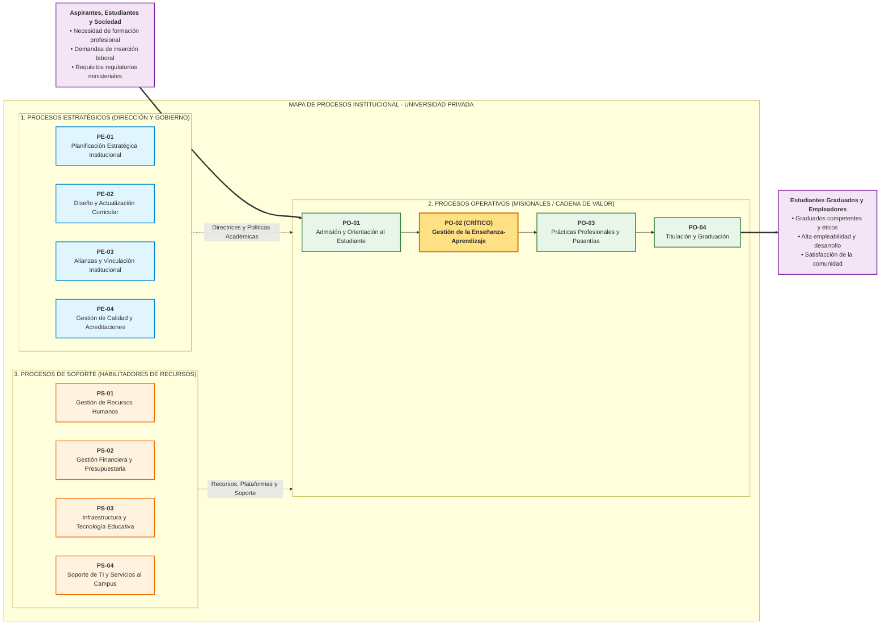

# Mapa de Procesos Institucional y Selección de Proceso Crítico (GMP Etapa 1)

**Organización Bajo Estudio:** Universidad Privada de Nivel Superior (Caso Canónico de Cátedra - TPI 2026)  
**Rubro / Actividad:** Servicio Educativo Terciario y Universitario de Formación Profesional Integral  
**Fecha de Elaboración:** 2026-09-11  
**Versión:** 2.0  
**Documentos Fuente de Cátedra:** `PlanillaMATRICES-TPI 2026 con ejemplo.xlsx` (Hoja *'Etapa 1 Situación actual'*, Matriz 2: *MAPA DE PROCESOS*), `SLI_U1_C03_Mapa_de_Procesos.pdf` y `SLI_U2_C01_Seleccion_Proceso.pdf`.

---

## 1. Identificación y Encuadre Institucional

| Campo | Definición / Descripción |
|---|---|
| **Nombre de la Organización** | Universidad Privada de Nivel Superior |
| **Rubro y Actividad Principal** | Educación Superior Universitaria, Formación de Grado, Posgrado y Extensión Profesional |
| **Misión Institucional** | Brindar educación superior de excelencia académica formando profesionales éticos e innovadores mediante programas curriculares actualizados y acompañamiento académico continuo. |
| **Visión Estratégica** | Consolidarse como referente en educación superior flexible, digital e innovadora, liderando la co-creación de valor formativo y la empleabilidad de sus graduados. |
| **Cliente / Beneficiario Primario** | Estudiantes universitarios activos, aspirantes a carreras de grado/posgrado y empresas/organizaciones demandantes de graduados calificados. |
| **Propuesta de Valor Central** | Formación académica integral, acreditada oficialmente, combinando contenidos teóricos con prácticas profesionales tempranas y entornos digitales de aprendizaje. |
| **Objetivos Estratégicos Relevantes** | • **OE-1:** Aumentar la tasa de retención estudiantil al 88% en los primeros 2 años mediante seguimiento tutorial proactivo. • **OE-2:** Digitalizar el 100% de los trámites académicos y evaluaciones formativas hacia entornos híbridos y móviles. • **OE-3:** Obtener la acreditación ministerial de excelencia para el 90% de las carreras de grado en el trienio 2026-2028. |

---

## 2. Diagrama Visual del Mapa de Procesos (3 Niveles de Cátedra)

---

## 3. Inventario Estructurado de Procesos y Objetivos

### 3.1 Procesos Estratégicos (Dirección y Gobierno)
Procesos que definen el rumbo institucional, políticas, reglas de negocio y toman decisiones de largo plazo (`SLI_U1_C03`, p. 3).

| ID | Nombre del Proceso | Objetivo del Proceso (Alineación Estratégica) | Dueño / Responsable Sugerido | Salidas Principales |
|---|---|---|---|---|
| `PE-01` | **Planificación Estratégica Institucional** | Definir las metas de crecimiento, presupuesto plurianual y prioridades de inversión académica. | Rectorado y Consejo Superior | Plan Estratégico Quinquenal, Presupuesto Aprobado |
| `PE-02` | **Diseño y Actualización Curricular** | Actualizar planes de estudio conforme a demandas del mercado laboral y normativas ministeriales. | Secretaría Académica | Planes de Estudio Actualizados, Resoluciones Curriculares |
| `PE-03` | **Alianzas y Vinculación Institucional** | Gestionar convenios de cooperación con empresas, centros de investigación y universidades internacionales. | Dirección de Relaciones Institucionales | Convenios Marco, Acuerdos de Intercambio |
| `PE-04` | **Gestión de Calidad y Acreditaciones** | Auditar y asegurar estándares de calidad académica para sostener las acreditaciones ministeriales. | Comité de Calidad Académica | Informes de Autoevaluación, Certificaciones de Calidad |

### 3.2 Procesos Operativos, Clave o Misionales (Cadena de Valor)
Procesos que intervienen directamente en la generación del producto o servicio y crean valor para el cliente (`SLI_U1_C03`, p. 4).

| ID | Nombre del Proceso | Objetivo del Proceso (Creación de Valor) | Dueño / Responsable Sugerido | Salidas Principales (Entregable al Cliente) |
|---|---|---|---|---|
| `PO-01` | **Admisión y Orientación al Estudiante** | Reclutar, orientar, evaluar e inscribir ingresantes garantizando una inserción universitaria exitosa. | Dirección de Admisiones | Legajo Estudiantil Habilitado, Matrícula Confirmada |
| `PO-02` | **Gestión de la Enseñanza-Aprendizaje** | Desarrollar las cátedras, cursadas, evaluaciones y seguimiento formativo continuo de los alumnos. | Decanato y Directores de Carrera | Actas de Examen, Asistencia, Calificaciones Registradas |
| `PO-03` | **Prácticas Profesionales y Pasantías** | Facilitar la inmersión de los estudiantes avanzados en entornos laborales reales supervisados. | Coordinación de Prácticas Profesionales | Informes de Pasantía Aprobados, Certificados de Práctica |
| `PO-04` | **Titulación y Graduación** | Gestionar el trámite final de defensa de tesis, validación de créditos y emisión del diploma habilitante. | Departamento de Títulos y Egresados | Diploma Universitario Legalizado, Certificado Analítico |

### 3.3 Procesos de Soporte o Apoyo
Procesos necesarios para proveer los recursos que permiten el funcionamiento eficaz de los procesos operativos (`SLI_U1_C03`, p. 5).

| ID | Nombre del Proceso | Objetivo del Proceso (Habilitador de Recursos) | Dueño / Responsable Sugerido | Servicios / Recursos Suministrados |
|---|---|---|---|---|
| `PS-01` | **Gestión de Recursos Humanos** | Reclutar, seleccionar, capacitar y liquidar haberes del cuerpo docente y no docente de la universidad. | Dirección de Recursos Humanos | Docentes Contratados, Nómina Liquidada |
| `PS-02` | **Gestión Financiera y Presupuestaria** | Administrar los flujos de fondos, cobranza de aranceles y compras de insumos para la operación diaria. | Dirección de Administración y Finanzas | Balances Financieros, Liquidaciones de Aranceles |
| `PS-03` | **Infraestructura y Tecnología Educativa** | Mantener aulas físicas, laboratorios experimentales, campus virtual y licencias de software pedagógico. | Dirección de Mantenimiento y Campus | Aulas Operativas, Plataforma Campus Virtual Activa |
| `PS-04` | **Soporte de TI y Servicios al Campus** | Proveer soporte técnico informático, infraestructura de red WiFi y seguridad de la información. | Departamento de Tecnologías de Información | Conectividad Segura, Soporte a Usuarios |

---

## 4. Matriz Multicriterio de Selección Ponderada de Proceso Crítico

A partir del mapa institucional, se evalúan los procesos operativos candidatos aplicando la matriz de decisión formal de los **5 factores de cátedra** (`SLI_U2_C01`):

### 4.1 Factores de Evaluación Normativos y Vector de Ponderación

**Escala de Calificación:** 1 (Muy Bajo) a 5 (Muy Alto / Crítico).

| Código | Factor de Cátedra (SLI_U2_C01) | Peso ($w_i$) | Porcentaje | Justificación del Peso en la Organización |
|:---:|:---|:---:|:---:|:---|
| **C1** | **Impacto en la Estrategia** | `0.25` | 25% | La retención y acreditación académica dependen directamente de la calidad de los procesos centrales. |
| **C2** | **Tendencias del Entorno / Lógica Dominante del Servicio (SDL)** | `0.20` | 20% | La demanda por educación híbrida, trazabilidad digital y co-creación formativa exige modernización continua. |
| **C3** | **Problemas Identificados y Oportunidades de Mejora** | `0.25` | 25% | Fricciones en actas, caídas del sistema de inscripción y retrabajos manuales generan costos y demoras críticas. |
| **C4** | **Cliente** | `0.20` | 20% | El estudiante experimenta el servicio a diario; las fallas impactan de forma directa en reclamos y deserción. |
| **C5** | **Producto / Servicio** | `0.10` | 10% | Relevancia directa sobre el núcleo de la propuesta de valor pedagógica de la universidad. |
| **Total** | **Suma de Ponderaciones ($\sum w_i$)** | **`1.00`** | **100%** | **Cierre matemático estricto cumplido.** |

### 4.2 Evaluación Multicriterio de Procesos Candidatos

| ID | Proceso Candidato | C1: Estrategia ($w=0.25$) | C2: Tendencias/SDL ($w=0.20$) | C3: Problemas/Costos ($w=0.25$) | C4: Cliente ($w=0.20$) | C5: Producto ($w=0.10$) | Puntaje Ponderado Total ($S_p$) | Ranking | Decisión Metodológica |
|:---:|:---|:---:|:---:|:---:|:---:|:---:|:---:|:---:|:---:|
| `PO-01` | **Admisión y Orientación** | 4 | 4 | 3 | 4 | 3 | **3.65** | `#3` | No Seleccionado |
| `PO-02` | **Gestión de la Enseñanza-Aprendizaje** | 5 | 4 | 5 | 5 | 5 | **4.80** | **#1** | **SELECCIONADO (Proceso Crítico)** |
| `PO-04` | **Titulación y Graduación** | 4 | 3 | 4 | 4 | 4 | **3.80** | `#2` | No Seleccionado |

*Detalle de Cálculo:*
- $S_{PO-01} = (0.25 \times 4) + (0.20 \times 4) + (0.25 \times 3) + (0.20 \times 4) + (0.10 \times 3) = 1.00 + 0.80 + 0.75 + 0.80 + 0.30 = 3.65$
- $S_{PO-02} = (0.25 \times 5) + (0.20 \times 4) + (0.25 \times 5) + (0.20 \times 5) + (0.10 \times 5) = 1.25 + 0.80 + 1.25 + 1.00 + 0.50 = 4.80$
- $S_{PO-04} = (0.25 \times 4) + (0.20 \times 3) + (0.25 \times 4) + (0.20 \times 4) + (0.10 \times 4) = 1.00 + 0.60 + 1.00 + 0.80 + 0.40 = 3.80$

---

## 5. Proceso Crítico Seleccionado y Justificación Técnica de Cátedra

### 5.1 Declaración del Proceso Crítico Seleccionado
- **Proceso Crítico Elegido:** `PO-02: Gestión de la Enseñanza-Aprendizaje y Cursado`
- **Puntaje Ponderado Total ($S_p$):** **4.80 / 5.00**
- **Posición en el Ranking:** **Puesto #1** (Ganador inequívoco, brecha de $+1.00$ sobre el segundo puesto).

### 5.2 Justificación del Porqué de la Selección (Sustento Multifactorial)
- **Sustento en C1 (Alineación con la Estrategia - Nota: 5/5):**  
  El proceso `PO-02` apalanca directamente el cumplimiento del **OE-1** (aumento de la tasa de retención estudiantil al 88%) y del **OE-3** (acreditación ministerial de excelencia). La retención no se pierde en la admisión ni en el trámite de egreso, sino en la fricción cotidiana durante las cursadas, el seguimiento pedagógico y las instancias de examen.
- **Sustento en C2 (Tendencias del Entorno y Lógica Dominante del Servicio - Nota: 4/5):**  
  Responde con alta urgencia al **OE-2** y a las tendencias globales de educación híbrida. Bajo la óptica de la Lógica Dominante del Servicio (SDL), la educación es el proceso arquetípico de **co-creación de valor**, donde el estudiante interactúa continuamente con el docente y las plataformas tecnológicas.
- **Sustento en C3 (Problemas, Costos y Cuellos de Botella - Nota: 5/5):**  
  Es el proceso que concentra el mayor volumen de fricciones operativas comprobadas: durante el último ciclo lectivo se registraron más de 420 reclamos formales por demoras crónicas en la carga y cierre de actas de examen (promedio de 18 días hábiles de demora vs. 3 normativos), desfasajes manuales en el control de correlatividades y saturación en ventanillas de bedelía.
- **Sustento en C4 (Impacto Directo en el Cliente - Nota: 5/5):**  
  El estudiante universitario experimenta este proceso a lo largo de 4 a 6 meses por semestre. Constituye el conjunto de "momentos de la verdad" del servicio universitario; las fallas en actas o inscripciones a exámenes generan estrés, quejas masivas en redes sociales y pérdida de lealtad.
- **Sustento en C5 (Propuesta de Valor y Producto/Servicio - Nota: 5/5):**  
  Constituye la esencia misma de la propuesta de valor universitaria: la formación académica de calidad. Sin un proceso de cursada, evaluación y seguimiento robusto, la institución carece de propósito educativo fundamental.

### 5.3 Conclusión de Priorización y Handoff a Etapa 2 de GMP
La selección de `PO-02: Gestión de la Enseñanza-Aprendizaje` maximiza el retorno de la inversión metodológica de GMP, atacando de raíz la mayor fuente de costos de no-calidad e insatisfacción de clientes identificada en el mapa institucional.

**Delimitación y Siguientes Entregables de Etapa 2:**
1. **Frontera Inicial (Disparador):** Publicación del cronograma de cursadas e inscripción de comisiones por parte del estudiante.
2. **Frontera Final (Resultado Entregado):** Emisión y cierre formal del acta definitiva de calificaciones registrada en el sistema de gestión académica.
3. **Pase Metodológico Inmediato:**
   - Construcción de la matriz SIPOC (`sipocBuilder` ➔ `sipoc.md`).
   - Modelado BPD AS-IS descriptivo y operacional en BPMN 2.0 (`bpmnExtractor` / `diagramStudio`).
   - Auditoría forense de los 4 ejes de `GUI_U2` (`processAuditor`).
   - Matriz de partes interesadas (`stakeholderMatrix` ➔ `stakeholders.md`).
   - Matriz FODA del proceso operativo (`fodaProcess` ➔ `foda.md`).
