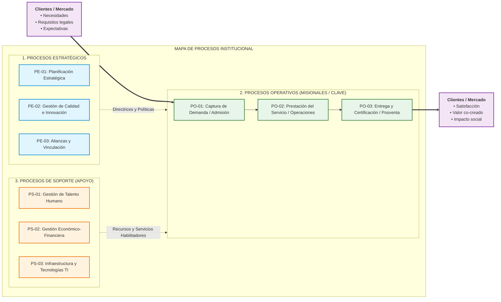

# Mapa de Procesos Institucional (GMP Etapa 1)

**Organización Bajo Estudio:** [Nombre de la organización]  
**Rubro / Actividad:** [Sector o actividad económica principal]  
**Fecha de Elaboración:** [YYYY-MM-DD]  
**Versión:** [1.0]  
**Documentos Fuente de Cátedra:** `PlanillaMATRICES-TPI 2026 con ejemplo.xlsx` (Hoja *'Etapa 1 Situación actual'*, Matriz 2: *MAPA DE PROCESOS*) y `SLI_U1_C03_Mapa_de_Procesos.pdf`.

---

## 1. Identificación y Encuadre Institucional

| Campo | Definición / Descripción |
|---|---|
| **Nombre de la Organización** | [Nombre formal de la entidad] |
| **Rubro y Actividad Principal** | [Descripción de la actividad principal y mercado] |
| **Misión Institucional** | [Finalidad concisa con foco en lo que hace HOY] |
| **Visión Estratégica** | [Aspiración de mediano/largo plazo hacia dónde se proyecta] |
| **Cliente / Beneficiario Primario** | [Perfil del cliente o usuario del servicio/producto] |
| **Propuesta de Valor Central** | [Qué entrega la organización que satisface las necesidades del cliente] |

---

## 2. Diagrama Visual del Mapa de Procesos (3 Niveles de Cátedra)

---

## 3. Inventario Estructurado de Procesos y Objetivos

### 3.1 Procesos Estratégicos (Dirección y Gobierno)
Procesos que definen el rumbo institucional, políticas, reglas de negocio y toman decisiones de largo plazo (`SLI_U1_C03`, p. 3).

| ID | Nombre del Proceso | Objetivo del Proceso (Alineación Estratégica) | Dueño / Responsable Sugerido | Salidas Principales |
|---|---|---|---|---|
| `PE-01` | [Nombre del Proceso Estratégico 1] | [Objetivo redactado con verbo en infinitivo] | [Rol o Área Responsable] | [Planes, Políticas, Directrices] |
| `PE-02` | [Nombre del Proceso Estratégico 2] | [Objetivo redactado con verbo en infinitivo] | [Rol o Área Responsable] | [Planes, Políticas, Directrices] |
| `PE-03` | [Nombre del Proceso Estratégico 3] | [Objetivo redactado con verbo en infinitivo] | [Rol o Área Responsable] | [Planes, Políticas, Directrices] |

### 3.2 Procesos Operativos, Clave o Misionales (Cadena de Valor)
Procesos que intervienen directamente en la generación del producto o servicio y crean valor para el cliente (`SLI_U1_C03`, p. 4).

| ID | Nombre del Proceso | Objetivo del Proceso (Creación de Valor) | Dueño / Responsable Sugerido | Salidas Principales (Entregable al Cliente) |
|---|---|---|---|---|
| `PO-01` | [Nombre del Proceso Operativo 1] | [Objetivo centrado en la necesidad del cliente] | [Rol o Área Responsable] | [Producto/Servicio entregado] |
| `PO-02` | [Nombre del Proceso Operativo 2] | [Objetivo centrado en la necesidad del cliente] | [Rol o Área Responsable] | [Producto/Servicio entregado] |
| `PO-03` | [Nombre del Proceso Operativo 3] | [Objetivo centrado en la necesidad del cliente] | [Rol o Área Responsable] | [Producto/Servicio entregado] |

### 3.3 Procesos de Soporte o Apoyo
Procesos necesarios para proveer los recursos que permiten el funcionamiento eficaz de los procesos operativos (`SLI_U1_C03`, p. 5).

| ID | Nombre del Proceso | Objetivo del Proceso (Habilitador de Recursos) | Dueño / Responsable Sugerido | Servicios / Recursos Suministrados |
|---|---|---|---|---|
| `PS-01` | [Nombre del Proceso de Soporte 1] | [Objetivo redactado con verbo en infinitivo] | [Rol o Área Responsable] | [Recursos, Nómina, Infraestructura, TI] |
| `PS-02` | [Nombre del Proceso de Soporte 2] | [Objetivo redactado con verbo en infinitivo] | [Rol o Área Responsable] | [Recursos, Nómina, Infraestructura, TI] |
| `PS-03` | [Nombre del Proceso de Soporte 3] | [Objetivo redactado con verbo en infinitivo] | [Rol o Área Responsable] | [Recursos, Nómina, Infraestructura, TI] |

---

## 4. Matriz de Relaciones Sistémicas e Interacciones

| Desde Nivel / Proceso | Hacia Nivel / Proceso | Tipo de Relación / Interacción | Flujo de Información / Recurso Intercambiado |
|---|---|---|---|
| **Clientes / Entorno** | **Procesos Operativos** | Entrada de Requisitos | Demandas de servicio, expedientes, requerimientos técnicos y expectativas. |
| **Procesos Estratégicos** | **Procesos Operativos** | Control y Lineamiento | Directrices, políticas de calidad, presupuestos asignados y reglamentos. |
| **Procesos de Soporte** | **Procesos Operativos** | Soporte de Recursos | Dotación de personal calificado, sistemas de información TI y recursos físicos. |
| **Procesos Operativos** | **Clientes / Entorno** | Salida de Valor | Servicio completado, producto entregado, certificaciones y valor co-creado. |

---

## 5. Insumos para la Selección del Proceso Crítico (Pase a `seleccion_proceso.md`)

De los procesos operativos identificados, se preseleccionan los candidatos para su evaluación formal mediante la Matriz Multicriterio de 5 Factores (`processCriticalSelector`):
1. **Candidato 1:** `PO-01` - [Nombre del proceso] (Justificación preliminar de impacto o dolor).
2. **Candidato 2:** `PO-02` - [Nombre del proceso] (Justificación preliminar de impacto o dolor).
3. **Candidato 3:** `PO-03` - [Nombre del proceso] (Justificación preliminar de impacto o dolor).
