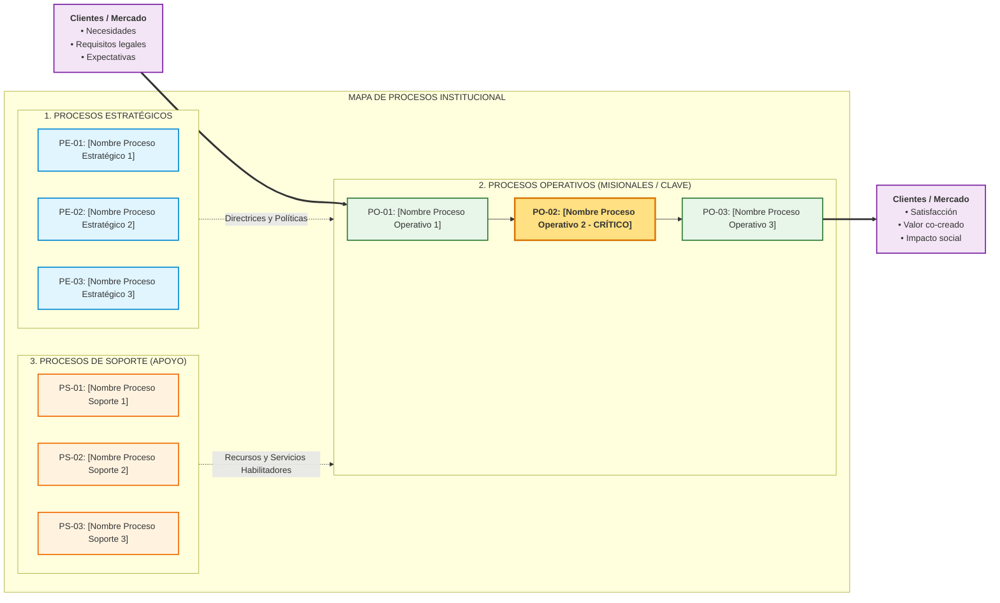

# Mapa de Procesos Institucional y Selección de Proceso Crítico (GMP Etapa 1)

**Organización Bajo Estudio:** `[Nombre de la organización]`  
**Rubro / Actividad:** `[Sector o actividad económica principal]`  
**Fecha de Elaboración:** `[YYYY-MM-DD]`  
**Versión:** `2.0`  
**Documentos Fuente de Cátedra:** `PlanillaMATRICES-TPI 2026 con ejemplo.xlsx` (Hoja *'Etapa 1 Situación actual'*, Matriz 2: *MAPA DE PROCESOS*), `SLI_U1_C03_Mapa_de_Procesos.pdf` y `SLI_U2_C01_Seleccion_Proceso.pdf`.

---

## 1. Identificación y Encuadre Institucional

| Campo | Definición / Descripción |
|---|---|
| **Nombre de la Organización** | `[Nombre formal de la entidad]` |
| **Rubro y Actividad Principal** | `[Descripción de la actividad principal y mercado]` |
| **Misión Institucional** | `[Finalidad concisa con foco en lo que hace HOY]` |
| **Visión Estratégica** | `[Aspiración de mediano/largo plazo hacia dónde se proyecta]` |
| **Cliente / Beneficiario Primario** | `[Perfil del cliente o usuario del servicio/producto]` |
| **Propuesta de Valor Central** | `[Qué entrega la organización que satisface las necesidades del cliente]` |
| **Objetivos Estratégicos Relevantes** | `[OE-1: SMART 1; OE-2: SMART 2; OE-3: SMART 3]` |

---

## 2. Diagrama Visual del Mapa de Procesos (3 Niveles de Cátedra)

---

## 3. Inventario Estructurado de Procesos y Objetivos

### 3.1 Procesos Estratégicos (Dirección y Gobierno)
Procesos que definen el rumbo institucional, políticas, reglas de negocio y toman decisiones de largo plazo (`SLI_U1_C03`, p. 3).

| ID | Nombre del Proceso | Objetivo del Proceso (Alineación Estratégica) | Dueño / Responsable Sugerido | Salidas Principales |
|---|---|---|---|---|
| `PE-01` | `[Nombre del Proceso Estratégico 1]` | `[Objetivo con verbo en infinitivo]` | `[Rol o Área]` | `[Planes, Políticas, Directrices]` |
| `PE-02` | `[Nombre del Proceso Estratégico 2]` | `[Objetivo con verbo en infinitivo]` | `[Rol o Área]` | `[Planes, Políticas, Directrices]` |
| `PE-03` | `[Nombre del Proceso Estratégico 3]` | `[Objetivo con verbo en infinitivo]` | `[Rol o Área]` | `[Planes, Políticas, Directrices]` |

### 3.2 Procesos Operativos, Clave o Misionales (Cadena de Valor)
Procesos que intervienen directamente en la generación del producto o servicio y crean valor para el cliente (`SLI_U1_C03`, p. 4).

| ID | Nombre del Proceso | Objetivo del Proceso (Creación de Valor) | Dueño / Responsable Sugerido | Salidas Principales (Entregable al Cliente) |
|---|---|---|---|---|
| `PO-01` | `[Nombre del Proceso Operativo 1]` | `[Objetivo centrado en la necesidad]` | `[Rol o Área]` | `[Producto/Servicio entregado]` |
| `PO-02` | `[Nombre del Proceso Operativo 2]` | `[Objetivo centrado en la necesidad]` | `[Rol o Área]` | `[Producto/Servicio entregado]` |
| `PO-03` | `[Nombre del Proceso Operativo 3]` | `[Objetivo centrado en la necesidad]` | `[Rol o Área]` | `[Producto/Servicio entregado]` |

### 3.3 Procesos de Soporte o Apoyo
Procesos necesarios para proveer los recursos que permiten el funcionamiento eficaz de los procesos operativos (`SLI_U1_C03`, p. 5).

| ID | Nombre del Proceso | Objetivo del Proceso (Habilitador de Recursos) | Dueño / Responsable Sugerido | Servicios / Recursos Suministrados |
|---|---|---|---|---|
| `PS-01` | `[Nombre del Proceso de Soporte 1]` | `[Objetivo con verbo en infinitivo]` | `[Rol o Área]` | `[Recursos, Nómina, TI]` |
| `PS-02` | `[Nombre del Proceso de Soporte 2]` | `[Objetivo con verbo en infinitivo]` | `[Rol o Área]` | `[Recursos, Nómina, TI]` |
| `PS-03` | `[Nombre del Proceso de Soporte 3]` | `[Objetivo con verbo en infinitivo]` | `[Rol o Área]` | `[Recursos, Nómina, TI]` |

---

## 4. Matriz Multicriterio de Selección Ponderada de Proceso Crítico

A partir del mapa institucional, se evalúan los procesos candidatos mediante los **5 factores de cátedra** (`SLI_U2_C01`):

### 4.1 Factores de Evaluación y Vector de Ponderación

**Escala de Calificación:** 1 (Muy Bajo) a 5 (Muy Alto / Crítico).

| Código | Factor de Cátedra (SLI_U2_C01) | Peso ($w_i$) | Porcentaje | Justificación del Peso en la Organización |
|:---:|:---|:---:|:---:|:---|
| **C1** | **Impacto en la Estrategia** | `0.25` | 25% | Procesos que permiten alcanzar los objetivos estratégicos y competitividad. |
| **C2** | **Tendencias del Entorno / Lógica Dominante del Servicio (SDL)** | `0.20` | 20% | Procesos vinculados a digitalización, autoservicio y co-creación de valor. |
| **C3** | **Problemas Identificados y Oportunidades de Mejora** | `0.25` | 25% | Fallas, costos de no-calidad, demoras, cuellos de botella y riesgos operativos. |
| **C4** | **Cliente** | `0.20` | 20% | Requerimientos, quejas, percepción y experiencia directa del usuario. |
| **C5** | **Producto / Servicio** | `0.10` | 10% | Relevancia para la propuesta de valor sustantiva y el producto entregado. |
| **Total** | **Suma de Ponderaciones ($\sum w_i$)** | **`1.00`** | **100%** | **Cierre matemático estricto cumplido.** |

### 4.2 Evaluación Multicriterio de Procesos Candidatos

| ID | Proceso Candidato | C1: Estrategia ($w=0.25$) | C2: Tendencias/SDL ($w=0.20$) | C3: Problemas/Costos ($w=0.25$) | C4: Cliente ($w=0.20$) | C5: Producto ($w=0.10$) | Puntaje Ponderado Total ($S_p$) | Ranking | Decisión Metodológica |
|:---:|:---|:---:|:---:|:---:|:---:|:---:|:---:|:---:|:---:|
| `PO-01` | `[Nombre Proceso 1]` | `[1-5]` | `[1-5]` | `[1-5]` | `[1-5]` | `[1-5]` | `[0.00 - 5.00]` | `#2` | No Seleccionado |
| `PO-02` | `[Nombre Proceso 2]` | `[1-5]` | `[1-5]` | `[1-5]` | `[1-5]` | `[1-5]` | `[0.00 - 5.00]` | **#1** | **SELECCIONADO (Proceso Crítico)** |
| `PO-03` | `[Nombre Proceso 3]` | `[1-5]` | `[1-5]` | `[1-5]` | `[1-5]` | `[1-5]` | `[0.00 - 5.00]` | `#3` | No Seleccionado |

*Fórmula de cálculo:* $S_p = (0.25 \times C_1) + (0.20 \times C_2) + (0.25 \times C_3) + (0.20 \times C_4) + (0.10 \times C_5)$.  
*Regla de Desempate Jerárquico:* Mayor calificación en $C_3 \to C_1 \to C_4 \to C_5 \to C_2$.

---

## 5. Proceso Crítico Seleccionado y Justificación Técnica de Cátedra

### 5.1 Declaración del Proceso Crítico Seleccionado
- **Proceso Crítico Elegido:** `[Código y Nombre del Proceso Ganador, ej. PO-02: Gestión Académica y Matrícula]`
- **Puntaje Ponderado Total ($S_p$):** `[Puntaje numérico, ej. 4.45 / 5.00]`
- **Posición en el Ranking:** **Puesto #1** (Ganador inequívoco).

### 5.2 Justificación del Porqué de la Selección (Sustento Multifactorial)
- **Sustento en C1 (Alineación con la Estrategia - Calificación: `[Nota]`):**  
  `[Justificación concreta explicando cómo el proceso apalanca directamente los OE-1, OE-2 u OE-3 documentados en la Sección 1]`.
- **Sustento en C2 (Tendencias del Entorno y Lógica Dominante del Servicio - Calificación: `[Nota]`):**  
  `[Justificación vinculada a tendencias de digitalización, autogestión y co-creación de valor bajo SDL]`.
- **Sustento en C3 (Problemas, Costos y Cuellos de Botella - Calificación: `[Nota]`):**  
  `[Evidencias empíricas documentadas: volumen de mermas, horas hombre perdidas, demoras crónicas, costos de retrabajo o riesgos de control interno]`.
- **Sustento en C4 (Impacto Directo en el Cliente - Calificación: `[Nota]`):**  
  `[Datos de insatisfacción, reclamos formales, impacto en la tasa de retención o NPS y momentos de la verdad]`.
- **Sustento en C5 (Propuesta de Valor y Producto/Servicio - Calificación: `[Nota]`):**  
  `[Relevancia del proceso en la entrega de la promesa de servicio nuclear de la organización]`.

### 5.3 Conclusión de Priorización y Handoff a Etapa 2 de GMP
`[Párrafo de síntesis que resume por qué este proceso genera el mayor apalancamiento operativo y retorno de inversión metodológica]`.

**Delimitación y Siguientes Entregables de Etapa 2:**
1. **Frontera Inicial (Disparador):** `[Evento exacto que inicia la ejecución del proceso]`.
2. **Frontera Final (Resultado Entregado):** `[Evento exacto que finaliza y entrega el valor al cliente]`.
3. **Pase Metodológico Inmediato:**
   - Construcción de la matriz SIPOC (`sipocBuilder` ➔ `sipoc.md`).
   - Modelado BPD AS-IS en BPMN 2.0 (`bpmnExtractor` / `diagramStudio`).
   - Auditoría forense de los 4 ejes de `GUI_U2` (`processAuditor`).
   - Matriz de partes interesadas (`stakeholderMatrix` ➔ `stakeholders.md`).
   - Matriz FODA del proceso operativo (`fodaProcess` ➔ `foda.md`).
