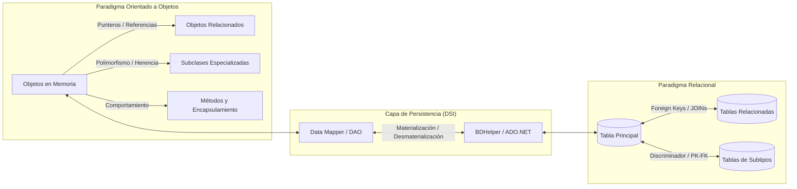
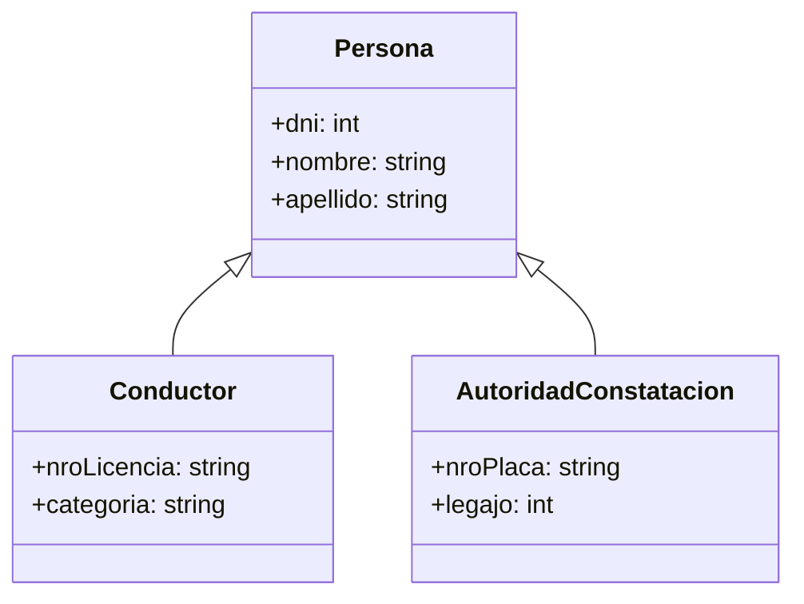
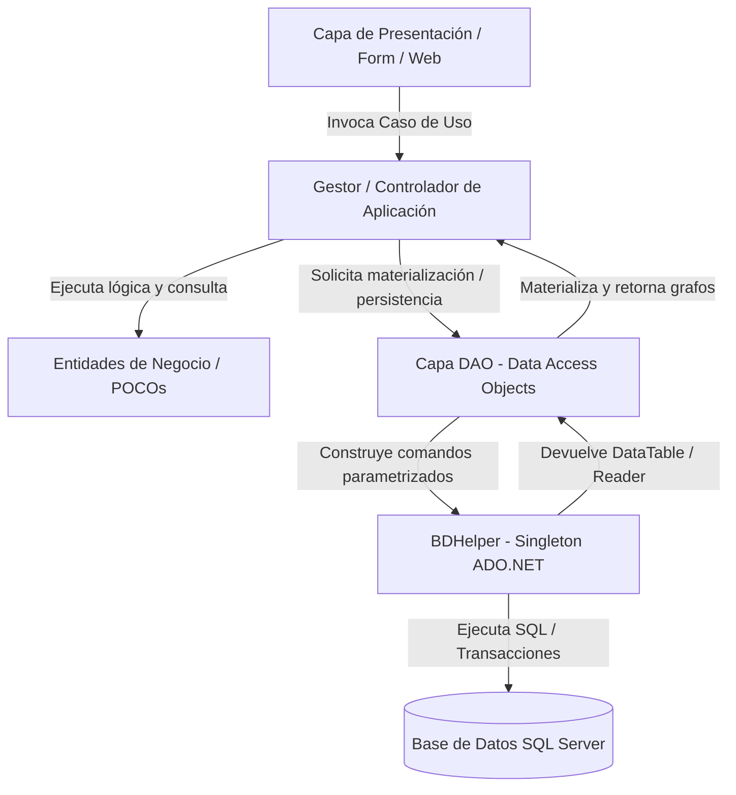
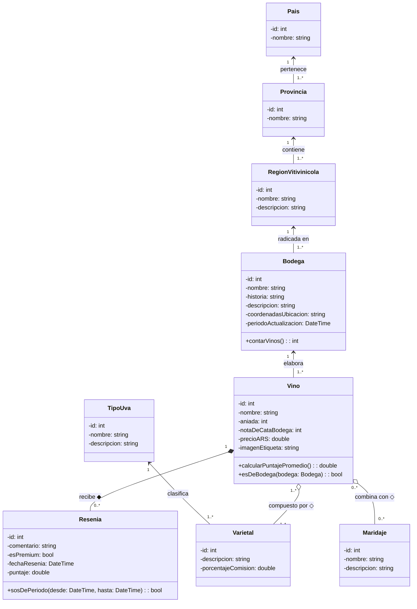
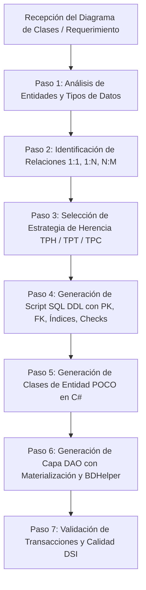

---
name: relationalObjectMap
description: >-
  Automatiza el mapeo Objeto-Relacional formal del Diagrama de Clases, generando scripts SQL DDL
  y la arquitectura de persistencia en capas (DAOs, Repositorios, Data Mappers y transacciones C#/SQL).
---

# domainToRelationalPersistenceScaffolder: Guía Maestra de Mapeo Objeto-Relacional y Persistencia en DSI

Esta skill encapsula el estándar metodológico y técnico para transformar modelos conceptuales de dominio (**Diagramas de Clases de Diseño**) en esquemas relacionales normalizados (**Scripts SQL DDL**) y en la arquitectura de persistencia en capas (**C# .NET con patrón DAO y `BDHelper`**), conforme al programa de **Diseño de Sistemas de Información (DSI)** y las prácticas de los Proyectos Prácticos Integradores (PPAI).

---

## 1. Fundamentos y Desfase de Impedancia Objeto-Relacional

El **desfase de impedancia (Object-Relational Impedance Mismatch)** representa la diferencia conceptual y estructural entre el paradigma Orientado a Objetos (grafos de objetos con identidad en memoria, encapsulamiento, comportamiento y relaciones polimórficas) y el modelo Relacional (conjuntos de tuplas normalizadas vinculadas mediante claves y operaciones de álgebra relacional).



### 1.1. Comparativa de Conceptos Clave

| Concepto OO | Concepto Relacional | Consideración de Mapeo en DSI |
| :--- | :--- | :--- |
| **Clase** | **Tabla / Relación** | Cada clase de negocio suele transformarse en una tabla base. |
| **Objeto / Instancia** | **Tupla / Fila (Registro)** | Una fila representa el estado persistido de una instancia. |
| **Atributo Primitivo** | **Columna / Campo** | Tipo compatible directo con el gestor (RDBMS). |
| **Atributo Complejo** | **Múltiples Columnas o Tabla Externa** | *Embedded Value* (aplanamiento) o tabla dependiente. |
| **Identidad de Objeto (OID / Ref)** | **Clave Primaria (Primary Key - PK)** | Identificador único unívoco (Surrogate Identity / Secuencia / GUID / Clave Natural). |
| **Asociación 1:1 o 1:N** | **Clave Foránea (Foreign Key - FK)** | Colocación de la FK en el lado dependiente (lado N). |
| **Asociación N:M** | **Tabla Intermedia Asociativa** | Tabla puente con PK compuesta por las dos FKs. |
| **Herencia (Generalización)** | **TPH / TPT / TPC** | Estrategias de Single Table, Class Table o Concrete Table. |

### 1.2. Operaciones Fundamentales del Mapeo
- **Materialización (Reconstitución)**: Proceso de leer tuplas de la base de datos (mediante `IDataReader` o `DataTable`) y construir las instancias vivas de los objetos en memoria, reconstituyendo sus atributos, colecciones y referencias.
- **Desmaterialización (Persistencia / Serialización)**: Proceso inverso de extraer el estado interno de los objetos del dominio y proyectarlo en comandos SQL (`INSERT`, `UPDATE`, `DELETE`) con parámetros fuertemente tipados.
- **Identificador de Objeto vs Clave Primaria**: En memoria los objetos se referencian por puntero/identidad de instancia; en BD se identifican mediante claves unívocas no nulas.
- **Materialización Perezosa (*Lazy Loading*) vs Ansiosa (*Eager Loading*)**:
  - *Eager Loading*: El DAO recupera la entidad y todas sus asociaciones (1:N, N:M) en la misma operación de carga.
  - *Lazy Loading*: La carga de las colecciones o referencias pesadas se posterga hasta que el método del negocio requiera su acceso (usando referencias por ID o *Virtual Proxies*).

### 1.3. Modelos Arquitectónicos de Persistencia
1. **SuperObjeto Persistente (*Active Record*)**: La clase de dominio hereda de una clase base que contiene la lógica de base de datos (`cliente.Guardar()`). Viola el principio de Responsabilidad Única (SRP) y genera alto acoplamiento.
2. **Esquema de Persistencia / Data Mapper / DAO (Estándar DSI)**: Separación estricta en capas. Las clases de entidad son objetos puros de dominio (*POCOs*), mientras que las clases DAO (`ClienteDAO`, `LlamadaDAO`, `VinoDAO`) se encargan exclusivamente de la interacción con la base de datos a través de `BDHelper`.

---

## 2. Reglas Formales de Mapeo Objeto-Relacional (O-R)

### 2.1. Mapeo de Atributos y Matriz de Compatibilidad de Tipos

| Tipo en C# (.NET) | SQL Server (T-SQL) | PostgreSQL | SQLite | Reglas y Consideraciones |
| :--- | :--- | :--- | :--- | :--- |
| `int` / `Int32` | `INT` | `INTEGER` | `INTEGER` | Claves primarias estándar e IDs foráneos. |
| `long` / `Int64` | `BIGINT` | `BIGINT` | `INTEGER` | Teléfonos, números de cuenta, códigos de barras. |
| `string` (corto) | `VARCHAR(N)` / `NVARCHAR(N)` | `VARCHAR(N)` | `TEXT` | Nombres, códigos, emails (especificar longitud máxima). |
| `string` (largo) | `VARCHAR(MAX)` / `NVARCHAR(MAX)` | `TEXT` | `TEXT` | Descripciones extensas, historiales, JSON. |
| `bool` / `Boolean` | `BIT` | `BOOLEAN` | `INTEGER (0/1)` | Banderas (`0` = False, `1` = True). Usado en `borrado`. |
| `DateTime` | `DATETIME` / `DATETIME2(3)` | `TIMESTAMP` / `TIMESTAMPTZ` | `TEXT (ISO8601)` | Fechas de registro, vigencias, marcas temporales. |
| `double` / `Double` | `FLOAT` | `DOUBLE PRECISION` | `REAL` | Coordenadas, métricas científicas, cálculos. |
| `decimal` / `Decimal` | `DECIMAL(18,2)` | `NUMERIC(18,2)` | `NUMERIC` | Moneda, precios, importes financieros (sin error flotante). |
| `Guid` | `UNIQUEIDENTIFIER` | `UUID` | `TEXT` | Identificadores globales distribuidos. |
| `byte[]` | `VARBINARY(MAX)` | `BYTEA` | `BLOB` | Documentos, imágenes binarias, firmas digitales. |
| `Enum` (Enumerativo) | `INT` o `VARCHAR(50)` + `CHECK` | `INTEGER` o `VARCHAR(50)` | `TEXT` / `INTEGER` | Guardar como entero o texto con restricción `CHECK`. |

#### Mapeo de Atributos Complejos (Value Objects)
- **Opción A (Aplanamiento / Embedded Value)**: Si una clase `Cliente` posee un atributo `Direccion` (con calle, número, piso), las columnas `calle`, `numero`, `piso` se incorporan directamente en la tabla `Cliente`.
- **Opción B (Tabla Separada)**: Si el atributo complejo tiene multiplicidad `0..*` o ciclo de vida compartido, se crea una tabla propia `Direccion` con FK referenciando a `Cliente`.

---

### 2.2. Mapeo de Relaciones Estructurales

#### A. Relación Uno a Uno (1:1)
- **Estrategia FK Unilateral con Restricción UNIQUE**: Se añade la columna FK en la tabla de la entidad dependiente o con menor cardinalidad obligatoria, declarando la columna como `UNIQUE`.
- **Estrategia de Clave Primaria Compartida**: La PK de la tabla dependiente es a la vez FK que referencia a la PK de la tabla principal (`PK/FK`).

```sql
-- Ejemplo 1:1 con Unique FK
CREATE TABLE DetalleAuditoria (
    id INT IDENTITY(1,1) PRIMARY KEY,
    id_llamada INT NOT NULL UNIQUE,
    observaciones VARCHAR(MAX) NOT NULL,
    CONSTRAINT FK_DetalleAuditoria_Llamada FOREIGN KEY (id_llamada) REFERENCES Llamada(id)
);
```

#### B. Relación Uno a Muchos (1:N)
- La tabla correspondiente al lado "Muchos" (N) aloja la clave foránea (`FK`) que referencia a la clave primaria del lado "Uno" (1).
- Si la relación es obligatoria (1..1), la FK se define como `NOT NULL`. Si es opcional (0..1), la FK permite valores `NULL`.

```sql
-- Ejemplo 1:N (Bodega 1 ---- * Vino)
CREATE TABLE Vino (
    id INT IDENTITY(1,1) PRIMARY KEY,
    nombre VARCHAR(100) NOT NULL,
    precioARS DECIMAL(18,2) NOT NULL,
    id_bodega INT NOT NULL,
    borrado BIT NOT NULL DEFAULT 0,
    CONSTRAINT FK_Vino_Bodega FOREIGN KEY (id_bodega) REFERENCES Bodega(id)
);
```

#### C. Relación Muchos a Muchos (N:M)
- Se crea una **Tabla Intermedia Asociativa** (Tabla Puente).
- La clave primaria de la tabla intermedia es una **clave compuesta** por las dos claves foráneas que referencian a las entidades participantes.
- Si la asociación contiene atributos propios (ej. `fechaAsignacion`, `porcentaje`, `rol`), estos se definen como columnas en esta tabla intermedia.

```sql
-- Ejemplo N:M (Vino * ---- * Maridaje)
CREATE TABLE VinoMaridaje (
    id_vino INT NOT NULL,
    id_maridaje INT NOT NULL,
    fechaSugerencia DATETIME NOT NULL DEFAULT GETDATE(),
    CONSTRAINT PK_VinoMaridaje PRIMARY KEY (id_vino, id_maridaje),
    CONSTRAINT FK_VinoMaridaje_Vino FOREIGN KEY (id_vino) REFERENCES Vino(id),
    CONSTRAINT FK_VinoMaridaje_Maridaje FOREIGN KEY (id_maridaje) REFERENCES Maridaje(id)
);
```

---

### 2.3. Mapeo de Agregación vs Composición

| Criterio | Agregación (Rombo Vacío `◇`) | Composición (Rombo Relleno `◆`) |
| :--- | :--- | :--- |
| **Semántica del Vínculo** | Relación débil "Todo - Parte". Las partes pueden existir independientemente del todo. | Relación fuerte "Todo - Parte". La parte no tiene sentido ni existencia sin el todo. Coincidencia de ciclo de vida. |
| **Ejemplo de Dominio** | `Bodega` agrega `RegionVitivinicola` \| `Llamada` conoce a `Cliente`. | `Encuesta` compone `Pregunta` \| `Factura` compone `DetalleFactura`. |
| **Estrategia de Clave (PK/FK)** | La parte suele tener su propia PK simple y una FK nullable o no restrictiva hacia el todo. | La parte puede tener **PK Compuesta Dependiente** (`PK (id_todo, id_parte)`) o PK simple con FK estricta. |
| **Integridad Referencial** | `ON DELETE NO ACTION` o `ON DELETE SET NULL`. | `ON DELETE CASCADE` (Eliminación en cascada obligatoria o borrado lógico simultáneo). |

```sql
-- Ejemplo Composición: Encuesta ◆---> (1..*) Pregunta
CREATE TABLE Encuesta (
    id INT IDENTITY(1,1) PRIMARY KEY,
    descripcion VARCHAR(150) NOT NULL,
    fechaVigencia DATETIME NOT NULL,
    borrado BIT NOT NULL DEFAULT 0
);

CREATE TABLE Pregunta (
    id INT NOT NULL,
    id_encuesta INT NOT NULL,
    pregunta VARCHAR(250) NOT NULL,
    borrado BIT NOT NULL DEFAULT 0,
    CONSTRAINT PK_Pregunta PRIMARY KEY (id, id_encuesta),
    CONSTRAINT FK_Pregunta_Encuesta FOREIGN KEY (id_encuesta) 
        REFERENCES Encuesta(id) ON DELETE CASCADE
);
```

---

### 2.4. Estrategias Formales de Mapeo de Herencia (Generalización)

En las bases de datos relacionales estándar no existe la herencia nativa de tipos. DSI define tres estrategias canónicas para mapear jerarquías de clases:



#### Estrategia 1: Single Table / Table-per-Hierarchy (TPH) — *"Eliminar los hijos"*
- **Mecanismo**: Se crea **una sola tabla** para toda la jerarquía de clases.
- Contiene todos los atributos de la superclase y de todas las subclases.
- Requiere una columna adicional denominada **discriminador** (`tipo_persona VARCHAR(30) NOT NULL`) para saber a qué subclase pertenece el registro.
- Las columnas exclusivas de las subclases deben permitir valores `NULL`.

```sql
CREATE TABLE Persona (
    dni INT PRIMARY KEY,
    nombre VARCHAR(50) NOT NULL,
    apellido VARCHAR(50) NOT NULL,
    tipo_persona VARCHAR(30) NOT NULL, -- DISCRIMINADOR: 'CONDUCTOR', 'AUTORIDAD'
    -- Atributos de Conductor:
    nroLicencia VARCHAR(20) NULL,
    categoria VARCHAR(10) NULL,
    -- Atributos de AutoridadConstatacion:
    nroPlaca VARCHAR(20) NULL,
    legajo INT NULL,
    borrado BIT NOT NULL DEFAULT 0,
    CONSTRAINT CK_Persona_Tipo CHECK (tipo_persona IN ('CONDUCTOR', 'AUTORIDAD', 'BASE'))
);
```

- **Ventajas**: Máxima velocidad de consulta (cero `JOIN`s). Operaciones polimórficas muy simples.
- **Desventajas**: Columnas `NULL` en la base de datos. Pérdida de restricciones `NOT NULL` en campos que son obligatorios para una subclase específica. Tabla desnormalizada.

---

#### Estrategia 2: Class Table / Joined / Table-per-Type (TPT) — *"Simular la herencia"*
- **Mecanismo**: Se crea **una tabla para la superclase** y **una tabla por cada subclase**.
- La tabla padre almacena los atributos comunes y la clave primaria.
- Cada tabla hija almacena únicamente sus atributos específicos y su clave primaria es simultáneamente clave foránea (`PK/FK`) referenciando a la tabla padre.

```sql
-- Tabla Superclase
CREATE TABLE Persona (
    dni INT PRIMARY KEY,
    nombre VARCHAR(50) NOT NULL,
    apellido VARCHAR(50) NOT NULL,
    borrado BIT NOT NULL DEFAULT 0
);

-- Tabla Subclase Conductor
CREATE TABLE Conductor (
    dni INT PRIMARY KEY,
    nroLicencia VARCHAR(20) NOT NULL,
    categoria VARCHAR(10) NOT NULL,
    CONSTRAINT FK_Conductor_Persona FOREIGN KEY (dni) 
        REFERENCES Persona(dni) ON DELETE CASCADE
);

-- Tabla Subclase AutoridadConstatacion
CREATE TABLE AutoridadConstatacion (
    dni INT PRIMARY KEY,
    nroPlaca VARCHAR(20) NOT NULL,
    legajo INT NOT NULL UNIQUE,
    CONSTRAINT FK_Autoridad_Persona FOREIGN KEY (dni) 
        REFERENCES Persona(dni) ON DELETE CASCADE
);
```

- **Ventajas**: Esquema estrictamente normalizado (3FN). Integridad garantizada con restricciones `NOT NULL` en atributos de hijos. Aislamiento claro de responsabilidades.
- **Desventajas**: Requiere `JOIN`s para recuperar una instancia completa de una subclase o consultas polimórficas. Las inserciones requieren transacciones de dos pasos (`INSERT` en padre y luego `INSERT` en hijo).

---

#### Estrategia 3: Concrete Table / Table-per-Concrete-Class (TPC) — *"Eliminar el padre"*
- **Mecanismo**: Se crean **tablas independientes únicamente para las clases concretas** (las hojas del árbol de herencia).
- No existe tabla para la superclase abstracta.
- Cada tabla concreta duplica todas las columnas de la superclase más sus atributos propios.

```sql
-- Tabla Concreta 1
CREATE TABLE Conductor (
    dni INT PRIMARY KEY,
    nombre VARCHAR(50) NOT NULL,
    apellido VARCHAR(50) NOT NULL,
    nroLicencia VARCHAR(20) NOT NULL,
    categoria VARCHAR(10) NOT NULL,
    borrado BIT NOT NULL DEFAULT 0
);

-- Tabla Concreta 2
CREATE TABLE AutoridadConstatacion (
    dni INT PRIMARY KEY,
    nombre VARCHAR(50) NOT NULL,
    apellido VARCHAR(50) NOT NULL,
    nroPlaca VARCHAR(20) NOT NULL,
    legajo INT NOT NULL UNIQUE,
    borrado BIT NOT NULL DEFAULT 0
);
```

- **Ventajas**: Lectura directa y sin `JOIN`s al consultar una entidad concreta específica. Sin columnas nulas.
- **Desventajas**: Las consultas polimórficas (ej. "listar todas las personas") requieren `UNION ALL`. Cambios en la superclase obligan a modificar múltiples tablas DDL. Si se usan claves autoincrementales, pueden existir colisiones de identificadores entre tablas hermanas.

---

### 2.5. Matriz de Decisión para Selección de Estrategia de Herencia

| Escenario de Diseño | Estrategia Recomendada | Justificación Técnica |
| :--- | :---: | :--- |
| Pocas subclases, pocos atributos específicos, alta demanda de lecturas masivas. | **TPH (Single Table)** | Minimiza el costo de `JOIN`s y simplifica los scripts DDL y DAOs. |
| Subclases con muchos atributos específicos propios, reglas de validación `NOT NULL` estrictas y necesidad de integridad referencial pura. | **TPT (Class Table)** | **(Estándar preferido en DSI)** Garantiza normalización y modelos limpios y trazables. |
| Clases abstractas que nunca se consultan polimórficamente y cuyas subclases son sistemas casi independientes. | **TPC (Concrete Table)** | Desacopla completamente el almacenamiento físico de cada tipo concreto. |

---

## 3. Guía de Generación de Scripts SQL DDL

### 3.1. Buenas Prácticas y Convenciones de Nomenclatura DSI
1. **Borrado Seguro y Recreación**: Incluir sentencias `IF OBJECT_ID ... DROP TABLE` en orden inverso a las dependencias de clave foránea.
2. **Nombres de Tablas y Columnas**: Usar `PascalCase` o `camelCase` consistente. Claves primarias claras (`Id` o `[entidad]Id`), claves foráneas explícitas (`[entidadRelacionada]Id`).
3. **Restricciones Explícitas**: Nombrar formalmente todas las restricciones (`PK_Tabla`, `FK_TablaHija_TablaPadre`, `CK_Tabla_Columna`, `UQ_Tabla_Columna`).
4. **Índices en Claves Foráneas**: Crear índices secundarios (`CREATE INDEX IX_Tabla_FK`) en todas las columnas foráneas para optimizar los `JOIN`s y búsquedas relacionales.
5. **Borrado Lógico (*Soft Delete*)**: Incluir la columna `borrado BIT NOT NULL DEFAULT 0` (o `eliminado BOOLEAN NOT NULL DEFAULT FALSE`) en todas las entidades transaccionales.

### 3.2. Plantilla Maestra de Script SQL DDL (Compatible SQL Server / T-SQL)

```sql
USE [master];
GO

IF NOT EXISTS (SELECT name FROM sys.databases WHERE name = N'SistemaDominioDB')
BEGIN
    CREATE DATABASE [SistemaDominioDB];
END
GO

USE [SistemaDominioDB];
GO

-- ============================================================================
-- 1. ELIMINACIÓN DE TABLAS EN ORDEN INVERSO DE DEPENDENCIAS
-- ============================================================================
IF OBJECT_ID('dbo.VinoMaridaje', 'U') IS NOT NULL DROP TABLE dbo.VinoMaridaje;
IF OBJECT_ID('dbo.VinoVarietal', 'U') IS NOT NULL DROP TABLE dbo.VinoVarietal;
IF OBJECT_ID('dbo.Resenia', 'U') IS NOT NULL DROP TABLE dbo.Resenia;
IF OBJECT_ID('dbo.Vino', 'U') IS NOT NULL DROP TABLE dbo.Vino;
IF OBJECT_ID('dbo.Varietal', 'U') IS NOT NULL DROP TABLE dbo.Varietal;
IF OBJECT_ID('dbo.TipoUva', 'U') IS NOT NULL DROP TABLE dbo.TipoUva;
IF OBJECT_ID('dbo.Bodega', 'U') IS NOT NULL DROP TABLE dbo.Bodega;
IF OBJECT_ID('dbo.RegionVitivinicola', 'U') IS NOT NULL DROP TABLE dbo.RegionVitivinicola;
IF OBJECT_ID('dbo.Provincia', 'U') IS NOT NULL DROP TABLE dbo.Provincia;
IF OBJECT_ID('dbo.Pais', 'U') IS NOT NULL DROP TABLE dbo.Pais;
IF OBJECT_ID('dbo.Maridaje', 'U') IS NOT NULL DROP TABLE dbo.Maridaje;
GO

-- ============================================================================
-- 2. CREACIÓN DE TABLAS MAESTRAS E INDEPENDIENTES
-- ============================================================================
CREATE TABLE Pais (
    Id INT IDENTITY(1,1) NOT NULL,
    Nombre VARCHAR(100) NOT NULL,
    Borrado BIT NOT NULL DEFAULT 0,
    CONSTRAINT PK_Pais PRIMARY KEY CLUSTERED (Id ASC),
    CONSTRAINT UQ_Pais_Nombre UNIQUE (Nombre)
);
GO

CREATE TABLE Provincia (
    Id INT IDENTITY(1,1) NOT NULL,
    Nombre VARCHAR(100) NOT NULL,
    PaisId INT NOT NULL,
    Borrado BIT NOT NULL DEFAULT 0,
    CONSTRAINT PK_Provincia PRIMARY KEY CLUSTERED (Id ASC),
    CONSTRAINT FK_Provincia_Pais FOREIGN KEY (PaisId) REFERENCES Pais(Id)
);
CREATE NONCLUSTERED INDEX IX_Provincia_PaisId ON Provincia(PaisId);
GO

CREATE TABLE RegionVitivinicola (
    Id INT IDENTITY(1,1) NOT NULL,
    Nombre VARCHAR(100) NOT NULL,
    Descripcion VARCHAR(MAX) NULL,
    ProvinciaId INT NOT NULL,
    Borrado BIT NOT NULL DEFAULT 0,
    CONSTRAINT PK_RegionVitivinicola PRIMARY KEY CLUSTERED (Id ASC),
    CONSTRAINT FK_RegionVitivinicola_Provincia FOREIGN KEY (ProvinciaId) REFERENCES Provincia(Id)
);
CREATE NONCLUSTERED INDEX IX_RegionVitivinicola_ProvinciaId ON RegionVitivinicola(ProvinciaId);
GO

CREATE TABLE Maridaje (
    Id INT IDENTITY(1,1) NOT NULL,
    Nombre VARCHAR(100) NOT NULL,
    Descripcion VARCHAR(MAX) NULL,
    Borrado BIT NOT NULL DEFAULT 0,
    CONSTRAINT PK_Maridaje PRIMARY KEY CLUSTERED (Id ASC)
);
GO

CREATE TABLE TipoUva (
    Id INT IDENTITY(1,1) NOT NULL,
    Nombre VARCHAR(100) NOT NULL,
    Descripcion VARCHAR(MAX) NULL,
    Borrado BIT NOT NULL DEFAULT 0,
    CONSTRAINT PK_TipoUva PRIMARY KEY CLUSTERED (Id ASC)
);
GO

-- ============================================================================
-- 3. CREACIÓN DE TABLAS DEPENDIENTES
-- ============================================================================
CREATE TABLE Bodega (
    Id INT IDENTITY(1,1) NOT NULL,
    Nombre VARCHAR(120) NOT NULL,
    Historia VARCHAR(MAX) NULL,
    Descripcion VARCHAR(MAX) NULL,
    CoordenadasUbicacion VARCHAR(60) NULL,
    PeriodoActualizacion DATETIME NOT NULL DEFAULT GETDATE(),
    RegionId INT NOT NULL,
    Borrado BIT NOT NULL DEFAULT 0,
    CONSTRAINT PK_Bodega PRIMARY KEY CLUSTERED (Id ASC),
    CONSTRAINT FK_Bodega_Region FOREIGN KEY (RegionId) REFERENCES RegionVitivinicola(Id)
);
CREATE NONCLUSTERED INDEX IX_Bodega_RegionId ON Bodega(RegionId);
GO

CREATE TABLE Varietal (
    Id INT IDENTITY(1,1) NOT NULL,
    Descripcion VARCHAR(150) NOT NULL,
    PorcentajeComision FLOAT NOT NULL DEFAULT 0.0,
    TipoUvaId INT NOT NULL,
    Borrado BIT NOT NULL DEFAULT 0,
    CONSTRAINT PK_Varietal PRIMARY KEY CLUSTERED (Id ASC),
    CONSTRAINT FK_Varietal_TipoUva FOREIGN KEY (TipoUvaId) REFERENCES TipoUva(Id)
);
CREATE NONCLUSTERED INDEX IX_Varietal_TipoUvaId ON Varietal(TipoUvaId);
GO

CREATE TABLE Vino (
    Id INT IDENTITY(1,1) NOT NULL,
    Nombre VARCHAR(120) NOT NULL,
    Aniada INT NOT NULL,
    NotaDeCataBodega INT NOT NULL DEFAULT 0,
    PrecioARS DECIMAL(18,2) NOT NULL DEFAULT 0.00,
    ImagenEtiqueta VARCHAR(255) NULL,
    BodegaId INT NOT NULL,
    Borrado BIT NOT NULL DEFAULT 0,
    CONSTRAINT PK_Vino PRIMARY KEY CLUSTERED (Id ASC),
    CONSTRAINT FK_Vino_Bodega FOREIGN KEY (BodegaId) REFERENCES Bodega(Id),
    CONSTRAINT CK_Vino_Aniada CHECK (Aniada >= 1900 AND Aniada <= 2100),
    CONSTRAINT CK_Vino_Precio CHECK (PrecioARS >= 0.00)
);
CREATE NONCLUSTERED INDEX IX_Vino_BodegaId ON Vino(BodegaId);
GO

CREATE TABLE Resenia (
    Id INT IDENTITY(1,1) NOT NULL,
    Comentario VARCHAR(MAX) NULL,
    EsPremium BIT NOT NULL DEFAULT 0,
    FechaResenia DATETIME NOT NULL DEFAULT GETDATE(),
    Puntaje FLOAT NOT NULL,
    VinoId INT NOT NULL,
    Borrado BIT NOT NULL DEFAULT 0,
    CONSTRAINT PK_Resenia PRIMARY KEY CLUSTERED (Id ASC),
    CONSTRAINT FK_Resenia_Vino FOREIGN KEY (VinoId) REFERENCES Vino(Id) ON DELETE CASCADE,
    CONSTRAINT CK_Resenia_Puntaje CHECK (Puntaje >= 1.0 AND Puntaje <= 100.0)
);
CREATE NONCLUSTERED INDEX IX_Resenia_VinoId ON Resenia(VinoId);
GO

-- ============================================================================
-- 4. TABLAS ASOCIATIVAS INTERMEDIAS (N:M)
-- ============================================================================
CREATE TABLE VinoMaridaje (
    VinoId INT NOT NULL,
    MaridajeId INT NOT NULL,
    FechaAsignacion DATETIME NOT NULL DEFAULT GETDATE(),
    CONSTRAINT PK_VinoMaridaje PRIMARY KEY CLUSTERED (VinoId ASC, MaridajeId ASC),
    CONSTRAINT FK_VinoMaridaje_Vino FOREIGN KEY (VinoId) REFERENCES Vino(Id) ON DELETE CASCADE,
    CONSTRAINT FK_VinoMaridaje_Maridaje FOREIGN KEY (MaridajeId) REFERENCES Maridaje(Id)
);
GO

CREATE TABLE VinoVarietal (
    VinoId INT NOT NULL,
    VarietalId INT NOT NULL,
    CONSTRAINT PK_VinoVarietal PRIMARY KEY CLUSTERED (VinoId ASC, VarietalId ASC),
    CONSTRAINT FK_VinoVarietal_Vino FOREIGN KEY (VinoId) REFERENCES Vino(Id) ON DELETE CASCADE,
    CONSTRAINT FK_VinoVarietal_Varietal FOREIGN KEY (VarietalId) REFERENCES Varietal(Id)
);
GO
```

---

## 4. Arquitectura de la Capa de Acceso a Datos en C# (.NET)

La arquitectura de persistencia estándar de DSI desacopla completamente las responsabilidades:



### 4.1. Clase Base `BDHelper.cs` (Singleton Transaccional y Seguro)

Esta versión profesional de `BDHelper` proporciona:
- Patrón **Singleton**.
- Consultas tabulares (`DataTable`).
- Comandos de actualización (`ExecuteNonQuery`).
- Consultas escalares (`ExecuteScalar` para recuperar IDs autoincrementales).
- **Parámetros SQL (`SqlParameter`) para evitar inyecciones SQL**.
- **Manejo de Transacciones Explícitas** (`BeginTransaction`, `Commit`, `Rollback`).

```csharp
using System;
using System.Collections.Generic;
using System.Data;
using System.Data.SqlClient;

namespace TPi.Datos
{
    public class BDHelper
    {
        private static BDHelper instancia;
        private readonly string cadenaConexion;
        private SqlConnection conexionTransaccion;
        private SqlTransaction transaccionActiva;

        private BDHelper()
        {
            // Ajustar según el entorno (puede cargarse de App.config / ConnectionStrings)
            cadenaConexion = @"Data Source=.;Initial Catalog=SistemaDominioDB;Integrated Security=True;TrustServerCertificate=True";
        }

        public static BDHelper ObtenerInstancia()
        {
            if (instancia == null)
            {
                instancia = new BDHelper();
            }
            return instancia;
        }

        #region Métodos de Conexión y Consulta Estándar

        public DataTable Consultar(string consultaSQL, List<SqlParameter> parametros = null)
        {
            DataTable tabla = new DataTable();
            using (SqlConnection conexion = new SqlConnection(cadenaConexion))
            {
                using (SqlCommand comando = new SqlCommand(consultaSQL, conexion))
                {
                    comando.CommandType = CommandType.Text;
                    if (parametros != null && parametros.Count > 0)
                    {
                        comando.Parameters.AddRange(parametros.ToArray());
                    }

                    conexion.Open();
                    using (SqlDataReader reader = comando.ExecuteReader())
                    {
                        tabla.Load(reader);
                    }
                }
            }
            return tabla;
        }

        public int Actualizar(string comandoSQL, List<SqlParameter> parametros = null)
        {
            int filasAfectadas = 0;
            using (SqlConnection conexion = new SqlConnection(cadenaConexion))
            {
                using (SqlCommand comando = new SqlCommand(comandoSQL, conexion))
                {
                    comando.CommandType = CommandType.Text;
                    if (parametros != null && parametros.Count > 0)
                    {
                        comando.Parameters.AddRange(parametros.ToArray());
                    }

                    conexion.Open();
                    filasAfectadas = comando.ExecuteNonQuery();
                }
            }
            return filasAfectadas;
        }

        public object EjecutarEscalar(string comandoSQL, List<SqlParameter> parametros = null)
        {
            object resultado = null;
            using (SqlConnection conexion = new SqlConnection(cadenaConexion))
            {
                using (SqlCommand comando = new SqlCommand(comandoSQL, conexion))
                {
                    comando.CommandType = CommandType.Text;
                    if (parametros != null && parametros.Count > 0)
                    {
                        comando.Parameters.AddRange(parametros.ToArray());
                    }

                    conexion.Open();
                    resultado = comando.ExecuteScalar();
                }
            }
            return resultado;
        }

        #endregion

        #region Gestión de Transacciones Atómicas (ACID)

        public void IniciarTransaccion()
        {
            if (conexionTransaccion == null || conexionTransaccion.State != ConnectionState.Open)
            {
                conexionTransaccion = new SqlConnection(cadenaConexion);
                conexionTransaccion.Open();
                transaccionActiva = conexionTransaccion.BeginTransaction();
            }
        }

        public int EjecutarEnTransaccion(string comandoSQL, List<SqlParameter> parametros = null)
        {
            if (transaccionActiva == null)
            {
                throw new InvalidOperationException("No hay una transacción activa para ejecutar el comando.");
            }

            using (SqlCommand comando = new SqlCommand(comandoSQL, conexionTransaccion, transaccionActiva))
            {
                comando.CommandType = CommandType.Text;
                if (parametros != null && parametros.Count > 0)
                {
                    comando.Parameters.AddRange(parametros.ToArray());
                }
                return comando.ExecuteNonQuery();
            }
        }

        public object EjecutarEscalarEnTransaccion(string comandoSQL, List<SqlParameter> parametros = null)
        {
            if (transaccionActiva == null)
            {
                throw new InvalidOperationException("No hay una transacción activa para ejecutar el comando.");
            }

            using (SqlCommand comando = new SqlCommand(comandoSQL, conexionTransaccion, transaccionActiva))
            {
                comando.CommandType = CommandType.Text;
                if (parametros != null && parametros.Count > 0)
                {
                    comando.Parameters.AddRange(parametros.ToArray());
                }
                return comando.ExecuteScalar();
            }
        }

        public void ConfirmarTransaccion()
        {
            if (transaccionActiva != null)
            {
                transaccionActiva.Commit();
                transaccionActiva.Dispose();
                transaccionActiva = null;
            }
            if (conexionTransaccion != null)
            {
                conexionTransaccion.Close();
                conexionTransaccion.Dispose();
                conexionTransaccion = null;
            }
        }

        public void CancelarTransaccion()
        {
            if (transaccionActiva != null)
            {
                transaccionActiva.Rollback();
                transaccionActiva.Dispose();
                transaccionActiva = null;
            }
            if (conexionTransaccion != null)
            {
                conexionTransaccion.Close();
                conexionTransaccion.Dispose();
                conexionTransaccion = null;
            }
        }

        #endregion
    }
}
```

---

### 4.2. Patrón de Implementación de DAOs (Data Access Objects)

Los DAOs deben estructurarse de la siguiente manera:
1. **Método `ObtenerPorId` / `ObtenerTodos`**: Realiza la consulta SQL y llama al método privado o constructor de materialización.
2. **Método de Materialización**: Convierte un `DataRow` en una instancia del objeto de dominio, gestionando tipos nulos mediante validaciones seguras (`row["columna"] != DBNull.Value`).
3. **Mapeo de Relaciones / Dependencias**: Invoca DAOs colaboradores para ensamblar las entidades relacionadas (por ejemplo, `BodegaDAO` para resolver la bodega de un vino, o `VarietalDAO` para poblar la lista `List<Varietal>`).

---

## 5. Ejemplo Integral Completo: Del Diagrama de Clases al Código C# y SQL

### 5.1. Diagrama de Clases Conceptual (Modelo de Dominio)



---

### 5.2. Justificación del Mapeo Relacional
1. **Jerarquía Geográfica (`Pais` -> `Provincia` -> `RegionVitivinicola`)**: Mapeo estándar 1:N mediante claves foráneas `PaisId` en `Provincia` y `ProvinciaId` en `RegionVitivinicola`.
2. **`Bodega` y `Vino`**: 1:N. La tabla `Vino` contiene la clave foránea `BodegaId NOT NULL`.
3. **Composición `Vino` ◆---> `Resenia`**: Mapeo 1:N con clave foránea `VinoId NOT NULL` en `Resenia` configurada con `ON DELETE CASCADE`.
4. **Asociaciones N:M (`Vino` <---> `Maridaje` y `Vino` <---> `Varietal`)**: Se resuelven con las tablas intermedias `VinoMaridaje` y `VinoVarietal` con claves primarias compuestas `(VinoId, MaridajeId)` y `(VinoId, VarietalId)`.

---

### 5.3. Código de Entidades de Dominio en C#

#### `Bodega.cs`
```csharp
using System;

namespace PrimerPractico.Entidades
{
    public class Bodega
    {
        public int Id { get; set; }
        public string Nombre { get; set; }
        public string Historia { get; set; }
        public string Descripcion { get; set; }
        public string CoordenadasUbicacion { get; set; }
        public RegionVitivinicola Region { get; set; }
        public DateTime PeriodoActualizacion { get; set; }

        public Bodega() { }

        public Bodega(int id, string nombre, string historia, string descripcion, 
                      string coordenadas, RegionVitivinicola region, DateTime periodoActualizacion)
        {
            Id = id;
            Nombre = nombre;
            Historia = historia;
            Descripcion = descripcion;
            CoordenadasUbicacion = coordenadas;
            Region = region;
            PeriodoActualizacion = periodoActualizacion;
        }
    }
}
```

#### `Vino.cs`
```csharp
using System;
using System.Collections.Generic;
using System.Linq;

namespace PrimerPractico.Entidades
{
    public class Vino
    {
        public int Id { get; set; }
        public string Nombre { get; set; }
        public int Aniada { get; set; }
        public int NotaDeCataBodega { get; set; }
        public double PrecioARS { get; set; }
        public string ImagenEtiqueta { get; set; }
        public Bodega Bodega { get; set; }
        public List<Resenia> Resenias { get; set; }
        public List<Varietal> Varietales { get; set; }
        public List<Maridaje> Maridajes { get; set; }

        public Vino()
        {
            Resenias = new List<Resenia>();
            Varietales = new List<Varietal>();
            Maridajes = new List<Maridaje>();
        }

        public Vino(int id, int aniada, string imagenEtiqueta, string nombre, 
                    int notaDeCata, double precio, List<Resenia> resenias, 
                    List<Varietal> varietales, List<Maridaje> maridajes, Bodega bodega)
        {
            Id = id;
            Aniada = aniada;
            ImagenEtiqueta = imagenEtiqueta;
            Nombre = nombre;
            NotaDeCataBodega = notaDeCata;
            PrecioARS = precio;
            Resenias = resenias ?? new List<Resenia>();
            Varietales = varietales ?? new List<Varietal>();
            Maridajes = maridajes ?? new List<Maridaje>();
            Bodega = bodega;
        }

        public double CalcularPuntajePromedio()
        {
            if (Resenias == null || Resenias.Count == 0) return 0.0;
            return Resenias.Average(r => r.Puntaje);
        }
    }
}
```

---

### 5.4. Código de DAOs (Data Access Objects) en C#

#### `BodegaDAO.cs`
```csharp
using System;
using System.Collections.Generic;
using System.Data;
using System.Data.SqlClient;
using PrimerPractico.Entidades;
using TPi.Datos;

namespace PrimerPractico.Entidades.AccesoDatos
{
    public class BodegaDAO
    {
        public Bodega ObtenerPorId(int id)
        {
            string sql = "SELECT Id, Nombre, Historia, Descripcion, CoordenadasUbicacion, PeriodoActualizacion, RegionId " +
                         "FROM Bodega WHERE Id = @Id AND Borrado = 0;";

            List<SqlParameter> parametros = new List<SqlParameter>
            {
                new SqlParameter("@Id", SqlDbType.Int) { Value = id }
            };

            DataTable tabla = BDHelper.ObtenerInstancia().Consultar(sql, parametros);
            if (tabla.Rows.Count == 0) return null;

            return MaterializarBodega(tabla.Rows[0]);
        }

        public List<Bodega> ObtenerTodas()
        {
            string sql = "SELECT Id, Nombre, Historia, Descripcion, CoordenadasUbicacion, PeriodoActualizacion, RegionId " +
                         "FROM Bodega WHERE Borrado = 0 ORDER BY Nombre ASC;";

            DataTable tabla = BDHelper.ObtenerInstancia().Consultar(sql);
            List<Bodega> bodegas = new List<Bodega>();

            foreach (DataRow fila in tabla.Rows)
            {
                bodegas.Add(MaterializarBodega(fila));
            }

            return bodegas;
        }

        private Bodega MaterializarBodega(DataRow fila)
        {
            RegionVitivinicolaDAO regionDAO = new RegionVitivinicolaDAO();
            int regionId = Convert.ToInt32(fila["RegionId"]);
            RegionVitivinicola region = regionDAO.ObtenerPorId(regionId);

            return new Bodega(
                Convert.ToInt32(fila["Id"]),
                fila["Nombre"].ToString(),
                fila["Historia"] != DBNull.Value ? fila["Historia"].ToString() : string.Empty,
                fila["Descripcion"] != DBNull.Value ? fila["Descripcion"].ToString() : string.Empty,
                fila["CoordenadasUbicacion"] != DBNull.Value ? fila["CoordenadasUbicacion"].ToString() : string.Empty,
                region,
                Convert.ToDateTime(fila["PeriodoActualizacion"])
            );
        }
    }
}
```

#### `VinoDAO.cs`
```csharp
using System;
using System.Collections.Generic;
using System.Data;
using System.Data.SqlClient;
using PrimerPractico.Entidades;
using TPi.Datos;

namespace PrimerPractico.Entidades.AccesoDatos
{
    public class VinoDAO
    {
        public List<Vino> ObtenerVinosConDetalle(int id = 0)
        {
            string sql = "SELECT Id, Nombre, Aniada, NotaDeCataBodega, PrecioARS, ImagenEtiqueta, BodegaId " +
                         "FROM Vino WHERE Borrado = 0 ";

            List<SqlParameter> parametros = new List<SqlParameter>();
            if (id > 0)
            {
                sql += "AND Id = @Id ";
                parametros.Add(new SqlParameter("@Id", SqlDbType.Int) { Value = id });
            }
            sql += "ORDER BY Nombre ASC;";

            DataTable tabla = BDHelper.ObtenerInstancia().Consultar(sql, parametros);

            ReseniaDAO reseniaDAO = new ReseniaDAO();
            VarietalDAO varietalDAO = new VarietalDAO();
            MaridajeDAO maridajeDAO = new MaridajeDAO();
            BodegaDAO bodegaDAO = new BodegaDAO();

            List<Vino> vinos = new List<Vino>();

            foreach (DataRow fila in tabla.Rows)
            {
                int vinoId = Convert.ToInt32(fila["Id"]);
                int bodegaId = Convert.ToInt32(fila["BodegaId"]);

                // Materialización de agregados y composiciones
                List<Resenia> resenias = reseniaDAO.ObtenerReseniasPorVinoId(vinoId);
                List<Varietal> varietales = varietalDAO.ObtenerVarietalesPorVinoId(vinoId);
                List<Maridaje> maridajes = maridajeDAO.ObtenerMaridajesPorVinoId(vinoId);
                Bodega bodega = bodegaDAO.ObtenerPorId(bodegaId);

                Vino vino = new Vino(
                    vinoId,
                    Convert.ToInt32(fila["Aniada"]),
                    fila["ImagenEtiqueta"] != DBNull.Value ? fila["ImagenEtiqueta"].ToString() : string.Empty,
                    fila["Nombre"].ToString(),
                    Convert.ToInt32(fila["NotaDeCataBodega"]),
                    Convert.ToDouble(fila["PrecioARS"]),
                    resenias,
                    varietales,
                    maridajes,
                    bodega
                );

                vinos.Add(vino);
            }

            return vinos;
        }

        public bool InsertarVinoTransaccional(Vino vino)
        {
            BDHelper helper = BDHelper.ObtenerInstancia();
            try
            {
                helper.IniciarTransaccion();

                // 1. Insertar Vino y obtener ID autoincremental
                string sqlVino = "INSERT INTO Vino (Nombre, Aniada, NotaDeCataBodega, PrecioARS, ImagenEtiqueta, BodegaId, Borrado) " +
                                 "VALUES (@Nombre, @Aniada, @NotaDeCata, @Precio, @Imagen, @BodegaId, 0); " +
                                 "SELECT SCOPE_IDENTITY();";

                List<SqlParameter> paramVino = new List<SqlParameter>
                {
                    new SqlParameter("@Nombre", SqlDbType.VarChar, 120) { Value = vino.Nombre },
                    new SqlParameter("@Aniada", SqlDbType.Int) { Value = vino.Aniada },
                    new SqlParameter("@NotaDeCata", SqlDbType.Int) { Value = vino.NotaDeCataBodega },
                    new SqlParameter("@Precio", SqlDbType.Decimal) { Value = vino.PrecioARS },
                    new SqlParameter("@Imagen", SqlDbType.VarChar, 255) { Value = (object)vino.ImagenEtiqueta ?? DBNull.Value },
                    new SqlParameter("@BodegaId", SqlDbType.Int) { Value = vino.Bodega.Id }
                };

                object nuevoIdObj = helper.EjecutarEscalarEnTransaccion(sqlVino, paramVino);
                int nuevoVinoId = Convert.ToInt32(nuevoIdObj);
                vino.Id = nuevoVinoId;

                // 2. Insertar relaciones N:M con Varietales
                if (vino.Varietales != null && vino.Varietales.Count > 0)
                {
                    foreach (var varietal in vino.Varietales)
                    {
                        string sqlVarietal = "INSERT INTO VinoVarietal (VinoId, VarietalId) VALUES (@VinoId, @VarietalId);";
                        List<SqlParameter> paramVar = new List<SqlParameter>
                        {
                            new SqlParameter("@VinoId", SqlDbType.Int) { Value = nuevoVinoId },
                            new SqlParameter("@VarietalId", SqlDbType.Int) { Value = varietal.Id }
                        };
                        helper.EjecutarEnTransaccion(sqlVarietal, paramVar);
                    }
                }

                // 3. Insertar relaciones N:M con Maridajes
                if (vino.Maridajes != null && vino.Maridajes.Count > 0)
                {
                    foreach (var maridaje in vino.Maridajes)
                    {
                        string sqlMaridaje = "INSERT INTO VinoMaridaje (VinoId, MaridajeId, FechaAsignacion) " +
                                             "VALUES (@VinoId, @MaridajeId, GETDATE());";
                        List<SqlParameter> paramMar = new List<SqlParameter>
                        {
                            new SqlParameter("@VinoId", SqlDbType.Int) { Value = nuevoVinoId },
                            new SqlParameter("@MaridajeId", SqlDbType.Int) { Value = maridaje.Id }
                        };
                        helper.EjecutarEnTransaccion(sqlMaridaje, paramMar);
                    }
                }

                helper.ConfirmarTransaccion();
                return true;
            }
            catch (Exception)
            {
                helper.CancelarTransaccion();
                throw;
            }
        }
    }
}
```

---

## 6. Procedimiento Operativo para el Agente Especialista

Cuando el usuario solicite persistir un modelo o generar scripts/código:



1. **Analizar el Diagrama de Clases**: Identificar nombres de clases, atributos con sus tipos de datos primitivos o complejos, y multiplicidades de las asociaciones.
2. **Identificar Relaciones y Semántica**:
   - Para composiciones (rombo relleno), planificar integridad en cascada (`ON DELETE CASCADE`) o eliminación atómica.
   - Para relaciones N:M, definir la tabla intermedia puente con PK compuesta.
3. **Mapear Herencia**: Determinar si corresponde **TPH** (discriminador), **TPT** (tablas vinculadas por PK/FK) o **TPC** (tablas concretas independientes). Por defecto en DSI académico y profesional se prioriza **TPT (Class Table)** por su rigor relacional.
4. **Generar el Script SQL DDL**:
   - Ordenar la creación de tablas respetando la jerarquía de dependencias.
   - Incluir claves primarias explícitas (`IDENTITY(1,1)` o naturales).
   - Crear claves foráneas con nombres estandarizados (`FK_Hija_Padre`).
   - Crear índices `NONCLUSTERED` sobre todas las columnas de FK.
   - Incluir restricciones `CHECK` para campos enumerativos o rangos válidos.
   - Incluir la columna `Borrado BIT NOT NULL DEFAULT 0` para soporte de borrado lógico.
5. **Generar las Clases de Dominio (POCOs)**:
   - Constructores vacíos y constructores completos para materialización.
   - Propiedades públicas fuertemente tipadas.
   - Métodos de negocio según el diagrama de clases.
6. **Generar la Capa DAO**:
   - Métodos de consulta con parametrización obligatoria (`SqlParameter`).
   - Métodos privados de materialización para ensamblar objetos desde `DataRow`.
   - Soporte transaccional mediante `BDHelper` para inserciones complejas que afecten múltiples tablas.

---

## 7. Checklist de Calidad de Persistencia DSI

Antes de entregar cualquier script o código de persistencia, verificar:

- [ ] **Sin Inyección SQL**: Todas las consultas con parámetros dinámicos utilizan `SqlParameter`.
- [ ] **Integridad Referencial Completa**: Todas las FKs tienen definida su tabla y columna de destino con tipos de datos idénticos.
- [ ] **Índices en Claves Foráneas**: Toda columna FK posee un índice secundario (`IX_Tabla_FK`) para evitar bloqueos y table scans en `JOIN`s.
- [ ] **Manejo de Nulos Seguro**: La materialización C# valida `row["campo"] != DBNull.Value` antes de hacer `.ToString()` o conversiones de tipo.
- [ ] **Cierre Seguro de Conexiones**: Los comandos y conexiones en `BDHelper` utilizan bloques `using` o manejo explícito garantizado con `try-finally`.
- [ ] **Transacciones Atómicas**: Las operaciones de escritura que afectan a más de una tabla (ej. maestro-detalle o tablas intermedias N:M) se ejecutan dentro de una transacción con `Commit` y `Rollback`.
- [ ] **Borrado Lógico Consistente**: Las consultas `SELECT` de los DAOs incluyen la cláusula `WHERE Borrado = 0` (o equivalente).
