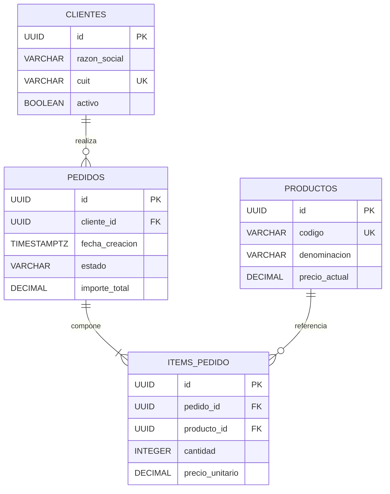

# Especificación de Mapeo Objeto-Relacional Lógico

**Caso de Uso / Módulo:** {{NOMBRE_MODULO}}  
**Modelo de Clases Fuente (DCD):** {{REFERENCIA_DCD}}  
**Modo:** `mapping` (Lógico) / `schema` / `ddl`  
**Fecha:** {{FECHA}}  

---

## 1. Alcance, Hechos Confirmados y Supuestos (TBD)
- **Clases Persistentes Mapeadas:** {{Lista de entidades del dominio que requieren persistencia}}.
- **Clases No Persistentes:** {{Objetos transitorios, controladores o servicios excluidos}}.
- **Supuestos y Decisiones de Persistencia:**
  | Elemento | Ambigüedad / Duda | Impacto Relacional | Decisión Provisional |
  |---|---|---|---|
  | `{{Clase}}` | Nulabilidad de atributo | Obligatoriedad en BD | `NOT NULL` justificado por regla de negocio |

---

## 2. Matriz de Mapeo Clases OO $\to$ Tablas Relacionales

| Clase / Atributo OO | Tabla / Columna Relacional | Tipo de Dato Lógico | Restricciones (PK / FK / UQ / Check) | Nulabilidad | Justificación / Regla |
|---|---|---|---|:---:|---|
| `Pedido` (Clase) | `pedidos` (Tabla) | Entidad principal | PK en `id` | - | Entidad transaccional |
| `Pedido.id` | `pedidos.id` | `Identifier` (UUID) | `PRIMARY KEY` | NOT NULL | Identificador inmutable |
| `Pedido.fecha` | `pedidos.fecha_creacion` | `TimestampTZ` | - | NOT NULL | Fecha y hora con zona |
| `Pedido.cliente` | `pedidos.cliente_id` | `Identifier` (UUID) | `FOREIGN KEY` $\to$ `clientes(id)` | NOT NULL | Asociación 1:N obligatoria |
| `Pedido.total` | `pedidos.importe_total` | `Decimal(12,2)` | `CHECK (importe_total >= 0)` | NOT NULL | Importe monetario |

---

## 3. Modelo Relacional Lógico (Mermaid ER)

---

## 4. Registro de Decisiones de Mapeo
- **Estrategia de Herencia:** {{TPH / TPT / TPC}} seleccionada para la jerarquía `{{Jerarquia}}` debido a {{Justificación de joins vs dispersión de nulos}}.
- **Relaciones N a M:** Resueltas mediante tabla asociativa intermedia con clave primaria compuesta o subrogada.
- **Objetos de Valor (Value Objects):** Mapeados como columnas embebidas (*flattening*) en la tabla contenedora.

---

## 5. Checklist de Integridad Relacional y Normalización
- [ ] ¿Todas las tablas cuentan con una Clave Primaria (PK) explícita e inmutable?
- [ ] ¿El esquema respeta 3FN (Tercera Forma Normal) salvo desnormalización deliberadamente justificada?
- [ ] ¿Toda Clave Foránea (FK) referencia una columna existente del mismo tipo de dato exacto?
- [ ] ¿Se eliminaron los scripts destructivos automáticos (`DROP TABLE`) preservando la seguridad de los datos?
