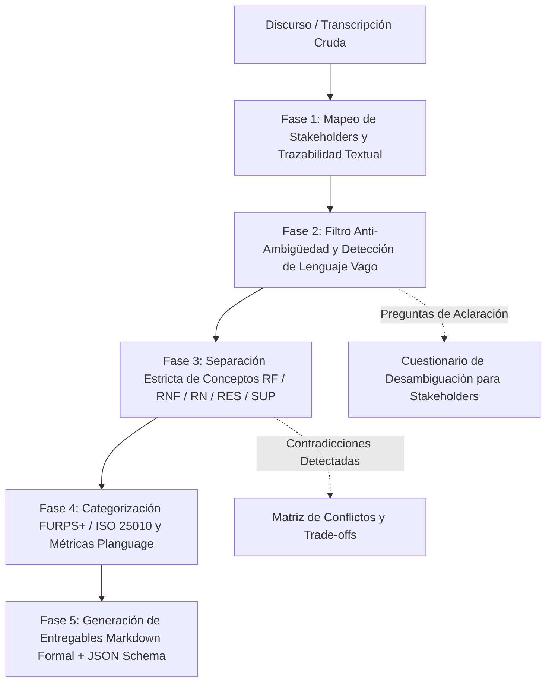

---
name: requirementsExtractor
description: >-
  Extrae, desambigua y estructura requerimientos de software formales y trazables a partir de
  transcripciones de entrevistas, minutas de reunión, notas de relevamiento y discursos no estructurados
  de stakeholders. Clasifica rigurosamente Requerimientos Funcionales (RF), Atributos de Calidad y
  No Funcionales (RNF) bajo FURPS+ e ISO/IEC 25010, Reglas de Negocio (RN), Supuestos (SUP),
  Restricciones (RES) y Dependencias (DEP). Detecta lenguaje vago o subjetivo y genera métricas
  cuantificables bajo Planguage (Tom Gilb) y cuestionarios de clarificación para stakeholders.
---

# Extractor de Requerimientos desde Entrevistas no Estructuradas (`rawInterviewToRequirementsExtractor`)

Esta skill proporciona las directrices metodológicas, algoritmos heurísticos, taxonomías de calidad y plantillas para transformar transcripciones de entrevistas, audios de relevamiento, minutas y notas informales en **Especificaciones de Requerimientos de Software (ERS / SRS)** completas, rigurosas y verificables.

---

## 1. Arquitectura del Pipeline de Extracción

El proceso de extracción opera en un pipeline secuencial de 5 fases estructuradas:



---

## 2. Separación Estricta de Conceptos

Para evitar la contaminación entre la política del negocio y las decisiones técnicas de software, aplique la siguiente regla de demarcación:

```
+--------------------------------------------------------------------------------------------------+
|                                    DISCURSO DEL STAKEHOLDER                                     |
+--------------------------------------------------------------------------------------------------+
          |                                  |                                  |
          v                                  v                                  v
+-----------------------+          +-----------------------+          +-----------------------+
|  REGLA DE NEGOCIO     |          |  REQ. FUNCIONAL (RF)  |          |  REQ. NO FUNCIONAL    |
|       (RN-XXX)        |          |       (RF-XXX)        |          |       (RNF-XXX)       |
|                       |          |                       |          |                       |
| Invariante, política, |          | Acción, entrada,      |          | Atributo de calidad,  |
| cálculo o condición   | -------> | transformación y      | <------- | rendimiento, SLA,     |
| que existe aun sin    | (Aplica) | salida que ejecuta el | (Limita) | seguridad, usabilidad |
| computadoras.         |          | software en pantalla. |          | o confiabilidad.      |
+-----------------------+          +-----------------------+          +-----------------------+
          |                                  |                                  |
          +------------------+---------------+----------------------------------+
                             |
                             v
           +-----------------------------------+
           |     ESTRUCTURAS DE ENTORNO        |
           |                                   |
           | • SUP-XXX: Supuesto no confirmado |
           | • RES-XXX: Restricción inmutable  |
           | • DEP-XXX: Dependencia externa    |
           | • AMB-XXX: Término vago a aclarar |
           | • CONF-XX: Conflicto entre roles  |
           +-----------------------------------+
```

### 2.1. Definición de Prefijos y Entidades
- `RF-XXX`: **Requerimiento Funcional**. Capacidad que el software provee al usuario o sistema consumidor.
- `RNF-XXX`: **Requerimiento No Funcional**. Criterio de calidad o nivel de servicio verificable (FURPS+ / ISO 25010).
- `RN-XXX`: **Regla de Negocio**. Política, cálculo, fórmula o condición de negocio independiente del software.
- `SUP-XXX`: **Supuesto (Assumption)**. Hipótesis asumida por falta de datos explícitos, con riesgo y validación.
- `RES-XXX`: **Restricción (Constraint)**. Límite tecnológico, legal o arquitectónico impuesto e innegociable.
- `DEP-XXX`: **Dependencia**. Sistema externo, base de datos legada o proceso previo obligatorio.
- `AMB-XXX`: **Ambigüedad Detectada**. Término impreciso con su pregunta de clarificación.
- `CONF-XXX`: **Conflicto de Stakeholders**. Discrepancia de intereses o requerimientos incompatibles.

---

## 3. Taxonomías de Calidad: Matriz FURPS+ e ISO/IEC 25010:2023

Al clasificar un `RNF`, mapee la necesidad del stakeholder a ambas taxonomías:

| Categoría FURPS+ | Dimensión ISO/IEC 25010:2023 | Subcaracterísticas Clave | Métricas Estándar |
| :--- | :--- | :--- | :--- |
| **Functionality** | **Adecuación Funcional / Seguridad** | Completitud, Exactitud, Confidencialidad, Integridad, No repudio | % Cobertura funcional, AES-256, TLS 1.3, HMAC |
| **Usability** | **Usabilidad / Calidad en Uso** | Aprendibilidad (*Learnability*), Operabilidad, Protección contra errores, Estética | Tiempo en tarea (*Time on Task*), Puntuación SUS > 80, Clics <= 3, WCAG 2.1 AA |
| **Reliability** | **Fiabilidad** | Disponibilidad, Tolerancia a fallos, Recuperabilidad | SLA (99.9%), MTBF, MTTR < 15 min, RPO < 5 min, RTO < 30 min |
| **Performance** | **Eficiencia de Desempeño** | Comportamiento temporal, Utilización de recursos, Capacidad | Latencia P95/P99 en ms, Throughput (TPS), % Uso CPU/RAM |
| **Supportability** | **Mantenibilidad / Portabilidad** | Modularidad, Mantenibilidad, Comprobabilidad (*Testability*), Adaptabilidad | Cobertura de tests >= 80%, Complejidad ciclomática < 10, OpenAPI 3.0 |
| **+ (Plus)** | **Restricciones Técnicas y Físicas** | Diseño (+D), Implementación (+I), Interfaz (+IF), Físicas (+P) | Motores de BD, SO, Protocolos, Terminales rugerizadas |

*Consulte la guía completa en [furps_and_iso25010_taxonomy.md](file:///C:/Users/Diego/.gemini/config/skills/rawInterviewToRequirementsExtractor/references/furps_and_iso25010_taxonomy.md).*

---

## 4. Motor Anti-Ambigüedad y Lenguaje Vago

### 4.1. Vocabulario de Alerta Lingüística
El agente debe identificar automáticamente las siguientes expresiones en el discurso:
1. **Adjetivos Subjetivos:** *"amigable"*, *"intuitivo"*, *"fácil"*, *"rápido"*, *"robusto"*, *"escalable"*, *"óptimo"*, *"moderno"*, *"seguro"*, *"liviano"*.
2. **Adverbios y Falsos Cuantificadores:** *"en tiempo real"*, *"al toque"*, *"inmediatamente"*, *"frecuentemente"*, *"casi siempre"*, *"muchos"*, *"pocos"*.
3. **Cláusulas de Escape:** *"según corresponda"*, *"de acuerdo al caso"*, *"y/o"*, *"etcétera"*, *"adecuado"*, *"a criterio del usuario"*, *"lo antes posible"*.
4. **Sujetos Omitidos y Voz Pasiva:** *"se deberá procesar"*, *"el archivo será enviado"*, *"los datos se validarán"*.

### 4.2. Transformación a Estándar Planguage (Tom Gilb)
Para cada adjetivo o atributo cualitativo, genere la ficha de medición formal:

```text
TAG: RNF-01 (Rendimiento en Búsqueda)
AMBIGUOUS_SOURCE: "Tiene que buscar los productos al instante."
SCALE: Tiempo de respuesta en milisegundos desde el clic hasta la renderización de resultados.
METER: Prueba automatizada con k6 bajo 100 usuarios concurrentes en catálogo de 500.000 SKUs.
BASELINE: 4.500 ms (Sistema legado actual).
WORST_ACCEPTABLE: 1.200 ms (P95).
TARGET_PLAN: <= 300 ms (P95).
STRETCH_WISH: <= 100 ms con índices en memoria (Elasticsearch/Redis).
```

### 4.3. Generador de Preguntas de Clarificación para Stakeholders
Para cada término vago no resuelto, formule preguntas con opciones cerradas para acelerar la toma de decisiones:
> **Ejemplo:**  
> *"En la entrevista mencionó que el reporte debe emitirse 'lo antes posible'.*  
> *a) ¿Cuál es el tiempo máximo admisible antes de que se considere fallo operativo? (< 5 seg, < 1 min, < 10 min)*  
> *b) ¿El usuario debe esperar en pantalla o prefiere notificación asíncrona por correo al finalizar?"*

*Consulte el catálogo completo en [ambiguity_detection_lexicon.md](file:///C:/Users/Diego/.gemini/config/skills/rawInterviewToRequirementsExtractor/references/ambiguity_detection_lexicon.md).*

---

## 5. Formato de Salida y Entregables

Cada ejecución del extractor debe generar dos artefactos perfectamente sincronizados:

1. **Documento Markdown de Especificación (`ERS_Specification.md`)**:
   - Ficha de Stakeholders y Objetivos.
   - Tabla de Requerimientos Funcionales (`RF-XXX`) con actores, E/S, Reglas asociadas, prioridad MoSCoW y cita textual (`[STK:Min/Par]`).
   - Tabla de Requerimientos No Funcionales (`RNF-XXX`) con FURPS+, ISO 25010 y Planguage.
   - Tabla de Reglas de Negocio (`RN-XXX`) con formulación lógica formal.
   - Listado de Supuestos (`SUP-XXX`), Restricciones (`RES-XXX`) y Dependencias (`DEP-XXX`).
   - Matriz de Desambiguación con Preguntas para Stakeholders (`AMB-XXX`).
   - Matriz de Conflictos de Negocio (`CONF-XXX`).

2. **Objeto JSON Estructurado (`extracted_requirements.json`)**:
   - Conforme al esquema JSON en [extracted_requirements.schema.json](file:///C:/Users/Diego/.gemini/config/skills/rawInterviewToRequirementsExtractor/templates/extracted_requirements.schema.json).

*Consulte la plantilla Markdown en [requirements_specification.template.md](file:///C:/Users/Diego/.gemini/config/skills/rawInterviewToRequirementsExtractor/templates/requirements_specification.template.md).*

---

## 6. Lista de Verificación de Calidad (Quality Gate)

Antes de dar por finalizada la extracción, verifique:
- [ ] **Trazabilidad 100%**: Todo `RF`, `RNF` y `RN` contiene la cita textual exacta y la referencia al stakeholder de origen.
- [ ] **Cero Adjetivos Vacíos**: Ningún `RNF` contiene palabras como "amigable", "rápido" o "seguro" sin su correspondiente bloque Planguage medible.
- [ ] **Aislamiento de Reglas**: Ninguna `RN` describe pantallas, botones, tecnologías o bases de datos; describe únicamente la política o cálculo de negocio.
- [ ] **Manejo de Excepciones Implícitas**: Se identificaron caídas de red, productos vencidos, autorizaciones denegadas o estados de error.
- [ ] **Priorización MoSCoW**: Todos los `RF` están clasificados como Must Have, Should Have, Could Have o Won't Have.
- [ ] **Validación de Esquema JSON**: El bloque JSON generado valida contra [extracted_requirements.schema.json](file:///C:/Users/Diego/.gemini/config/skills/rawInterviewToRequirementsExtractor/templates/extracted_requirements.schema.json).

---

## 7. Referencias y Recursos Disponibles

- **Taxonomía FURPS+ e ISO 25010**: [furps_and_iso25010_taxonomy.md](file:///C:/Users/Diego/.gemini/config/skills/rawInterviewToRequirementsExtractor/references/furps_and_iso25010_taxonomy.md)
- **Léxico de Ambigüedad y Preguntas**: [ambiguity_detection_lexicon.md](file:///C:/Users/Diego/.gemini/config/skills/rawInterviewToRequirementsExtractor/references/ambiguity_detection_lexicon.md)
- **Heurísticas de Elicitación**: [elicitation_heuristics.md](file:///C:/Users/Diego/.gemini/config/skills/rawInterviewToRequirementsExtractor/references/elicitation_heuristics.md)
- **Plantilla Markdown de Requerimientos**: [requirements_specification.template.md](file:///C:/Users/Diego/.gemini/config/skills/rawInterviewToRequirementsExtractor/templates/requirements_specification.template.md)
- **Esquema JSON Formal**: [extracted_requirements.schema.json](file:///C:/Users/Diego/.gemini/config/skills/rawInterviewToRequirementsExtractor/templates/extracted_requirements.schema.json)
- **Ejemplo Práctico Completo**: [logistics_stakeholder_interview_case.md](file:///C:/Users/Diego/.gemini/config/skills/rawInterviewToRequirementsExtractor/examples/logistics_stakeholder_interview_case.md)
