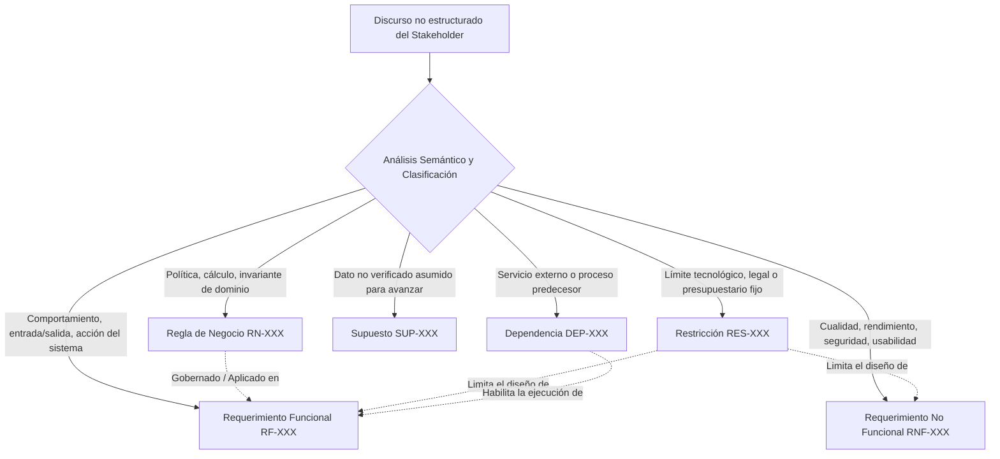

# Heurísticas de Elicitación y Análisis de Discurso de Stakeholders

Esta guía proporciona el marco analítico para transformar transcripciones de entrevistas, minutas de reunión, notas desordenadas y expresiones informales de usuarios en especificaciones de requerimientos formales, precisas y trazables.

---

## 1. Principio Fundamental: Separación Estricta de Conceptos

Uno de los errores más comunes en la ingeniería de requisitos es mezclar la política del negocio con la implementación de software. El extractor debe aplicar la siguiente regla de demarcación estricta:

### 1.1. Regla de Negocio (RN) vs. Requerimiento Funcional (RF)
- **Regla de Negocio (`RN-XXX`)**: Es una directriz o política del negocio que existiría **incluso si no hubiera computadoras o software**.  
  *Ejemplo:* *"Los clientes con categoría VIP tienen un 15% de descuento en compras superiores a $50.000, siempre que no registren facturas vencidas."*
- **Requerimiento Funcional (`RF-XXX`)**: Es la capacidad o comportamiento específico que el **software** debe ejecutar para soportar el negocio o aplicar una regla.  
  *Ejemplo:* *"El sistema debe calcular y aplicar automáticamente el porcentaje de descuento sobre el total de la orden al momento de facturar, validando la política RN-05."*

---

## 2. Heurísticas para Detectar Requerimientos Implícitos

Los stakeholders rara vez mencionan aspectos obvios para ellos, o requisitos de infraestructura y seguridad. El agente debe identificar las siguientes señales de requisitos implícitos:

| Señal en el Discurso | Requerimiento Implícito a Derivar | Clasificación |
| :--- | :--- | :--- |
| *"El operario escanea el código en el depósito y sigue con el próximo bulto..."* | Manejo de escenarios sin conectividad Wi-Fi (Offline-first y sincronización en cola). | RNF (Reliability / Offline Capability) |
| *"Queremos que el cliente pueda pagar con tarjeta de crédito en cuotas..."* | Integración con Gateway de Pagos (Stripe/MercadoPago), almacenamiento tokenizado y cumplimiento PCI-DSS. | RF (Integración Pasarela) + RNF (Seguridad PCI-DSS) + DEP (Gateway) |
| *"A fin de mes el gerente de finanzas necesita ver la conciliación bancaria..."* | Generación de reporte consolidado, exportación a formato Excel/PDF y control de permisos de acceso. | RF (Reporte Conciliación) + RF (Exportación) + RN (Permisos de Rol) |
| *"Si el chofer no encuentra al destinatario, reprograma la entrega..."* | Gestión de estados de remito/envío (Máquina de estados: *En Tránsito -> Intento Fallido -> Reprogramado*), registro de motivo y geolocalización. | RF (Gestión de Estados de Envío) + RN (Máximo de intentos permitidos) |

---

## 3. Manejo de Conflictos y Contradicciones entre Stakeholders

Cuando múltiples interlocutores expresan visiones contrapuestas durante la entrevista, el extractor no debe elegir arbitrariamente una de ellas. Debe:

1. **Documentar la discrepancia**: Identificar los interlocutores, sus roles y las citas textuales enfrentadas.
2. **Clasificar el tipo de conflicto**:
   - **Conflicto de Interés/Alcance** (ej. Ventas quiere formulario de 1 solo campo vs. Finanzas exige 8 datos fiscales obligatorios).
   - **Conflicto Terminológico** (ej. Logística llama "Bulto" a lo que Facturación llama "Ítem Facturable").
   - **Conflicto de Prioridad** (ej. Operaciones exige disponibilidad inmediata vs. Seguridad exige doble factor biométrico).
3. **Formular una Matriz de Decisión / Trade-off**:
   - Presentar las alternativas con sus pros, contras e impacto técnico.
   - Proponer una solución de compromiso (ej. *Carga progresiva: 1 campo en landing de ventas + enriquecimiento de datos fiscales en el checkout*).
   - Generar un Ítem de Decisión Pendiente (`DEC-XXX`) para el Product Owner / Comité de Dirección.

---

## 4. Trazabilidad Textual Estricta (Traceability Tagging)

Cada requerimiento, regla o supuesto derivado debe mantener una referencia inequívoca a la fuente primaria de información:

- **Formato de Cita**: `[FUENTE:PXX]` donde `FUENTE` es el identificador del documento/entrevista (ej. `ENT-01`, `MIN-03`, `NOTAS-DISCOVERY`) y `PXX` es el número de párrafo o minuto de grabación (`MIN-14:32`).
- **Cita Textual (*Verbatim Quote*)**: Debe incluirse la frase exacta del stakeholder entre comillas, preservando los modismos y el tono original como evidencia de auditoría de elicitación.
