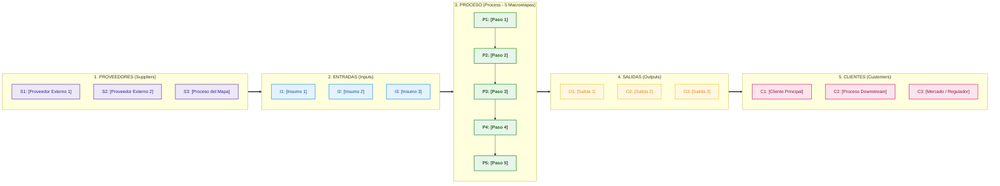

# Matriz SIPOC: [Nombre del Proceso] (GMP Etapa 2 - Matriz 1)

## 1. Definición y Delimitación del Proceso (Encuadre de Cátedra)
- **Proceso u Operación:** `[Nombre del Proceso en Verbo Infinitivo + Objeto Sustantivo]`
- **Cliente Principal del Proceso:** `[Beneficiario principal directo (Interno o Externo)]`
- **Dueño / Responsable:** `[Rol o Área responsable del extremo a extremo del proceso]`
- **Objetivo del Proceso:** `[Propósito central y qué asegura el proceso para la organización y el cliente]`
- **Alcance Operativo:** `[Descripción breve de las áreas, sedes o situaciones que cubre el proceso]`
- **Límites del Proceso (Fronteras Deterministas):**
  - **Inicio (Desde / Disparador):** `[Evento fáctico o solicitud que activa la primera macroetapa]`
  - **Fin (Hasta / Evento Terminal):** `[Evento que marca la conclusión y entrega del resultado/salida]`
- **Marco Regulatorio:**
  - **Normativa Externa:** `[Leyes nacionales, resoluciones ministeriales, normas de entes reguladores o certificadoras]`
  - **Reglas de Negocio Internas:** `[Estatuto institucional, reglamento interno, políticas de calidad y manuales]`
- **Valor Creado por el Proceso:** `[El "corazón" del proceso: ¿Por qué existe y qué valor diferencial entrega al cliente?]`

---

## 2. Matriz SIPOC Principal

| Proveedores (S) | Entradas / Insumos (I) | Macroproceso (P - 4 a 7 Pasos) | Salidas / Entregables (O) | Clientes / Destinatarios (C) |
|---|---|---|---|---|
| **Proveedores Externos:** - S1: `[Proveedor Externo 1]` - S2: `[Proveedor Externo 2]`  **Procesos del Mapa:** - S3: `[Proceso del Mapa (Soporte/Estratégico)]` | - I1: `[Insumo / Dato 1]` - I2: `[Insumo / Documento 2]` - I3: `[Insumo / Recurso 3]` | P1: `[Paso 1: Verbo + Objeto]` P2: `[Paso 2: Verbo + Objeto]` P3: `[Paso 3: Verbo + Objeto]` P4: `[Paso 4: Verbo + Objeto]` P5: `[Paso 5: Verbo + Objeto]` | - O1: `[Producto / Servicio Principal]` - O2: `[Documento / Estado Conforme]` - O3: `[Registro / Dato para otros procesos]` | **Cliente Principal:** - C1: `[Beneficiario Directo]`  **Clientes Internos (Procesos):** - C2: `[Proceso Downstream del Mapa]`  **Cliente Externo / Sociedad:** - C3: `[Mercado Laboral / Regulador]` |

---

## 3. Especificaciones Técnicas y Requisitos de Calidad de Entradas

| ID | Entrada / Insumo | Proveedor (S) | Requisito Técnico / Criterio de Aceptación | Formato / Medio de Captura |
|---|---|---|---|---|
| I1 | `[Nombre Insumo 1]` | S1: `[Proveedor Externo 1]` | `[Especificación técnica: completitud de campos, firmas requeridas, tolerancias, tiempo máximo de frescura]` | `[Digital PDF / Formulario Web / EDI / Papel Físico]` |
| I2 | `[Nombre Insumo 2]` | S2: `[Proveedor Externo 2]` | `[Criterio de aceptación: certificado de calidad, validación de integridad, rango dimensional]` | `[ERP / Base de Datos / Correo electrónico]` |
| I3 | `[Nombre Insumo 3]` | S3: `[Proceso del Mapa]` | `[Regla de negocio: autorización previa aprobada, validación fiscal/contable, estado activo]` | `[Servicio REST / Webhook / Hoja de Ruta]` |

---

## 4. Especificaciones Técnicas y Requisitos de Calidad de Salidas

| ID | Salida / Entregable | Cliente Destinatario (C) | Especificación de Calidad / SLA | Criterio de Conformidad / Aceptación |
|---|---|---|---|---|
| O1 | `[Nombre Salida 1]` | C1: `[Cliente Principal]` | `[SLA de entrega: Lead Time máximo, estándar de servicio, tolerancia técnica]` | `[Inspección visual / Firma de remito conforme / Validación de usuario]` |
| O2 | `[Nombre Salida 2]` | C2: `[Cliente Interno - Proceso]` | `[Tasa de defectos permitida: Scrap < 0.5%, exactitud de datos 100%, disponibilidad]` | `[Validación automática / Checksum / Conciliación en sistema]` |
| O3 | `[Nombre Salida 3]` | C3: `[Cliente Externo / Sociedad]` | `[Cumplimiento normativo, persistencia en repositorio oficial, reporte auditable]` | `[Acuse de recibo de ente / Certificado de entrega legal]` |

---

## 5. Representación Visual SIPOC (diagramStudio)

---

## 6. Matriz de Trazabilidad y Validación de Fronteras

- **Conteo de Macroetapas:** 5 pasos (Rango canónico de cátedra verificado: 4 a 7).
- **Consistencia de Entradas:** Todas las entradas provienen de un proveedor identificado (externo o proceso del mapa) y poseen criterios técnicos de recepción.
- **Consistencia de Salidas:** Todas las salidas tienen clientes destinatarios (principal, interno o externo) y especificaciones de calidad/SLA explícitas.
- **Alineación con el Mapa de Procesos:** Proveedores y clientes internos mapeados a procesos Estratégicos, Clave o de Soporte (SLI_U1_C03).
- **Sincronización BPMN (sipoc-sync):** Fronteras y flujo listos para validación matemática contra pools, lanes, tareas y data objects en `bpmnExtractor`.
