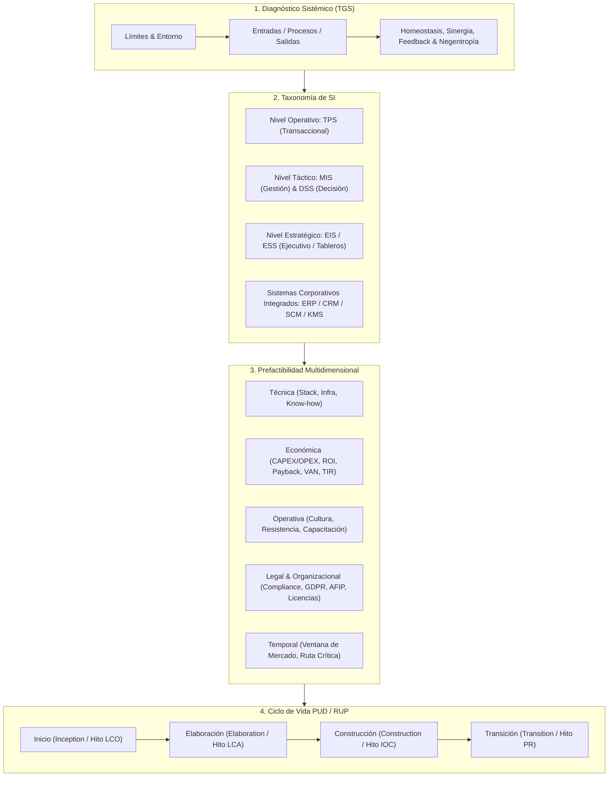
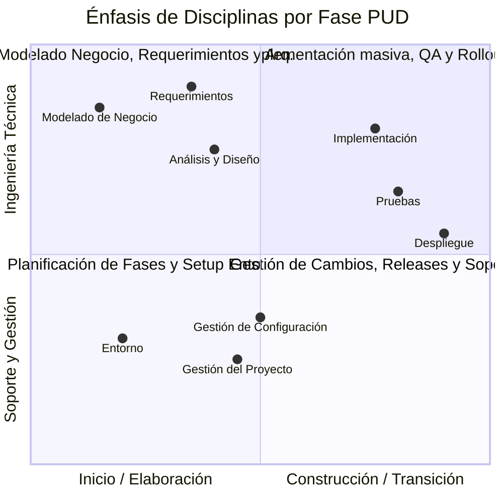
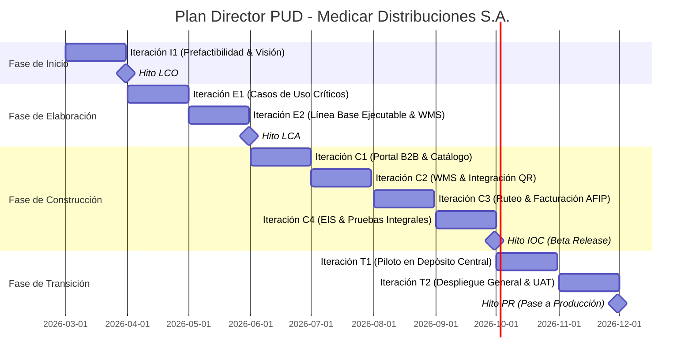

---
name: systemClassifier
description: >-
  Analiza, diagnostica y clasifica sistemas organizacionales y de software mediante la Teoría General de Sistemas (TGS),
  la Taxonomía de Sistemas de Información (TPS, MIS, DSS, EIS, ERP, CRM, SCM, KMS), el Estudio de Prefactibilidad
  Multidimensional (Técnica, Económica [ROI, Payback, VAN/TIR], Operativa, Legal/Organizacional y Temporal) y su
  planificación y alineación con el ciclo de vida del Proceso Unificado de Desarrollo (PUD / RUP: Inicio, Elaboración,
  Construcción, Transición).
---

# Systems Feasibility & PUD Classifier (`systemsFeasibilityAndPudClassifier`)

Esta skill proporciona el marco metodológico, analítico y operativo para evaluar la viabilidad integral de iniciativas de software, modelar sistemas organizacionales bajo los principios de la **Teoría General de Sistemas (TGS)**, clasificar sistemas de información según la **pirámide organizacional y grado de estructuración de decisiones**, y estructurar la hoja de ruta y gobierno del proyecto dentro de las fases y disciplinas del **Proceso Unificado de Desarrollo (PUD / RUP)**.

---

## 1. Alcance y Capacidades Clave

La skill `systemsFeasibilityAndPudClassifier` asiste al analista de sistemas y al equipo de ingeniería de software en cuatro capacidades fundamentales:

1. **Diagnóstico Sistémico (TGS)**: Modelar la organización y el software como sistemas abiertos, identificando con precisión sus límites/fronteras, entorno, entradas, transformaciones, salidas, retroalimentación (positiva/negativa), mecanismos de homeostasis, fuentes de entropía y negentropía, propiedades sinérgicas y equifinalidad.
2. **Taxonomía de Sistemas de Información (SI)**: Clasificar componentes funcionales y aplicativos en TPS, MIS, DSS, EIS/ESS, ERP, CRM, SCM y KMS, alineando su propósito con el nivel jerárquico organizacional (Operativo, Táctico, Estratégico) y el grado de estructuración de las decisiones que soporta.
3. **Estudio de Prefactibilidad Multidimensional**: Determinar cuantitativa y cualitativamente la viabilidad antes de comprometer inversiones mayores mediante 5 dimensiones analíticas:
   - **Factibilidad Técnica**: Infraestructura, hardware, stack de software, madurez tecnológica y competencias del equipo.
   - **Factibilidad Económica**: Cuadro integral CAPEX/OPEX, beneficios tangibles e intangibles, y evaluación financiera formal (ROI, Periodo de Recupero / Payback, VAN/NPV a tasa de descuento $k$, y TIR/IRR).
   - **Factibilidad Operativa**: Disposición hacia el cambio, análisis de resistencia cultural, curva de aprendizaje y plan estratégico de capacitación.
   - **Factibilidad Legal, Regulatoria y Organizacional**: Cumplimiento de protección de datos (ej. Ley 25.326, GDPR), normativas fiscales (AFIP/ARCA), regulaciones sanitarias/sectoriales, licenciamiento y convenios colectivos.
   - **Factibilidad Temporal / Calendario**: Ventana de oportunidad de mercado, ruta crítica y cronograma macro de hitos.
4. **Planificación y Mapeo al Ciclo de Vida PUD**: Distribuir el alcance, los riesgos y las 9 disciplinas en las 4 fases del PUD (*Inception*, *Elaboration*, *Construction*, *Transition*), definiendo los criterios de superación de los hitos formales (*LCO*, *LCA*, *IOC*, *PR*).



---

## 2. Marco Teórico y Criterios Metodológicos

### 2.1. Diagnóstico mediante Teoría General de Sistemas (TGS)

La TGS (formulada originariamente por Ludwig von Bertalanffy y adaptada a la ingeniería de sistemas) concibe a las organizaciones y a las aplicaciones de software como sistemas abiertos con intercambio permanente de materia, energía e información con su entorno.

| Concepto TGS | Definición Operacional | Directriz de Análisis en Proyectos de Software |
| :--- | :--- | :--- |
| **Límite / Frontera** | Línea de demarcación (física, lógica o conceptual) que separa al sistema de su entorno. Define lo que está dentro y fuera del alcance. | Establece con exactitud qué módulos, tablas y funcionalidades pertenecen al software a construir y qué procesos quedan en sistemas externos o manuales. |
| **Ambiente / Entorno** | Todo lo exterior a la frontera del sistema que interactúa con él, influye sobre él o es impactado por sus salidas. | Identifica actores externos (clientes, proveedores, entes fiscales/reguladores) y servicios de terceros (APIs, pasarelas de pago, webservices). |
| **Entradas (Inputs)** | Datos, eventos, órdenes, recursos o señales que ingresan al sistema desde el entorno. | Identifica contratos de interfaz, DTOs de entrada, payloads JSON/XML, eventos de mensajería o formularios web/móviles. |
| **Procesamiento (Throughput)** | Mecanismos de transformación interna regidos por algoritmos y reglas del negocio. | Lógica de negocio, servicios de dominio, validaciones de reglas de negocio (`RN-XX`) y orquestación de transacciones ACID. |
| **Salidas (Outputs)** | Información procesada, documentos, comprobantes o eventos emitidos hacia el entorno. | Comprobantes fiscales electrónicos, remitos de despacho, notificaciones push/email, reportes consolidados y eventos emitidos. |
| **Retroalimentación (Feedback)** | Información de salida que se reinyecta al sistema para monitorear y regular su comportamiento. | **Negativa (Estabilizadora)**: Detecta desvíos de metas y aplica correcciones (ej. alertas de stock mínimo para reabastecimiento). **Positiva (Amplificadora)**: Detecta patrones crecientes y refuerza la tendencia (ej. detección de alta demanda para escalar servidores o sugerir promociones). |
| **Homeostasis** | Capacidad del sistema de mantener su equilibrio interno y continuidad operativa ante perturbaciones del entorno. | Resiliencia arquitectónica: balanceadores de carga, colas asíncronas para picos de tráfico, patrones *Circuit Breaker* y tolerancia a fallos. |
| **Entropía vs. Negentropía** | **Entropía**: Tendencia natural hacia el desorden, inconsistencia de datos o degradación de código. **Negentropía**: Energía o información importada que restablece el orden. | La entropía se manifiesta en desincronización de inventario físico vs. digital o deuda técnica acumulada. La negentropía son jobs de conciliación, refactorizaciones y pipelines CI/CD. |
| **Sinergia** | Propiedad emergente donde el resultado del sistema integrado es cualitativa y cuantitativamente superior a la suma de sus partes aisladas ($1+1 > 2$). | Demuestra el valor emergente de conectar en tiempo real el portal B2B con el WMS de depósito y el ERP contable frente a silos desconectados. |
| **Equifinalidad** | Principio según el cual un sistema puede alcanzar el mismo estado final a través de diferentes caminos o condiciones iniciales. | Ofrecer al usuario múltiples canales equivalentes (portal web, aplicación móvil, bot interactivo o API batch) para completar una misma transacción. |

---
### 2.2. Taxonomía de Sistemas de Información (SI)

Los Sistemas de Información se clasifican atendiendo a la **pirámide organizacional de Robert Anthony** y a la **naturaleza y estructuración de las decisiones**:

```
                  /\
                 /  \     Nivel Estratégico (Decisiones No Estructuradas)
                /EIS \    -> EIS / ESS / BI Ejecutivo / Tableros de Mando
               /------\
              /  MIS   \  Nivel Táctico (Decisiones Semiestructuradas)
             /   DSS    \ -> MIS / DSS / OLAP / Dashboards de Gestión
            /------------\
           /     TPS      \ Nivel Operativo (Decisiones Estructuradas)
          /  ERP / CRM /SCM\-> TPS / POS / WMS / Facturación / Trámites
         /------------------\
```

#### Cuadro Comparativo de Tipologías de SI

| Tipo de SI | Nombre Formal | Nivel Jerárquico | Grado de Estructuración | Frecuencia / Horizonte | Fuentes de Información | Casos de Uso Representativos |
| :--- | :--- | :--- | :--- | :--- | :--- | :--- |
| **TPS** | *Transaction Processing System* | Operativo | Totalmente estructurada (reglas fijas) | Tiempo real / Transaccional diario | Internas (operadores de línea, escáneres, pedidos, trámites) | Facturación en caja, registro de pedidos B2B, cobro por pasarela, lectura de código de barras, emisión de remitos. |
| **MIS** | *Management Information System* | Táctico / Supervisión | Semiestructurada (control por desvíos y resúmenes) | Periódica (semanal, mensual, trimestral) | Internas (agregación y consolidación de datos TPS) | Resumen mensual de ventas por sucursal, control de desvíos presupuestarios, reporte de horas extras, rotación de stock. |
| **DSS** | *Decision Support System* | Táctico / Directivo | Semiestructurada / No estructurada | Interactiva / Ad-hoc / Simulaciones | Internas consolidadas + Modelos cuantitativos/estadísticos | Simulador de escenarios de precios (*What-if*), optimizador de rutas logísticas de despacho, scoring de riesgo crediticio. |
| **EIS / ESS** | *Executive Information System* | Estratégico | No estructurada (visión global de negocio) | Largo plazo / Continuo (Dashboard de control) | Internas agregadas + Externas (mercado, inflación, competencia) | Tablero de Mando Integral (*Balanced Scorecard*), KPIs de margen corporativo, análisis de participación de mercado. |
| **ERP** | *Enterprise Resource Planning* | Transversal Corporativo | Integración Operativa y Táctica | Tiempo real e integrado | Base de datos relacional corporativa unificada | Núcleo integral que sincroniza Contabilidad, Tesorería, Compras, Inventario, Facturación y Recursos Humanos. |
| **CRM** | *Customer Relationship Management* | Marketing / Comercial / Soporte | Operativa, Táctica y Analítica | Ciclo de vida completo del cliente | Omnicanal (portal web, email, WhatsApp, llamadas) | Gestión de prospectos (leads), pipeline de oportunidades comerciales, tickets de mesa de ayuda y soporte postventa. |
| **SCM** | *Supply Chain Management* | Cadena de Suministro / Logística | Operativa y Táctica interorganizacional | Tiempo real / Planificación de cadena | Proveedores, transportistas, depósitos, centros de distribución | Previsión colaborativa de demanda, tracking GPS de flota, gestión de cross-docking y órdenes de reposición automática. |
| **KMS** | *Knowledge Management System* | Transversal / I+D | No estructurada / Colaborativa | Permanente | Repositorios documentales, lecciones aprendidas, bases de conocimiento | Wiki institucional, base de conocimiento de resolución de incidencias técnicas, gestión de manuales y patentes. |

---

### 2.3. Metodología de Estudio de Prefactibilidad Multidimensional

El estudio de prefactibilidad es el filtro metodológico que dictamina formalmente si una iniciativa de software es viable antes de comprometer recursos de desarrollo. Se estructura en 5 dimensiones obligatorias:

#### 1. Factibilidad Técnica
- **Infraestructura y Hardware**: Servidores (on-premise vs. cloud AWS/Azure/GCP), conectividad y ancho de banda, periféricos especializados (lectores RFID, terminales industriales), redundancia y almacenamiento.
- **Software de Base y Stack Tecnológico**: Lenguajes de backend/frontend, motores de bases de datos (SQL ACID vs. NoSQL), brokers de eventos (RabbitMQ/Kafka), librerías y compatibilidad con APIs legadas.
- **Madurez Tecnológica**: Nivel de estabilidad del stack propuesto (tecnologías probadas con soporte a largo plazo vs. frameworks experimentales).
- **Competencias Técnicas del Equipo**: Capacidad del equipo de ingeniería para desarrollar, desplegar y mantener la arquitectura sin dependencias externas críticas irresolubles.

#### 2. Factibilidad Económica
- **Estructura de Inversión y Costos**:
  - **CAPEX (Inversión Inicial / Gastos de Capital)**: Horas de desarrollo, análisis, diseño y QA; adquisición de infraestructura o licencias iniciales; costos de puesta en marcha; capacitación inicial y migración de datos.
  - **OPEX (Costos Operativos Recurrentes)**: Suscripciones cloud (IaaS/PaaS/SaaS), licencias mensuales, soporte técnico N1/N2/N3, mantenimiento correctivo/evolutivo, enlaces dedicados.
  - **Costos de Transición y Contingencia**: Depuración de datos legados, soporte paralelo durante el despliegue inicial.
- **Estructura de Beneficios**:
  - **Beneficios Tangibles (Cuantificables en dinero)**: Reducción directa de horas extras, disminución de pérdidas por errores humanos de inventario/facturación, ahorro de insumos/papel, reducción de stock inmovilizado, incremento directo en ventas.
  - **Beneficios Intangibles (Cualitativos de alto valor)**: Satisfacción y fidelización del cliente, agilidad y oportunidad en la toma de decisiones directivas, imagen de modernidad institucional, seguridad y trazabilidad auditable.
- **Métricas Financieras Formales**:
  - **Retorno sobre la Inversión (ROI)**:
    $$\text{ROI} = \left( \frac{\text{Beneficios Netos Totales Acumulados}}{\text{Inversión Total (CAPEX)}} \right) \times 100$$
  - **Periodo de Recupero de la Inversión (Payback)**:
    $$\text{Payback} = t_{\text{previo}} + \frac{|\text{Flujo Acumulado Negativo Residual}|}{\text{Flujo Neto del Periodo Siguiente}}$$
  - **Valor Actual Neto (VAN / NPV)** con tasa de descuento o costo de oportunidad $k$:
    $$\text{VAN} = \sum_{t=1}^{n} \frac{F_t}{(1 + k)^t} - I_0 \quad \text{donde } \text{VAN} > 0 \implies \text{Proyecto Rentable}$$
  - **Tasa Interna de Retorno (TIR / IRR)**: Tasa $r$ que hace $\text{VAN} = 0$. $\text{TIR} > k \implies \text{Viable}$.

#### 3. Factibilidad Operativa
- **Aceptación y Resistencia al Cambio**: Identificación de grupos de interés (stakeholders), nivel de apertura o reticencia frente a la automatización, percepción de amenaza laboral.
- **Brecha Digital y Usabilidad**: Grado de alfabetización digital de los usuarios finales; diseño de interfaces accesibles (UX/UI intuitivo) para minimizar la tasa de error.
- **Plan y Calendario de Capacitación**: Estrategia de formación escalonada por roles (administradores, supervisores, operadores), planificada fuera de periodos pico de negocio.

#### 4. Factibilidad Legal, Regulatoria y Organizacional
- **Marco Regulatorio y Protección de Datos**: Ley de Protección de Datos Personales (ej. Ley 25.326 Argentina, GDPR UE), consentimiento informado, políticas de privacidad y retención.
- **Normativas Fiscales y Sectoriales**: Facturación electrónica obligatoria (AFIP/ARCA), regulaciones sanitarias (ANMAT), normativas bancarias (BCRA, PCI-DSS).
- **Licenciamiento y Propiedad Intelectual**: Compatibilidad de licencias de software libre (MIT, Apache 2.0 vs. GPL restrictivas), titularidad del código fuente y acuerdos SLA.
- **Cultura Organizacional y Convenios Colectivos**: Compatibilidad con la estructura jerárquica y convenios laborales vigentes.

#### 5. Factibilidad Temporal / Calendario (*Schedule*)
- **Ventana de Oportunidad**: Fechas límite no negociables de lanzamiento (ej. licitaciones, apertura de ciclo lectivo, normativas legales de aplicación obligatoria).
- **Ruta Crítica y Capacidad Productiva**: Evaluación de si los plazos estimados son alcanzables con la velocidad del equipo sin comprometer la calidad técnica.

#### Dictamen Consolidado de Prefactibilidad
$$\boxed{\textbf{DICTAMEN FINAL: [ FACTIBLE / FACTIBLE CONDICIONADO / NO FACTIBLE ]}}$$
- **FACTIBLE**: Las 5 dimensiones son favorables y no existen bloqueantes. Se autoriza el paso a la fase de Elaboración.
- **FACTIBLE CONDICIONADO**: Existen riesgos mitigables (ej. necesidad de capacitar al equipo técnico en un framework o negociar una prórroga de cronograma). Se detallan las condiciones mandatorias.
- **NO FACTIBLE**: Al menos una dimensión crítica es inviable (ej. VAN negativo insalvable, imposibilidad técnica absoluta o rechazo legal). Se recomienda abortar o redefinir radicalmente la iniciativa.

---
### 2.4. Mapeo al Proceso Unificado de Desarrollo (PUD / RUP)

El PUD se fundamenta en tres principios rectores:
1. **Dirigido por Casos de Uso (*Use-case driven*)**: Los Casos de Uso guían todas las actividades, desde los requerimientos hasta el diseño, implementación y pruebas.
2. **Centrado en la Arquitectura (*Architecture-centric*)**: La arquitectura define la estructura modular, subsistemas e interfaces sobre las cuales se implementan los casos de uso.
3. **Iterativo e Incremental (*Iterative and incremental*)**: El desarrollo se divide en mini-proyectos iterativos que producen releases ejecutables progresivos.

```
+---------------------------------------------------------------------------------------------+
|                                  CICLO DE VIDA PUD / RUP                                    |
|                                                                                             |
|   FASE DE INICIO       FASE DE ELABORACIÓN       FASE DE CONSTRUCCIÓN     FASE DE TRANSICIÓN |
|    (Inception)            (Elaboration)             (Construction)           (Transition)   |
|   +------------+      +-------------------+      +--------------------+   +---------------+  |
|   | Iteración  |      | Iteración | Iter. |      | Iter. | ... | Iter.|   | Iter. | Iter. |  |
|   |    I1      |      |    E1     |  E2   |      |  C1   | ... |  C4  |   |  T1   |  T2   |  |
|   +------------+      +-------------------+      +--------------------+   +---------------+  |
|         |                       |                          |                      |         |
|      HITO LCO                HITO LCA                   HITO IOC               HITO PR      |
|    (Lifecycle               (Lifecycle                  (Initial               (Product     |
|    Objectives)             Architecture)               Operational             Release)     |
|                                                        Capability)                          |
+---------------------------------------------------------------------------------------------+
```

#### Las 4 Fases y sus Hitos Formales de Control

| Fase PUD | Propósito Central | Cobertura de Alcance y Riesgo | Hito Formal de Salida | Criterios Específicos para Superar el Hito | Artefactos Clave Generados |
| :--- | :--- | :--- | :--- | :--- | :--- |
| **1. Inicio (*Inception*)** | Delimitar el alcance global, justificar el caso de negocio y validar la prefactibilidad. | Delimita el 100% del alcance macro; mitiga riesgos de viabilidad y alineación estratégica. | **LCO (*Lifecycle Objectives*)** | 1. Alcance y visión formalmente aprobados por patrocinadores.<br>2. Prefactibilidad multidimensional aprobada.<br>3. Identificación de ~20% de casos de uso críticos.<br>4. Estimación de costos y cronograma macro. | - Documento de Visión.<br>- Estudio de Prefactibilidad.<br>- Modelo de Casos de Uso Preliminar.<br>- Glosario de Dominio.<br>- Plan de Fases Inicial. |
| **2. Elaboración (*Elaboration*)** | Capturar y detallar la mayoría de los requerimientos (~80%), diseñar y validar una **Línea Base Arquitectónica ejecutable** mitigando los riesgos técnicos más severos. | Especifica ~80% del sistema; mitiga el 100% de los riesgos arquitectónicos mayores. | **LCA (*Lifecycle Architecture*)** | 1. Arquitectura estable y validada mediante prototipo ejecutable.<br>2. Riesgos tecnológicos de alto impacto eliminados o mitigados.<br>3. ~80% de Casos de Uso especificados en detalle.<br>4. Plan de Construcción detallado y presupuesto firme. | - Documento de Arquitectura de Software (SAD - Modelo 4+1 Vistas).<br>- ERS detallada.<br>- Prototipo Arquitectónico Ejecutable (*Baseline*).<br>- Modelo de Datos / Dominio detallado. |
| **3. Construcción (*Construction*)** | Desarrollar iterativa e incrementalmente toda la funcionalidad restante del sistema, completando la codificación y pruebas. | Implementa el 100% de la funcionalidad; refina detalles de interfaz y casos de borde. | **IOC (*Initial Operational Capability*)** | 1. Todos los casos de uso implementados y testeados.<br>2. Suite de pruebas automatizadas en verde.<br>3. Versión Beta estable lista para pruebas piloto con usuarios.<br>4. Manuales de usuario y operación listos. | - Código fuente completo y probado.<br>- Suite de pruebas unitarias, de integración y carga.<br>- Release Beta operativo.<br>- Manuales de Usuario y Administración. |
| **4. Transición (*Transition*)** | Traspasar el software al entorno de producción real, capacitar usuarios, migrar datos y estabilizar el sistema post-lanzamiento. | Puesta en producción y aceptación formal por parte del cliente. | **PR (*Product Release*)** | 1. Pruebas de aceptación de usuario (UAT) firmadas.<br>2. Migración de datos históricos completada y auditada.<br>3. Personal operativo completamente capacitado.<br>4. Pase a régimen de mantenimiento y soporte. | - Release Golden Master en Producción.<br>- Base de datos migrada y validada.<br>- Acta formal de aceptación.<br>- Documentación final de entrega y soporte. |

#### Las 9 Disciplinas (Flujos de Trabajo) del PUD



| Disciplina | Tipo | Distribución Típica del Esfuerzo | Tareas y Responsabilidades |
| :--- | :--- | :--- | :--- |
| **Modelado del Negocio** | Ingeniería | Muy alto en Inicio (20%), medio en Elaboración (10%), residual después. | Modelar procesos de negocio (BPMN), actores de negocio, reglas de negocio y metas estratégicas. |
| **Requerimientos** | Ingeniería | Alto en Inicio (35%), pico en Elaboración (30%), soporte en Construcción (10%). | Elicitar, analizar, especificar y trazar requerimientos (Casos de Uso, ERS, matrices de trazabilidad). |
| **Análisis y Diseño** | Ingeniería | Medio en Inicio (15%), pico en Elaboración (30%), medio en Construcción (15%). | Estructurar la arquitectura (SAD), diseñar clases, interfaces, componentes, bases de datos y diagramas de secuencia. |
| **Implementación** | Ingeniería | Mínimo en Inicio (5% - spikes), medio en Elaboración (15% - baseline), masivo en Construcción (45%). | Codificación, compilación, refactorización, pruebas unitarias y generación de builds ejecutables. |
| **Pruebas (QA)** | Ingeniería | Bajo en Inicio (5%), medio en Elaboración (10%), muy alto en Construcción (20%) y Transición (40%). | Pruebas de integración, pruebas funcionales de casos de uso, pruebas de estrés, seguridad y UAT. |
| **Despliegue** | Ingeniería | Nulo en Inicio (0%), bajo en Elaboración (2%), medio en Construcción (5%), pico en Transición (30%). | Empaquetado, infraestructura como código (Docker/K8s/Terraform), migración de esquemas BD y rollout. |
| **Gestión de Configuración** | Soporte | Constante a lo largo de todo el ciclo (~5% por fase). | Control de versiones (Git), branching strategy, control de cambios (*Change Requests*), baseline de artefactos. |
| **Gestión del Proyecto** | Soporte | Alto en Inicio (plan de fases) y constante en todas las iteraciones. | Monitoreo de riesgos, estimaciones, seguimiento de hitos, asignación de tareas y gestión de recursos. |
| **Entorno** | Soporte | Muy alto en Inicio/Elaboración (setup), residual después. | Configuración de servidores de CI/CD, herramientas de testeo, estándares de código y ambientes de staging. |

---

## 3. Protocolo de Ejecución Paso a Paso

Al evaluar una iniciativa, el analista debe seguir rigurosamente los siguientes pasos:

1. **Paso 1: Diagnóstico Sistémico TGS**:
   - Definir Suprasistema, Sistema y Subsistemas.
   - Demarcar Límites/Fronteras y caracterizar el Ambiente.
   - Detallar Entradas, Procesos y Salidas.
   - Explicitar bucles de Feedback (positivo/negativo), mecanismos de Homeostasis, fuentes de Entropía y Negentropía, Sinergias y Equifinalidad.
2. **Paso 2: Clasificación Taxonómica de SI**:
   - Asignar cada componente funcional a TPS, MIS, DSS, EIS/ESS, ERP, CRM, SCM o KMS.
   - Justificar el nivel organizacional (Operativo, Táctico, Estratégico) y el grado de estructuración de decisiones.
3. **Paso 3: Estudio de Prefactibilidad Multidimensional**:
   - Factibilidad Técnica: infraestructura, stack, madurez y competencias.
   - Factibilidad Económica: cuadro CAPEX/OPEX, beneficios tangibles/intangibles, cálculo explícito de ROI, Payback, VAN (con tasa $k$) y TIR.
   - Factibilidad Operativa: análisis de resistencia al cambio, usabilidad y plan de capacitación.
   - Factibilidad Legal/Regulatoria y Organizacional: compliance normativo, leyes de datos, licencias y convenios.
   - Factibilidad Temporal: cronograma macro y ventana de oportunidad.
   - Emitir el **Dictamen Consolidado de Prefactibilidad** (`[FACTIBLE]`, `[FACTIBLE CONDICIONADO]` o `[NO FACTIBLE]`).
4. **Paso 4: Plan Director y Mapeo al PUD**:
   - Estructurar el proyecto en las 4 fases (Inicio, Elaboración, Construcción, Transición) con sus iteraciones estimadas.
   - Definir los criterios cuantitativos para superar los hitos LCO, LCA, IOC y PR.
   - Presentar la matriz de distribución de esfuerzo por disciplinas.

---
## 4. Ejemplo Práctico de Aplicación Paso a Paso

### 4.1. Entrada del Caso
> **Empresa:** *Medicar Distribuciones S.A.*  
> **Problema:** Distribuidora mayorista de insumos hospitalarios con 120 empleados y 4 sucursales. La recepción de pedidos se realiza por email y teléfono, cargándose manualmente en un ERP legacy monolítico sin control de stock en tiempo real. Esto genera demoras de entrega de hasta 96 horas, errores en despachos del 14% y quiebres de inventario que provocan pérdidas de 220.000 USD anuales.  
> **Iniciativa Propuesta:** Desarrollar una Plataforma B2B Omnicanal con gestión de depósitos WMS basada en lectores QR/RFID, optimizador logístico de despachos y tablero de control directivo. Presupuesto disponible: hasta 150.000 USD.

### 4.2. Ejecución del Diagnóstico y Clasificación

#### 1. Diagnóstico TGS
- **Suprasistema:** Cadena de Suministro de Salud e Insumos Médicos de la República Argentina.
- **Sistema:** Plataforma Integral de Pedidos B2B, WMS y Trazabilidad Hospitalaria.
- **Subsistemas:** 1. Portal B2B y Catálogo Digital; 2. Núcleo WMS de Picking y Depósito; 3. Motor Logístico de Ruteo y Despacho; 4. Tablero Gerencial y Facturación.
- **Frontera:** Abarca desde la captura del pedido B2B hasta la entrega en clínica con remito digital firmado. Excluye la contabilidad general profunda (se integra vía API al ERP legacy).
- **Entorno:** Clínicas/Hospitales clientes, Proveedores de insumos, AFIP/ARCA, ANMAT, Transportistas.
- **Entradas:** Órdenes de compra hospitalarias, confirmaciones de pago, recepciones de mercadería de laboratorio.
- **Procesamiento:** Validación atómica de inventario, cálculo de lote/vencimiento (FEFO), optimización de rutas de reparto.
- **Salidas:** Factura electrónica AFIP, remitos digitales con firma criptográfica, notificaciones de seguimiento en tiempo real.
- **Feedback:** Negativo: Alerta automática y bloqueo de producto si stock cae bajo el punto de reorden; Positivo: Algoritmo que detecta patrones de epidemia estacional e incrementa sugerencias de compra.
- **Homeostasis:** Colas RabbitMQ para absorber picos de pedidos durante emergencias sanitarias sin degradar el backend.
- **Entropía / Negentropía:** Entropía: Desajustes por extravío o rotura física de insumos. Negentropía: Auditoría cíclica por escaneo RFID diario y conciliación nocturna automática.
- **Sinergia:** La coordinación en tiempo real reduce el ciclo de entrega de 96 hs a 18 hs, logrando una eficiencia inalcanzable por áreas aisladas.

#### 2. Taxonomía de Sistemas de Información
| Módulo | Tipo SI | Nivel | Estructuración | Justificación |
| :--- | :---: | :---: | :---: | :--- |
| **Portal de Captura B2B y Picking WMS** | **TPS** | Operativo | Estructurada | Registra transacciones masivas de pedidos y confirmación de ítems escaneados en depósito. |
| **Panel de Control de Stock y Desvíos WMS** | **MIS** | Táctico | Semiestructurada | Consolida reportes semanales de quiebres de stock, mermas por vencimiento y rendimiento de operarios. |
| **Motor de Ruteo y Optimización Logística** | **DSS** | Táctico / Directivo | Semiestructurada | Modela variables de tráfico, capacidad vehicular y urgencia clínica para simular rutas óptimas. |
| **Dashboard de Margen y SLA Hospitalario** | **EIS / ESS** | Estratégico | No Estructurada | KPIs ejecutivos de rentabilidad por cliente, cumplimiento de contratos marco y proyecciones. |
| **Módulo de Fidelización y Soporte Clínico** | **CRM** | Operativo / Táctico | Semiestructurada | Gestión del historial de compras hospitalarias y acuerdos de suministro continuo. |

#### 3. Estudio de Prefactibilidad

##### Factibilidad Técnica: `[APROBADO]`
- **Stack:** Backend NestJS (Node.js/TypeScript), Frontend React/Tailwind (Portal B2B) y PWA offline-first para terminales Zebra en bodega; PostgreSQL 16 + Redis; RabbitMQ.
- **Evaluación:** Tecnologías maduras, soporte a largo plazo y amplia disponibilidad de librerías para lectores QR/RFID.

##### Factibilidad Económica: `[APROBADO]`
- **Inversión Inicial (CAPEX - Año 0):** $110.000 USD (Desarrollo: $85.000 + Infra/Hardware inicial: $15.000 + Capacitación/Migración: $10.000).
- **Costos Operativos (OPEX Anual):** $18.000 USD/año (Cloud AWS, soporte y mantenimiento).
- **Beneficios Tangibles Anuales:** $115.000 USD/año (Reducción de pérdidas por quiebre de stock: $75.000 + Ahorro en horas extras y errores de despacho: $40.000).
- **Flujos Netos de Fondos ($F_t$):**
  - Año 0 ($I_0$): `-$110.000 USD`
  - Año 1: `+$97.000 USD` ($115.000 - $18.000)
  - Año 2: `+$97.000 USD`
  - Año 3: `+$97.000 USD`
- **Métricas:**
  - **Payback:** 1,13 años (~13,5 meses).
  - **VAN (a tasa $k = 12\%$):**
    $$\text{VAN} = \frac{97000}{1.12} + \frac{97000}{1.12^2} + \frac{97000}{1.12^3} - 110000 = 86.607 + 77.328 + 69.043 - 110.000 = \mathbf{+\$122.978 \text{ USD}} > 0$$
  - **ROI (3 años):**
    $$\text{ROI} = \left( \frac{291.000 - 164.000}{164.000} \right) \times 100 = \mathbf{77,4\%}$$
  - **TIR:** $\mathbf{58,3\%} > 12\%$.

##### Factibilidad Operativa: `[APROBADO]`
- Alta motivación de los equipos comerciales; diseño de interfaz PWA simplificada con botones de alto contraste para los 25 operarios de bodega; programa de capacitación de 3 semanas en turnos rotativos sin afectar la operación.

##### Factibilidad Legal y Temporal: `[APROBADO]`
- Cumple con trazabilidad de psicotrópicos y trazabilidad de medicamentos ANMAT; facturación electrónica homologada por AFIP; plazo estimado de 8 meses compatible con la renovación de contratos hospitalarios de fin de año.

##### Dictamen Consolidado:
$$\boxed{\textbf{DICTAMEN GENERAL: FACTIBLE}}$$

#### 4. Plan Director PUD


- **Hito LCO (Fin Mes 1):** Aprobación de caso de negocio y prefactibilidad económica.
- **Hito LCA (Fin Mes 3):** Prototipo arquitectónico ejecutable de concurrencia de stock validado bajo 10.000 peticiones/seg.
- **Hito IOC (Fin Mes 7):** Versión Beta completa desplegada en ambiente de staging para pruebas con 5 clínicas seleccionadas.
- **Hito PR (Fin Mes 9):** Sistema 100% operativo en las 4 sucursales, auditoría de migración sin discrepancias y soporte activo.

---

## 5. Buenas Prácticas y Reglas de Oro

1. **La prefactibilidad no es opcional**: Jamás inicies la codificación o diseño detallado sin validar formalmente la factibilidad técnica y económica.
2. **Riesgos arquitectónicos en Elaboración**: La fase de Elaboración en PUD no es para escribir todo el código, sino para mitigar el 100% de las incertidumbres arquitectónicas mediante código ejecutable real (*Spike / Architectural Baseline*).
3. **Diferenciación estricta de niveles de información**: No confundir un reporte operativo TPS (ej. comprobante de picking) con un indicador MIS/EIS (ej. margen de contribución por cliente hospitalario).
4. **Fórmulas financieras con rigor**: Siempre explicita la tasa de descuento ($k$) al calcular el VAN y desglosa claramente CAPEX de OPEX.
5. **Enfoque evolutivo**: Todo sistema modelado bajo PUD debe ser iterativo e incremental; cada incremento de software debe ser integrable y verificable.

---

## 6. Plantillas y Recursos Asociados

- **Plantilla Oficial de Reporte:** Consulta [templates/prefeasibility_and_pud_report_template.md](templates/prefeasibility_and_pud_report_template.md) para generar especificaciones ejecutivas estandarizadas.
- **Manual Teórico y Bibliográfico:** Consulta [references/tgs_and_pud_handbook.md](references/tgs_and_pud_handbook.md) para profundizar en los fundamentos de Bertalanffy, Kendall & Kendall, Pressman, Sommerville y Jacobson.
