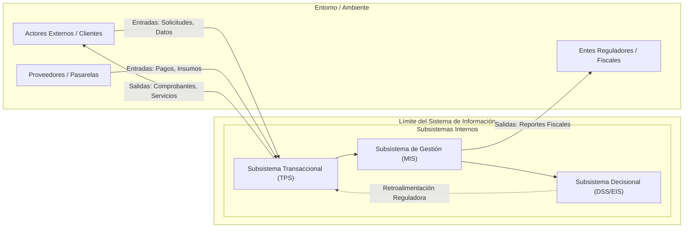
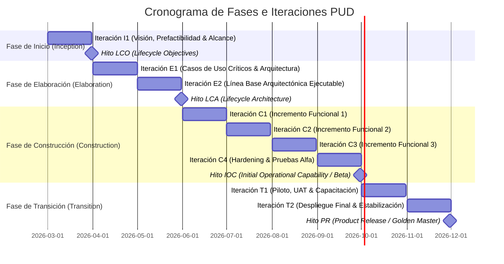

# Reporte de Diagnóstico Sistémico, Prefactibilidad y Plan PUD
**Proyecto:** [Nombre del Proyecto / Sistema]
**Organización:** [Nombre de la Empresa o Institución]
**Analista / Autor:** [Nombre del Analista / Equipo]
**Fecha:** [YYYY-MM-DD]
**Versión:** v1.0

---

## 1. Diagnóstico de Teoría General de Sistemas (TGS)

### 1.1. Diagrama de Fronteras y Flujos

### 1.2. Parámetros Sistémicos Fundamentales
| Parámetro TGS | Descripción e Instanciación | Implicancia en Arquitectura / Diseño |
| :--- | :--- | :--- |
| **Suprasistema** | [Definición del macrosistema en el que se inserta la organización] | Restricciones de mercado, competencia y marco legal |
| **Sistema** | [Definición del sistema bajo análisis] | Alcance de software a diseñar e implementar |
| **Subsistemas** | [Desglose de subsistemas funcionales] | Módulos y servicios de software |
| **Límite / Frontera** | [Límites lógicos, organizacionales y físicos] | Contratos de interfaces y delimitación de alcance |
| **Ambiente / Entorno** | [Entidades externas interactuantes] | APIs externas, actores primarios y secundarios |
| **Entradas (Inputs)** | [Datos, eventos, recursos entrantes] | Formatos de entrada, validaciones y DTOs |
| **Procesos (Throughput)** | [Reglas de negocio y transformaciones] | Algoritmos, servicios de aplicación y dominio |
| **Salidas (Outputs)** | [Información procesada, eventos emitidos] | Vistas UI, reportes, eventos publicados |
| **Feedback Negativo** | [Mecanismo de estabilización y control de desvíos] | Alertas de umbrales, validaciones de saldo/stock |
| **Feedback Positivo** | [Mecanismo de refuerzo o amplificación] | Indicadores de crecimiento, retargeting, analítica |
| **Homeostasis** | [Capacidad de autorregulación ante estrés] | Resiliencia, circuit breakers, balanceo de carga |
| **Entropía** | [Factores de degradación, desorden o desfase] | Desincronización de datos, deuda técnica |
| **Negentropía** | [Mecanismos de restauración del orden] | Conciliaciones periódicas, refactorización, CI/CD |
| **Sinergia** | [Valor holístico emergente del sistema integrado] | Eficiencia y reducción de costos por integración |
| **Equifinalidad** | [Caminos alternativos para lograr el mismo objetivo] | Canales omnicanal (web, mobile, batch) |

---

## 2. Taxonomía de Sistemas de Información

| Módulo / Funcionalidad | Tipo de SI (TPS/MIS/DSS/EIS/ERP/CRM/SCM/KMS) | Nivel Organizacional (Operativo/Táctico/Estratégico) | Grado de Estructuración de la Decisión | Periodicidad / Horizonte | Usuarios Principales |
| :--- | :---: | :---: | :---: | :---: | :--- |
| [Módulo 1] | [Tipo] | [Nivel] | [Estructurada / Semiestructurada / No Estructurada] | [Tiempo Real / Diario / Mensual] | [Roles] |
| [Módulo 2] | [Tipo] | [Nivel] | [Estructurada / Semiestructurada / No Estructurada] | [Tiempo Real / Diario / Mensual] | [Roles] |
| [Módulo 3] | [Tipo] | [Nivel] | [Estructurada / Semiestructurada / No Estructurada] | [Tiempo Real / Diario / Mensual] | [Roles] |

---

## 3. Estudio de Prefactibilidad Multidimensional

### 3.1. Factibilidad Técnica
- **Infraestructura y Hardware:** [Servidores, redes, dispositivos]
- **Stack Tecnológico:** [Lenguajes, frameworks, bases de datos, mensajería]
- **Disponibilidad y Madurez Tecnológica:** [Evaluación del stack y dependencias]
- **Competencias del Equipo:** [Capacidad interna vs necesidad de capacitación/consultoría]
- **Dictamen de Factibilidad Técnica:** `[APROBADO / OBSERVADO / RECHAZADO]`

### 3.2. Factibilidad Económica

#### Tabla de Costos Proyectados (USD)
| Rubro | Concepto | Año 0 (CAPEX) | Año 1 (OPEX) | Año 2 (OPEX) | Año 3 (OPEX) |
| :--- | :--- | :---: | :---: | :---: | :---: |
| Desarrollo | Horas de ingeniería / equipo | $ [Monto] | - | - | - |
| Infraestructura | Cloud hosting, CDN, BD | $ [Setup] | $ [Anual] | $ [Anual] | $ [Anual] |
| Licencias | Software base y servicios terceros | $ [Setup] | $ [Anual] | $ [Anual] | $ [Anual] |
| Capacitación | Formación de usuarios y soporte | $ [Monto] | - | - | - |
| Mantenimiento | Soporte evolutivo y correctivo | - | $ [Anual] | $ [Anual] | $ [Anual] |
| **Total Costos** | | **$ [Total A0]** | **$ [Total A1]** | **$ [Total A2]** | **$ [Total A3]** |

#### Tabla de Beneficios Proyectados (USD)
| Tipo | Concepto del Beneficio | Año 1 | Año 2 | Año 3 |
| :--- | :--- | :---: | :---: | :---: |
| Tangible | Ahorro en costos operativos / horas hombre | $ [Monto] | $ [Monto] | $ [Monto] |
| Tangible | Reducción de mermas y errores | $ [Monto] | $ [Monto] | $ [Monto] |
| Tangible | Incremento directo de facturación | $ [Monto] | $ [Monto] | $ [Monto] |
| Intangible | Mejora en satisfacción de clientes y marca | Cualitativo | Cualitativo | Cualitativo |
| Intangible | Información oportuna para toma de decisiones | Cualitativo | Cualitativo | Cualitativo |
| **Total Beneficios** | | **$ [Total B1]** | **$ [Total B2]** | **$ [Total B3]** |

#### Evaluación Financiera
- **Flujo de Fondos Neto Anual ($F_t$):**
  - Año 0 ($I_0$): `-$ [Monto]`
  - Año 1: `+$ [Monto]`
  - Año 2: `+$ [Monto]`
  - Año 3: `+$ [Monto]`
- **Retorno de Inversión (ROI a 3 años):** `[Valor]%`
- **Periodo de Recupero (Payback):** `[X] años / [Y] meses`
- **Valor Actual Neto (VAN / NPV a tasa k = [X]%):** `$ [Monto]`
- **Tasa Interna de Retorno (TIR / IRR):** `[Valor]%`
- **Dictamen de Factibilidad Económica:** `[APROBADO / OBSERVADO / RECHAZADO]`

### 3.3. Factibilidad Operativa
- **Aceptación de Usuarios y Cultura:** [Evaluación de resistencia al cambio]
- **Curva de Aprendizaje y Usabilidad:** [Estrategia UX/UI y diseño de flujos]
- **Plan de Capacitación:** [Cronograma, modalidades y materiales]
- **Impacto en Procesos Existentes:** [Reingeniería requerida / coexistencia]
- **Dictamen de Factibilidad Operativa:** `[APROBADO / OBSERVADO / RECHAZADO]`

### 3.4. Factibilidad Legal, Organizacional y Temporal
- **Cumplimiento Legal y Regulatorio:** [Leyes de protección de datos, fiscales, laborales]
- **Propiedad Intelectual y Licencias:** [Esquema de propiedad del software]
- **Factibilidad Temporal (Schedule):** [Plazo estimado vs ventana de oportunidad]
- **Dictamen Legal y Temporal:** `[APROBADO / OBSERVADO / RECHAZADO]`

### 3.5. Dictamen Consolidado de Prefactibilidad
$$\boxed{\textbf{DICTAMEN FINAL: [ FACTIBLE / FACTIBLE CONDICIONADO / NO FACTIBLE ]}}$$
*Síntesis de condicionamientos y recomendaciones previas a la fase de Elaboración/Construcción.*

---

## 4. Plan Director y Mapeo al Proceso Unificado de Desarrollo (PUD)

### 4.1. Estructura de Fases e Hitos PUD

### 4.2. Definición Detallada de Fases
| Fase PUD | Iteraciones | Duración | Hito de Salida | Criterios Específicos de Aprobación |
| :--- | :---: | :---: | :---: | :--- |
| **Inicio (*Inception*)** | 1 (I1) | [X] semanas | **LCO** | Visión formalizada, prefactibilidad económica aprobada, ~20% casos de uso identificados. |
| **Elaboración (*Elaboration*)** | 2 (E1-E2) | [Y] semanas | **LCA** | Línea base arquitectónica ejecutable validada, riesgos técnicos mayores eliminados, ~80% ERS detallada. |
| **Construcción (*Construction*)** | [N] (C1-CN) | [Z] semanas | **IOC** | 100% de casos de uso implementados, suite de tests automatizada en verde, release Beta estable. |
| **Transición (*Transition*)** | 2 (T1-T2) | [W] semanas | **PR** | UAT aprobada por usuarios clave, migración de datos finalizada, usuarios capacitados y pase a producción. |

### 4.3. Matriz de Distribución de Esfuerzo por Disciplinas (%)
| Disciplina / Flujo de Trabajo | Inicio (%) | Elaboración (%) | Construcción (%) | Transición (%) |
| :--- | :---: | :---: | :---: | :---: |
| **Modelado del Negocio** | 20% | 10% | 3% | 2% |
| **Requerimientos** | 35% | 30% | 10% | 5% |
| **Análisis y Diseño** | 15% | 30% | 15% | 5% |
| **Implementación** | 5% | 15% | 45% | 15% |
| **Pruebas (QA / Testing)** | 5% | 10% | 20% | 40% |
| **Despliegue** | 0% | 2% | 5% | 30% |
| **Gestión y Configuración** | 20% | 3% | 2% | 3% |
