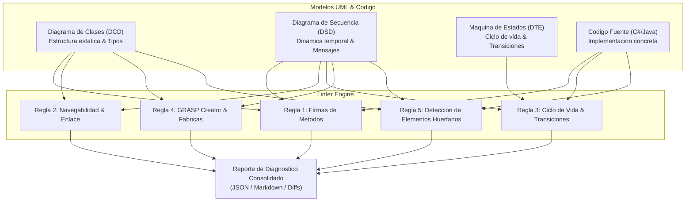
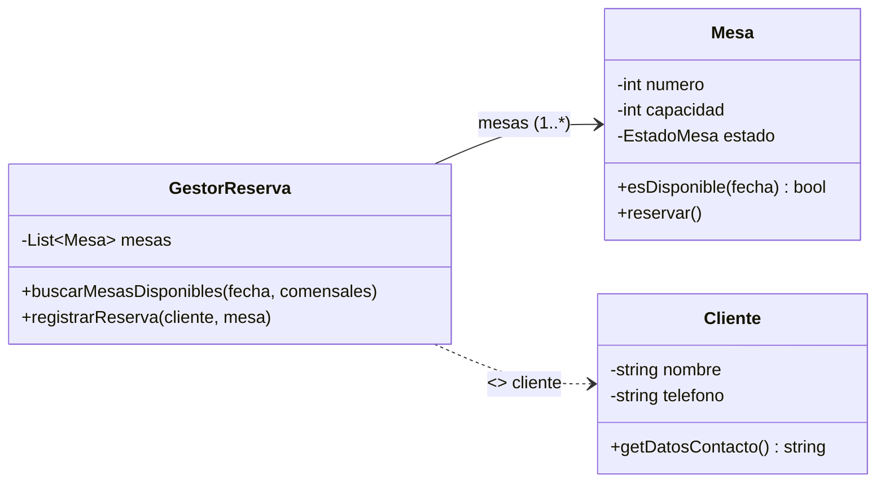
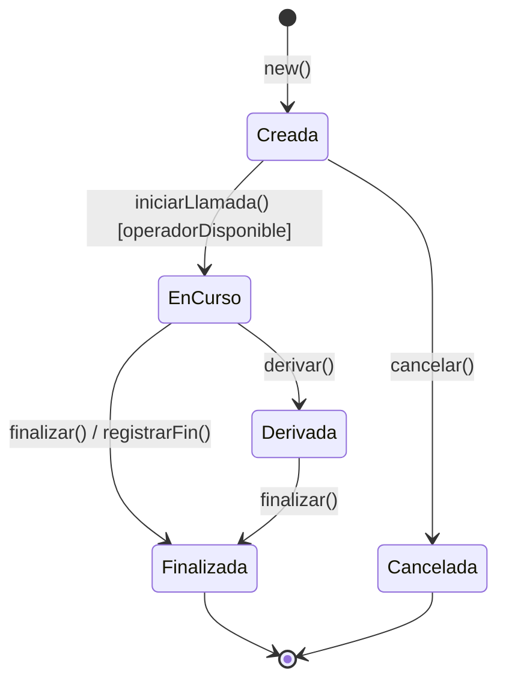
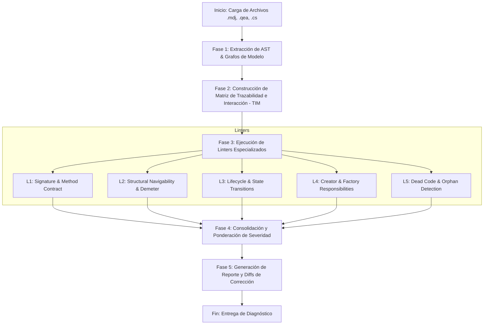
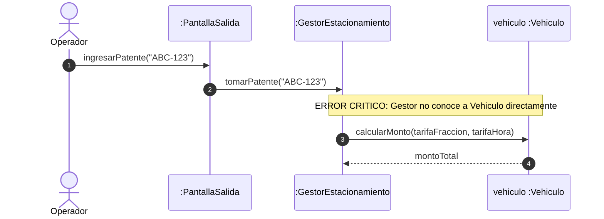
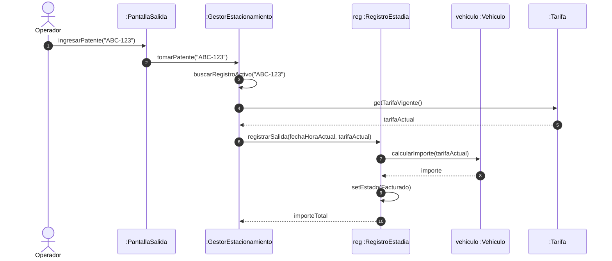
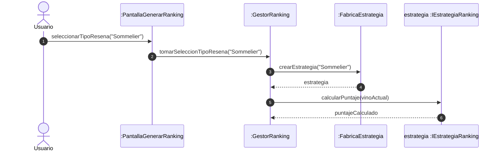

---
name: umlConsistency
description: >-
  Audita y verifica estáticamente la consistencia cruzada entre Diagramas de Clases, Diagramas
  de Secuencia, Máquinas de Estado y Código Fuente, detectando métodos inexistentes, violaciones
  de navegabilidad y transiciones ilegales.
---

# UML Cross-Model Consistency Linter (DSI)

Skill especializada y motor de auditoría estática para el aseguramiento de la consistencia semántica y sintáctica cruzada entre **Diagramas de Clases de Diseño (DCD)**, **Diagramas de Secuencia de Diseño (DSD)**, **Diagramas de Transición de Estados (DTE/DSE)** y **Código Fuente (C# / .NET / Java)** en el marco de la metodología de Diseño de Sistemas de Información (DSI), patrones GRASP, patrones GoF y arquitecturas por capas (Boundary-Control-Entity / MVC / Clean Architecture).

---

## 1. Fundamentos y Alcance de la Auditoría Multi-Modelo

En proyectos de software y evaluaciones de diseño (parciales, finales, entregas de PPAI), el **80% de las deducciones de puntaje y fallas de implementación provienen de discrepancias inter-modelo**:
1. **Métodos llamados en un DSD que no existen en el DCD o en el código fuente**.
2. **Mensajes enviados entre objetos sin una ruta de navegabilidad válida** (asociación, inyección o instanciación previa).
3. **Cambios de estado en un DSD que violan la máquina de estados formal** (transiciones ilegales, estados terminales o bypass del patrón State).
4. **Asignación errónea de responsabilidades de creación** (violación del patrón GRASP Creador, como pantallas instanciando entidades).
5. **Métodos o clases huérfanas en el DCD** que nunca son ejecutados por ningún caso de uso o representan divergencia de código (*Code Drift*).

Esta skill establece el marco formal, las reglas de validación algebraicas, el esquema de reportes diagnósticos y los procedimientos de corrección automatizada mediante parches (*diffs*) para modelos **StarUML (`.mdj`)**, **Enterprise Architect (`.qea`, `.eap`, XMI)** y **código fuente C# / .NET**.



---

## 2. Reglas Formales de Consistencia Multi-Modelo

### Regla 1: Consistencia de Firmas de Métodos (Secuencia -> Clases -> Código)

$$\forall m \in \text{Mensajes}(DSD), \quad m: A \xrightarrow{\text{op}(p_1, \dots, p_k): R} B \implies \text{op}(p_1, \dots, p_k): R \in \text{Operaciones}(B_{DCD}) \land \text{op} \in \text{Métodos}(B_{SRC})$$

#### Criterios de Validación Rigurosa:
1. **Existencia en Clase Receptora**:
   - Si la línea de vida receptora en el DSD es de tipo $B$, la clase $B$ en el DCD **debe declarar explícitamente la operación $\text{op}$** o heredarla de una clase base/interfaz con visibilidad accesible.
2. **Concordancia de Parámetros (Aridad, Tipos y Orden)**:
   - La cantidad de argumentos pasados en la llamada del DSD debe ser idéntica a la aridad declarada en el DCD y en el código.
   - Los tipos formales deben ser compatibles (ej. no pasar un `string` donde se espera un `DateTime` o una instancia de `Tarifa`).
3. **Tipo de Retorno y Asignación**:
   - Si en el DSD se modela una asignación de retorno `$resultado := \text{op}(\dots)$` o una flecha de retorno con datos, el tipo de retorno en el DCD **no puede ser `void`** y debe ser compatible con el receptor.
4. **Visibilidad y Modificadores**:
   - Si el emisor $A \neq B$ y $A$ no pertenece a la misma jerarquía de herencia, el método en $B$ **debe ser público (`+`)**.
   - Si el método es polimórfico (patrones Strategy o State), la firma debe existir como `abstract`/`virtual` en la clase base o interfaz.

#### Catálogo de Infracciones:
| Código | Severidad | Descripción |
| :--- | :--- | :--- |
| `ERR-METH-001` | `CRITICAL_ERROR` | Método invocado en DSD inexistente en la clase receptora en DCD o código. |
| `ERR-METH-002` | `CRITICAL_ERROR` | Discordancia en la cantidad, tipo u orden de parámetros entre DSD, DCD y código. |
| `ERR-METH-003` | `WARNING` | Retorno de datos en DSD sobre una operación tipada como `void` en DCD. |
| `ERR-METH-004` | `CRITICAL_ERROR` | Invocación externa a un método privado (`-`) o protegido (`#`). |
| `ERR-METH-005` | `CRITICAL_ERROR` | Invocación polimórfica en DSD sobre una interfaz que carece de la declaración del método. |

---

### Regla 2: Consistencia de Navegabilidad y Asociaciones (Emisor -> Receptor)

$$\forall m: A \xrightarrow{} B \text{ en } DSD, \quad \exists \text{RutaNavegabilidad}(A, B)$$

Un objeto emisor $A$ solo puede enviar un mensaje a un receptor $B$ si se cumple **al menos una** de las siguientes cuatro precondiciones de acoplamiento estructural:

1. **Navegabilidad Estructural por Atributo**:
   - Existe una relación en el DCD $A \rightarrow B$ con navegabilidad explícita hacia $B$ (asociación, agregación $A \diamond \rightarrow B$ o composición $A \blacklozenge \rightarrow B$).
2. **Navegabilidad por Parámetro (Inyección de Dependencia)**:
   - $A$ recibe una referencia a $B$ como argumento de la operación en curso que disparó el subflujo.
3. **Navegabilidad por Creación Local**:
   - $A$ instanció a $B$ previamente en el mismo método/flujo (`<<create>>` o `new B()`).
4. **Navegabilidad por Retorno de Colaborador Intermedio**:
   - $A$ obtuvo la referencia a $B$ como valor de retorno de un mensaje previo a otro objeto $C$ ($A \rightarrow C.\text{getB}() \implies B$).



#### Restricciones de Arquitectura en DSI:
- **Prohibición de Salto de Capa (Boundary -> Entity)**: Las pantallas/interfaces de usuario (`Boundary`) **tienen estrictamente prohibido comunicarse de forma directa con entidades de dominio (`Entity`)**. Toda interacción debe canalizarse a través de la capa de control (`Controller`/Gestor).
- **Violación de la Ley de Demeter**: Evitar cadenas de navegación profundas `$A \rightarrow B.\text{getC}().\text{getD}().\text{operacion}()$`. El DSD debe modelar delegación o el DCD debe declarar explícitamente la dependencia de uso `<<use>>`.
- **Navegabilidad Invertida**: Si el DCD muestra $B \rightarrow A$, es un error crítico que $A$ envíe mensajes a $B$ asumiendo que posee su puntero/referencia.

#### Catálogo de Infracciones:
| Código | Severidad | Descripción |
| :--- | :--- | :--- |
| `ERR-NAV-001` | `CRITICAL_ERROR` | Violación de navegabilidad. Mensaje enviado sin asociación, parámetro o instanciación previa. |
| `ERR-NAV-002` | `CRITICAL_ERROR` | Navegabilidad invertida en DCD (la flecha apunta de $B$ a $A$, pero $A$ invoca a $B$). |
| `ERR-NAV-003` | `CRITICAL_ERROR` | Salto de capa no permitido (comunicación directa `Boundary -> Entity`). |
| `ERR-NAV-004` | `WARNING` | Acoplamiento excesivo o violación de Demeter sin justificación por delegación. |

---

### Regla 3: Consistencia de Ciclo de Vida y Transiciones (Secuencia -> Máquina de Estados -> Código)

$$\forall \text{Evento}(e) \text{ aplicado a } B \text{ en estado } S_i \text{ en DSD} \implies \exists \text{ Transición } (S_i \xrightarrow{e [guard] / action} S_j) \in DTE(B)$$

#### Criterios de Validación Rigurosa:
1. **Transición Legal en Autómata**:
   - Todo método del DSD que altera el estado de una entidad (ej. `cancelar()`, `finalizar()`, `confirmar()`, `iniciar()`) debe corresponder a una transición válida definida en el DTE de la clase.
2. **Respeto del Estado Inicial**:
   - Todo objeto instanciado debe pasar obligatoriamente por el estado inicial formal del DTE (ej. `Creada`, `Iniciada`, `Borrador`).
3. **Mapeo con Patrón State (GoF)**:
   - En la arquitectura DSI estándar, los estados se implementan mediante una clase abstracta `Estado` y subclases concretas (`EstadoEnCurso`, `EstadoFinalizada`, etc.).
   - El mensaje del DSD que ejecuta la transición debe invocar el método polimórfico en el objeto de estado actual.
   - El DSD y el código deben reflejar la creación o asignación del nuevo objeto de estado (`crearEstado()`, `setEstado()`).
4. **Inmutabilidad de Estados Terminales**:
   - Ningún mensaje que intente mutar el estado o ejecutar lógica operativa puede enviarse a un objeto que ya se encuentra en un estado terminal (ej. `Anulada`, `Facturada`, `Cerrada`).



#### Catálogo de Infracciones:
| Código | Severidad | Descripción |
| :--- | :--- | :--- |
| `ERR-STATE-001` | `CRITICAL_ERROR` | Transición ilegal. Método invocado en un estado donde no existe la transición en el DTE. |
| `ERR-STATE-002` | `CRITICAL_ERROR` | Intento de mutación de estado sobre un objeto en estado terminal / final. |
| `ERR-STATE-003` | `WARNING` | Discordancia en el patrón State: el método existe en el Contexto pero falta en la clase base abstracta `Estado`. |
| `ERR-STATE-004` | `CRITICAL_ERROR` | Instanciación de entidad sin asignación del estado inicial obligatorio. |

---

### Regla 4: Consistencia de Creación e Inyección (Creator GRASP -> Lifelines)

De acuerdo con el principio GRASP **Creador (Creator)**, una clase $A$ debe tener la responsabilidad de crear una instancia de la clase $B$ si y solo si se satisface alguna de las siguientes cláusulas:
1. $A$ tiene una relación de **Composición** o Agregación fuerte con $B$ ($A \blacklozenge\hspace{-0.4em}\longrightarrow B$).
2. $A$ contiene o registra una colección de instancias de $B$.
3. $A$ utiliza estrechamente a $B$ en su lógica interna.
4. $A$ posee la información de inicialización requerida para construir a $B$.

#### Criterios de Validación Rigurosa:
1. **Mensaje de Creación en DSD**:
   - Modelado con flecha de creación directa `<<create>>` hacia el encabezado de la línea de vida receptora o mediante constructor explícito `new B(...)`.
   - En el DCD, $A$ debe poseer agregación/composición con $B$, o bien ser un Gestor/Fábrica con responsabilidad de creación.
2. **Prohibición de Creación en Pantallas (`Boundary`)**:
   - Las clases de interfaz de usuario no deben crear entidades de dominio ni registrar transacciones de negocio. La creación se delega al `Gestor` o a una `Fabrica` especializada.
3. **Consistencia de Constructores**:
   - Los parámetros provistos en el mensaje `<<create>>` del DSD deben coincidir exactamente con los parámetros del constructor declarado en el DCD y en el código fuente.

#### Catálogo de Infracciones:
| Código | Severidad | Descripción |
| :--- | :--- | :--- |
| `ERR-CREAT-001` | `CRITICAL_ERROR` | Violación de GRASP Creador. Clase sin agregación, composición ni datos crea instancias de dominio. |
| `ERR-CREAT-002` | `CRITICAL_ERROR` | Creación directa de entidad de negocio desde una clase `Boundary` (Pantalla/UI). |
| `ERR-CREAT-003` | `WARNING` | Parámetros del mensaje de creación en DSD no corresponden a ningún constructor en DCD. |

---

### Regla 5: Detección de Código, Métodos y Atributos Huérfanos

Garantiza la máxima cohesión, trazabilidad 1:1 con los Casos de Uso y previene tanto el diseño especulativo (*Dead Design*) como el desvío de código (*Code Drift*).

#### Criterios de Validación Rigurosa:
1. **Métodos Huérfanos en DCD**: Métodos públicos declarados en el DCD que no participan en ningún DSD y no corresponden a getters/setters elementales ni a contratos de persistencia.
2. **Clases Huérfanas**: Clases del DCD sin asociaciones activas, sin líneas de vida en ningún DSD y sin referencias en el código.
3. **Desvío de Código (Code Drift)**: Métodos públicos implementados en clases C# que no existen en el DCD ni en los DSDs, o métodos modelados en DCD que nunca fueron codificados.
4. **Atributos No Utilizados**: Atributos declarados en DCD/Código que nunca son leídos ni modificados en la dinámica de ningún caso de uso.

#### Catálogo de Infracciones:
| Código | Severidad | Descripción |
| :--- | :--- | :--- |
| `ERR-ORPH-001` | `WARNING` | Método público en DCD huérfano (sin invocación en ningún DSD). |
| `ERR-ORPH-002` | `WARNING` | Clase de dominio huérfana en DCD (desconectada y sin participación en CU). |
| `ERR-ORPH-003` | `INFO` | Desviación de implementación (método en C# ausente en DCD/DSD). |
| `ERR-ORPH-004` | `INFO` | Atributo en DCD no accedido en la dinámica de interacciones. |

---

## 3. Formato del Reporte de Diagnóstico

El linter produce un diagnóstico estructurado dual: **JSON Canónico** para automatización y **Markdown Ejecutivo** con alertas GitHub y diffs unificados.

### 3.1. Esquema JSON Canónico

```json
{
  "$schema": "https://json-schema.org/draft/2020-12/schema",
  "project": "SistemaDeRespuestaDeVozInteractiva",
  "auditDate": "2026-09-01T16:09:11-03:00",
  "summary": {
    "criticalErrors": 2,
    "warnings": 1,
    "infos": 1,
    "verdict": "REJECTED"
  },
  "diagnostics": [
    {
      "id": "ERR-METH-001",
      "severity": "CRITICAL_ERROR",
      "category": "METHOD_SIGNATURE",
      "rule": "Regla 1: Consistencia de Firmas de Métodos",
      "message": "El método 'buscarLlamadasConEncuestaRespondida()' invocado en DSD no existe en la clase 'GestorConsultarEncuesta' del DCD.",
      "sourceLocation": {
        "model": "DSD_ConsultarEncuesta.mdj",
        "diagram": "DSD-CU-28",
        "step": 4,
        "lifeline": "gestor : GestorConsultarEncuesta"
      },
      "targetLocation": {
        "model": "DCD_ClasesDominio.mdj",
        "element": "Class: GestorConsultarEncuesta",
        "sourceCodeFile": "GestorEncuesta.cs"
      },
      "suggestedFix": {
        "action": "ADD_METHOD_TO_DCD_AND_CODE",
        "patchDescription": "Agregar '+ buscarLlamadasConEncuestaRespondida(fechaInicio: DateTime, fechaFin: DateTime): List<Llamada>' a 'GestorConsultarEncuesta'."
      }
    }
  ]
}
```

### 3.2. Formato Markdown Estándar de Auditoría

```markdown
# 📋 Reporte de Auditoría de Consistencia UML - DSI

> [!CAUTION]
> **Veredicto: RECHAZADO (2 Errores Críticos, 1 Advertencia, 1 Info)**
> Los modelos analizados contienen discrepancias estructurales que invalidan la trazabilidad y ejecución del Caso de Uso.

---

### Resumen Ejecutivo de Hallazgos

| ID | Severidad | Regla Violada | Origen (DSD / Código) | Destino (DCD / DTE) | Descripción Breve |
| :--- | :--- | :--- | :--- | :--- | :--- |
| `ERR-METH-001` | 🔴 `CRITICAL_ERROR` | Regla 1: Firmas | `DSD: Paso 4` | `DCD: GestorEncuesta` | Método `buscarLlamadasConEncuestaRespondida()` ausente en DCD. |
| `ERR-NAV-001` | 🔴 `CRITICAL_ERROR` | Regla 2: Navegabilidad | `DSD: Pantalla -> Cliente` | `DCD: Boundary -> Entity` | La Pantalla invoca directamente a `Cliente` saltando el Gestor. |
| `ERR-STATE-003` | 🟡 `WARNING` | Regla 3: Patrón State | `DSD: llamada.finalizar()` | `DCD: Estado` (Jerarquía) | Falta método polimórfico en la clase base abstracta `Estado`. |
| `ERR-ORPH-001` | 🔵 `INFO` | Regla 5: Huérfanos | `DCD: Cliente` | `DSD: Todos` | Método `validarDNI()` en DCD nunca es invocado. |

---

### Detalle de Inconsistencias y Parches de Corrección

#### 1. [ERR-METH-001] Método Inexistente en Clase Receptora
- **Severidad:** `CRITICAL_ERROR`
- **Contexto:** En el DSD `DSD-CU-28`, la línea de vida `pantalla` invoca `gestor.buscarLlamadasConEncuestaRespondida(fi, ff)`.
- **Inconsistencia:** La clase `GestorConsultarEncuesta` en el DCD no declara dicha operación. En el código `GestorEncuesta.cs` el método fue nombrado `consultarLlamadasConEncuesta()`.
- **Impacto:** Ruptura de contrato de diseño y falla de compilación.

**Parche de Corrección en DCD:**
```diff
--- DCD_ClasesDominio/GestorConsultarEncuesta
+++ DCD_ClasesDominio/GestorConsultarEncuesta
@@ -15,4 +15,5 @@
 class GestorConsultarEncuesta {
   - DateTime fechaInicio
   - DateTime fechaFin
+  + buscarLlamadasConEncuestaRespondida(fechaInicio: DateTime, fechaFin: DateTime): List<Llamada>
 }
```
```

---

## 4. Algoritmo de Inspección y Generación de Parches

El motor del linter ejecuta un flujo determinístico en 5 fases:



### Paso a Paso Operativo:

1. **Fase 1: Parsing y Extracción del AST Multi-Modelo**:
   - Leer e interpretar los JSON de StarUML (`.mdj`) o bases de datos de Enterprise Architect (`.qea`, `.eap`, XMI).
   - Extraer clases, atributos, operaciones, visibilidades, asociaciones y multiplicidades del DCD.
   - Extraer líneas de vida, tipos instanciados, mensajes síncronos/asíncronos, parámetros y retornos de los DSDs.
   - Extraer estados, transiciones, guardas y acciones de los DTEs.
   - Parsear el código fuente C# para obtener tipos y firmas de métodos reales.

2. **Fase 2: Construcción de la Matriz de Trazabilidad e Interacción (TIM)**:
   - Crear el grafo dirigido $G = (V, E)$ donde los nodos $V$ son las clases e interfaces del DCD, y las aristas dirigidas $E$ representan asociaciones con navegabilidad explícita.
   - Mapear cada línea de vida $L$ del DSD con su clase $C_L \in V$.

3. **Fase 3: Evaluación de Reglas de Consistencia**:
   - **Chequeo 1**: Para cada mensaje $m: C_1 \rightarrow C_2.\text{op}(\text{args})$ en el DSD, verificar si $\text{op} \in \text{Operaciones}(C_2)$ con concordancia exacta de parámetros.
   - **Chequeo 2**: Verificar que exista una arista $(C_1, C_2) \in E$, o que $C_2$ sea un parámetro en la operación actual de $C_1$, o que $C_1$ haya ejecutado `<<create>>` sobre $C_2$.
   - **Chequeo 3**: Si $m$ altera el estado de una entidad $E$ en estado $S_k$, verificar en el DTE que exista la transición $S_k \xrightarrow{\text{op}} S_{k+1}$.
   - **Chequeo 4**: Si $m$ es `<<create>>` hacia $C_2$ desde $C_1$, comprobar que $C_1$ no sea `Boundary` y que posea composición con $C_2$ o rol de Fábrica.
   - **Chequeo 5**: Identificar operaciones en DCD con grado de entrada 0 en todos los DSDs.

4. **Fase 4: Consolidación y Veredicto**:
   - `APPROVED`: 0 Errores Críticos, 0 Advertencias.
   - `CONDITIONALLY_APPROVED`: 0 Errores Críticos, $\ge 1$ Advertencias.
   - `REJECTED`: $\ge 1$ Errores Críticos.

5. **Fase 5: Generación de Parches**:
   - Generar diffs unificados para código C# y especificaciones de modificación JSON para StarUML / EA.

---

## 5. Casos Prácticos de Auditoría y Ejemplos de Examen (DSI)

### Caso 1: Modelo "Estacionamiento" (Parcial DSI - StarUML `Estacionamiento.mdj`)

#### Contexto del Caso:
Caso de Uso: **"Registrar Salida de Vehículo y Cobro de Estadía"**.

#### Modelos Auditados:
- **DSD:** Lifeline `gestor: GestorEstacionamiento` envía a `vehiculo: Vehiculo` el mensaje `calcularMonto(tarifaFraccion, tarifaHora)`.
- **DCD:** La clase `Vehiculo` tiene definida la operación `+ calcularImporte(tarifaHora: float): float`. La asociación en el DCD es `GestorEstacionamiento --> PlayaEstacionamiento --> Sector --> RegistroEstadia --> Vehiculo`.
- **DTE (RegistroEstadia):** Estados: `Activo` $\xrightarrow{\text{registrarSalida()}}$ `Facturado`.



#### Diagnóstico del Linter:
1. `ERR-METH-001` (`CRITICAL_ERROR`): La clase `Vehiculo` no tiene el método `calcularMonto(...)`, sino `calcularImporte(...)`.
2. `ERR-METH-002` (`CRITICAL_ERROR`): Discordancia de parámetros: el DSD envía 2 tarifas (`tarifaFraccion`, `tarifaHora`), pero el DCD solo espera 1 parámetro.
3. `ERR-NAV-001` (`CRITICAL_ERROR`): Violación de Navegabilidad: `GestorEstacionamiento` no tiene asociación directa con `Vehiculo`. Debe navegar a través del `RegistroEstadia` correspondiente.
4. `ERR-STATE-001` (`CRITICAL_ERROR`): El DSD omite el cambio de estado en `RegistroEstadia` de `Activo` a `Facturado`.

#### Solución y Parche de Corrección:



**Diff de Corrección en DCD:**
```diff
--- DCD_Estacionamiento/Clases
+++ DCD_Estacionamiento/Clases
@@ -20,7 +20,7 @@
 class RegistroEstadia {
   - DateTime fechaHoraEntrada
   - DateTime fechaHoraSalida
   - float montoTotal
-  + cerrar()
+  + registrarSalida(fechaHora: DateTime, tarifa: Tarifa): float
+  + setEstado(nuevoEstado: EstadoRegistro)
 }
```

---

### Caso 2: PPAI IVR (Sistema de Respuesta de Voz Interactiva - C# / EA)

#### Contexto del Caso:
Caso de Uso: **"Consultar Encuesta"** (PPAI DSI).

#### Inconsistencias Detectadas:
1. `ERR-NAV-001` (`CRITICAL_ERROR`): En el DSD, el `GestorConsultarEncuesta` envía el mensaje `getDescripcion()` directamente a `Cliente`, pero el Gestor solo conoce la lista de `Llamada`. Viola Information Expert. Debe invocar `llamada.getNombreCliente()` y `Llamada` delega en `Cliente`.
2. `ERR-STATE-001` (`CRITICAL_ERROR`): El DSD incluye una llamada a `llamada.finalizar()`. Sin embargo, en este Caso de Uso de consulta histórica, la llamada ya está en estado final `Finalizada`. Aplicar `finalizar()` es una transición ilegal en el DTE.
3. `ERR-METH-003` (`WARNING`): En `Llamada.cs`, el método `getCliente()` expone la referencia interna violando encapsulamiento y no está modelado como interacción formal.

#### Código C# Corregido (`Llamada.cs` y `GestorEncuesta.cs`):

```diff
--- Codigo_Fuente/Llamada.cs
+++ Codigo_Fuente/Llamada.cs
@@ -35,6 +35,11 @@
     public bool tieneRespuesta()
     {
         return this.respuestasCliente != null && this.respuestasCliente.Count > 0;
     }
+
+    public string getNombreCliente()
+    {
+        return this.cliente.getNombre();
+    }
 }

--- Codigo_Fuente/GestorEncuesta.cs
+++ Codigo_Fuente/GestorEncuesta.cs
@@ -42,7 +42,7 @@
         foreach (var llamada in listaLlamadas)
         {
             if (llamada.esDePeriodo(fechaInicio, fechaFin) && llamada.tieneRespuesta())
             {
-                string nombre = llamada.getCliente().getNombre();
+                string nombre = llamada.getNombreCliente();
                 llamadasValidas.Add(llamada);
             }
         }
```

---

### Caso 3: PPAI BonVino (Ranking de Vinos - Patrones Iterator, Strategy, State)

#### Contexto del Caso:
Caso de Uso: **"Generar Ranking de Vinos"** con filtros por tipo de reseña (Sommeliers, Amigos, Normales).

#### Inconsistencias Detectadas:
1. **Ruptura de Polimorfismo / Strategy (Regla 1 & Regla 3)**:
   - El DSD invoca `estrategia.calcularPuntajeSommelier(vino)` sobre la referencia `IEstrategiaRanking`.
   - En el DCD, la interfaz polimórfica declara el método general `+ calcularPuntaje(vino: Vino): float`.
   - Diagnóstico: `ERR-METH-001` (`CRITICAL_ERROR`). Ruptura del patrón Strategy.
2. **Violación de GRASP Creador (Regla 4)**:
   - En el DSD, la clase `PantallaGenerarRanking` (`Boundary`) ejecuta `new EstrategiaSommelier()` directamente.
   - Diagnóstico: `ERR-CREAT-002` (`CRITICAL_ERROR`). La UI no puede instanciar estrategias de dominio. La responsabilidad pertenece al `GestorGenerarRanking` mediante `FabricaEstrategiasRanking`.

#### Diagrama de Secuencia Corregido:



---

## 6. Guía de Ejecución Rápida para el Agente

Cuando el usuario te solicite auditar o lintear modelos UML de DSI:

1. **Paso 1: Localizar los artefactos fuente**:
   - Diagramas StarUML (`.mdj`) o Enterprise Architect (`.qea`, `.eap`, `.xmi`).
   - Archivos de código fuente (`.cs`, `.java`).
   - Especificación del Caso de Uso (`CU-XX`).

2. **Paso 2: Ejecutar la Matriz de Chequeos**:
   - Contrastar exhaustivamente cada mensaje del DSD contra los métodos del DCD y el código (Regla 1).
   - Validar la ruta de navegabilidad y prohibir saltos `Boundary -> Entity` (Regla 2).
   - Verificar la coherencia del ciclo de vida y el patrón State en DTE (Regla 3).
   - Auditar las responsabilidades de creación (Regla 4).
   - Detectar elementos huérfanos y desviaciones de implementación (Regla 5).

3. **Paso 3: Emitir el Reporte**:
   - Presentar la tabla resumen con clasificación de severidades (`CRITICAL_ERROR`, `WARNING`, `INFO`).
   - Incluir los bloques `diff` de código y diagramas Mermaid corregidos.
   - Emitir el veredicto formal (`APPROVED` / `CONDITIONALLY_APPROVED` / `REJECTED`).

---

> [!TIP]
> **Regla Mnemotécnica de Oro DSI:**
> *"Todo mensaje en el DSD es un método en el DCD del receptor, requiere una flecha de navegabilidad en el DCD, debe ser una transición válida en el DTE y una línea de código compilable en el proyecto."*