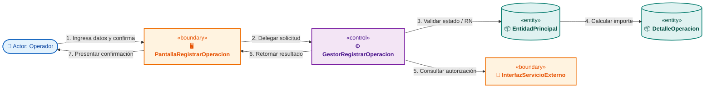
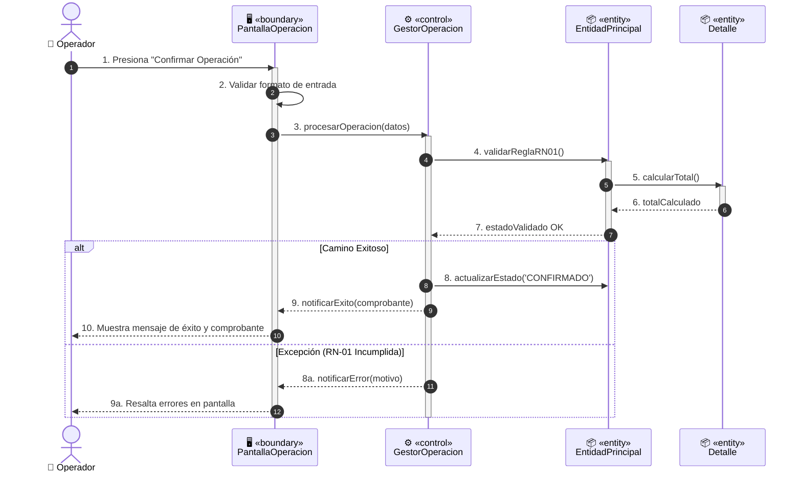

---
name: useCaseExtractor
description: >-
  Elicita, especifica formalmente y realiza Casos de Uso (CU-XX) bajo estándares Cockburn (Sea Level,
  diálogo Actor-Sistema en 2 columnas, reglas RN-XX, contratos de datos y criterios BDD Gherkin),
  plantilla técnica institucional completa y análisis de robustez BCE en el Proceso Unificado (PUD)
  (arquetipos Boundary-Control-Entity, diagramas de robustez PlantUML/Mermaid, secuencia de análisis,
  VOPC y asignación de responsabilidades GRASP).
---

# Extractor y Realizador de Casos de Uso (`useCaseExtractor`)

Esta skill proporciona el marco metodológico unificado, los estándares de ingeniería de software y las plantillas institucionales para:
1. **Especificar Casos de Uso Funcionales (CU-XX)** según los estándares de **Alistair Cockburn** (*Writing Effective Use Cases*), **Steve Adolph & Paul Bramble** y las normas de cátedra de **Análisis de Sistemas de Información (ASI)**.
2. **Ejecutar la Realización de Casos de Uso en el Flujo de Análisis del Proceso Unificado de Desarrollo (PUD)** mediante el patrón **Boundary-Control-Entity (BCE / ECB)** de **Ivar Jacobson, Grady Booch y James Rumbaugh**, derivando diagramas de robustez, diagramas de secuencia de análisis, Vistas de Clases Participantes (VOPC) y matrices de responsabilidades **GRASP**.

---

## 1. Fundamentos y Principios Metodológicos

### 1.1. Granularidad al Nivel del Mar (Cockburn Sea Level)
Cada caso de uso concreto debe satisfacer un **Objetivo de Usuario** (*User Goal*):
- Representa una unidad elemental de trabajo realizada por un actor en una interacción continua.
- Deja los datos del sistema en un estado consistente y produce un valor medible de negocio.
- **Evitar antipatrones:** No crear casos de uso para micro-operaciones de interfaz (clics, aperturas de modales o lecturas triviales sin decisión).

### 1.2. Independencia Tecnológica y Semántica
- El diálogo debe redactarse en términos de **intenciones del actor y responsabilidades del sistema**.
- ❌ **Prohibido:** *El usuario presiona el botón azul "Aceptar" y el combobox se despliega.*
- ✔️ **Correcto:** *El actor solicita confirmar el registro seleccionando la opción deseada.*

### 1.3. Diálogo Estricto de Dos Columnas (Actor vs Sistema)
- **Columna Actor:** Exclusivamente intenciones deliberadas, selección de entidades, suministro de datos y confirmaciones del usuario.
- **Columna Sistema:** Exclusivamente recuperación de datos, presentación de interfaces abstractas, validación sintáctica y de reglas `RN-XX`, cálculos, persistencia transaccional y feedback.

---

## 2. Plantilla Maestra de Especificación de Caso de Uso

```markdown
# CU-XX: [Nombre del Caso de Uso en Verbo Infinitivo + Objeto Directo]

## 1. Ficha Técnica

| Atributo | Detalle |
| :--- | :--- |
| **Identificador** | CU-XX |
| **Nombre** | [Nombre del Caso de Uso] |
| **Módulo / Subsistema** | [Módulo / Subsistema del Negocio] |
| **Actor Principal** | [Rol humano o sistema externo que inicia la interacción] |
| **Actores Secundarios** | [Otros roles o sistemas consultados/notificados] |
| **Propósito / Objetivo** | [Descripción breve de una o dos oraciones sobre qué logra el actor] |
| **Tipo de Ejecución** | [En línea (Web/Mobile) / Asíncrono / Automático (Cron) / Por Lotes (Batch)] |
| **Frecuencia de Uso** | [Muy alta (Diaria) / Alta (Semanal) / Periódica / Eventual] |
| **Estado de Madurez** | [Borrador / En Revisión / Aprobado / Implementado] |
| **Trazabilidad** | Requerimientos asociados: `RF-XX`, Historias: `US-XX`, Épica: `EP-XX` |
| **Relaciones CU** | `<<include>>`: [CU-YY] | `<<extend>>`: [CU-ZZ] (Punto y condición de extensión) |

---

## 2. Precondiciones
1. [Precondición 1: ej. El usuario debe haber iniciado sesión con rol X].
2. [Precondición 2: ej. La entidad E debe encontrarse en estado 'ESTADO_INICIAL'].

---

## 3. Disparador (Trigger)
* [Evento inicial observable que dispara el caso de uso].

---

## 4. Postcondiciones Duales (Cockburn Guarantees)
- **Garantía de Éxito:** [Estado final del sistema al cumplir la meta: entidades persistidas en BD, cambios de estado, eventos de dominio emitidos].
- **Garantía Mínima (Fallo / Rollback):** [Estado preservado ante cancelaciones o errores: rollback transaccional, logs de auditoría, no corrupción de datos].

---

## 5. Flujo Principal (Camino Feliz / Happy Path)

| Paso | Actor | Sistema |
| :---: | :--- | :--- |
| **1** | Solicita iniciar la operación [NombreAccion]. | |
| **2** | | Recupera datos iniciales y presenta la interfaz [UI-XX] con los datos requeridos. |
| **3** | Suministra los datos [campo1, campo2] y solicita confirmar. | |
| **4** | | Valida formato de datos y reglas de negocio RN-01 y RN-02. |
| **5** | | Persiste transaccionalmente los cambios en BD y emite evento EV-01. |
| **6** | | Presenta mensaje de confirmación y comprobante generado. |

---

## 6. Flujos Alternativos y de Excepción

### 6.1. Flujos Alternativos (FA-XX.N)
- **FA-XX.1: [Nombre de la variante exitosa]**
  - *Condición de activación:* En el paso [N] del flujo principal, [Condición].
  - *Secuencia de pasos:* 1. [Paso alternativo]. 2. Retorna al paso [M] o concluye con éxito.

### 6.2. Flujos de Excepción (FE-XX.N)
- **FE-XX.1: [Nombre del manejo de error / violación de RN]**
  - *Condición de activación:* En el paso [N], [Falla validación o incumplimiento de RN-YY].
  - *Secuencia de pasos:* 1. El sistema informa el motivo de error. 2. Preserva la garantía mínima y retorna al paso [P] sin persistir cambios inválidos.

---

## 7. Catálogo de Reglas de Negocio Asociadas

| Código | Enunciado y Lógica de Validación | Severidad / Acción |
| :--- | :--- | :--- |
| `RN-01` | [Descripción de la política, fórmula o restricción de negocio]. | Bloqueante / Error |
| `RN-02` | [Descripción de validación de estado o límite operativo]. | Bloqueante / Advertencia |

---

## 8. Contratos de Datos y Criterios de Aceptación BDD (Gherkin)

```gherkin
Escenario: Registro exitoso de la operación (Happy Path)
  Dado que el usuario autenticado tiene el rol "Operador"
  Y la entidad "Expediente" se encuentra en estado "PENDIENTE"
  Cuando suministra datos válidos y confirma la operación
  Entonces el sistema registra la transacción en BD
  Y la entidad cambia al estado "CONFIRMADO"
  Y se muestra el mensaje "Operación registrada con éxito"
```
```

---

## 3. Realización de Casos de Uso en el Flujo de Análisis (PUD - BCE)

El flujo de análisis transforma la especificación funcional (caja negra) en una arquitectura conceptual de objetos (caja blanca de alto nivel) independiente de la tecnología física.

### 3.1. Arquetipos de Clases de Análisis (Estereotipos BCE / ECB)

```
    ┌────────────────┐         ┌────────────────┐         ┌────────────────┐
    │  <<boundary>>  │         │  <<control>>   │         │   <<entity>>   │
    │    Interfaz    │         │  Controlador   │         │    Entidad     │
    │   (Frontera)   │         │    (Gestor)    │         │  (Información) │
    └───────┬────────┘         └───────┬────────┘         └───────┬────────┘
```

1. **`<<boundary>>` (Frontera / Interfaz)**:
   - Modela la interacción entre el sistema y actores externos (usuarios, hardware, APIs externas).
   - *Nomenclatura:* `Pantalla[Accion]`, `Formulario[Entidad]`, `InterfazServicio[API]`.
2. **`<<control>>` (Controlador / Gestor)**:
   - Coordina la dinámica del caso de uso, orquesta transacciones y secuencia llamadas entre entidades.
   - *Nomenclatura:* `Gestor[NombreCU]`, `Controlador[Proceso]`.
3. **`<<entity>>` (Entidad)**:
   - Modela información persistente y encapsula la lógica intrínseca y cálculos del dominio (GRASP Experto).
   - *Nomenclatura:* Sustantivo en singular (`Socio`, `Pedido`, `Factura`, `Turno`).

### 3.2. Las 4 Reglas Canónicas de Conectividad de Ivar Jacobson

| Origen \ Destino | Actor | `<<boundary>>` | `<<control>>` | `<<entity>>` | Regla y Fundamento Arquitectónico |
| :--- | :---: | :---: | :---: | :---: | :--- |
| **Actor** | ❌ | **✅ VÁLIDO** | ❌ **PROHIBIDO** | ❌ **PROHIBIDO** | El actor solo interactúa con superficies de interfaz (pantallas, APIs). |
| **`<<boundary>>`** | ❌ | ❌ *(Vía Control)* | **✅ VÁLIDO** | ❌ **PROHIBIDO** | **Regla de Oro**: La UI nunca accede directamente a Entidades ni a la BD. |
| **`<<control>>`** | ❌ | **✅ VÁLIDO** | **✅ VÁLIDO** | **✅ VÁLIDO** | El gestor orquesta: recibe de Boundary, delega en sub-controles, opera entidades y retorna a Boundary. |
| **`<<entity>>`** | ❌ | ❌ **PROHIBIDO** | ❌ **PROHIBIDO** | **✅ VÁLIDO** | Las entidades operan entre sí, pero **nunca conocen ni invocan a la UI ni a los Gestores**. |

---

## 4. Diagramas de Análisis y Asignación de Responsabilidades

### 4.1. Diagrama de Robustez (Mermaid)



### 4.2. Diagrama de Secuencia de Análisis (Mermaid)



### 4.3. Vista de Clases Participantes (VOPC) y Matriz GRASP

| Clase | Estereotipo | Responsabilidad de Saber | Responsabilidad de Hacer | Colaboradores | Patrón GRASP Justificado |
| :--- | :---: | :--- | :--- | :--- | :--- |
| `PantallaOperacion` | `<<boundary>>` | Estado de controles visuales y mensajes. | Capturar inputs, validar formato, invocar gestor, renderizar feedback. | `GestorOperacion` | **Pure Fabrication / Boundary** |
| `GestorOperacion` | `<<control>>` | Datos de sesión, transacción en memoria. | Coordinar secuencia, aplicar reglas cross-entity, orquestar persistencia. | `PantallaOperacion`, `EntidadPrincipal` | **Controller / Alta Cohesión** |
| `EntidadPrincipal` | `<<entity>>` | Identificador, estado, colección de detalles. | Validar reglas internas, agregar detalles, cambiar estado. | `Detalle` | **Information Expert / Creador** |
| `Detalle` | `<<entity>>` | Cantidad, precio unitario, subtotal. | Calcular subtotal de línea. | Ninguno | **Information Expert** |

---

## 5. Checklist de Calidad y Prevención de Antipatrones

- [ ] **Granularidad**: ¿El caso de uso satisface una meta completa al nivel del mar (no micro-clicks)?
- [ ] **Independencia semántica**: ¿El diálogo está libre de menciones a widgets físicos ("botón azul", "dropdown")?
- [ ] **Postcondiciones duales**: ¿Se especifica la garantía de éxito y la garantía mínima (rollback transaccional)?
- [ ] **Aislamiento de Reglas**: ¿Las reglas de negocio están formalizadas en `RN-XX` y no mezcladas en la narrativa?
- [ ] **Regla de Oro BCE**: ¿Toda interacción entre Boundary y Entity pasa por un Controlador `Gestor`?
- [ ] **GRASP Experto**: ¿Los cálculos y validaciones de datos residen en las Entidades y no como un script en el Gestor?
- [ ] **Consistencia VOPC**: ¿Cada mensaje del diagrama de secuencia existe como método en la VOPC y en la tabla de responsabilidades?