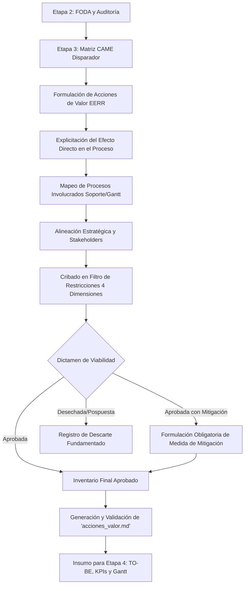

# Acciones de Valor EERR y Filtro de Restricciones Operativas (GMP Etapa 3)

Skill atómica especialista para la formulación, evaluación operativa y gobernanza del **Inventario de Acciones de Valor** en la Etapa 3 de Gestión y Mejora de Procesos (GMP). Transforma las directrices estratégicas de la Matriz CAME en intervenciones operativas concretas en el proceso actual, clasificadas bajo el esquema **EERR** (Eliminar, Reducir, Incrementar, Crear / Automatizar, Simplificar, Modificar, Incorporar) y validadas contra las 4 dimensiones canónicas del **Filtro de Restricciones Operativas** antes del rediseño TO-BE y la planificación de Etapa 4.

Este módulo implementa con estricta fidelidad las heurísticas, definiciones y estructuras de los materiales oficiales de cátedra de la Universidad Tecnológica Nacional - Facultad Regional Córdoba (UTN FRC):
- **Diapositivas oficiales:** `SLI_U3_C05_Acciones_de_Valor.pdf` (Clase 5: Acciones de Valor).
- **Planilla de cátedra:** `PlanillaMATRICES-TPI 2026 con ejemplo.xlsx` (Pestaña *'Etapa 3 Propuesta de mejora'*, Matriz 2: *PROPUESTA DE MEJORA Y ALINEACIÓN ESTRATÉGICA ¿Qué queremos hacer y a quién beneficia?*).

---

## Límites de Autoridad y Reglas Invariables de Cátedra

1. **Persistencia Determinista Obligatoria:** El resultado debe persistirse obligatoriamente en el archivo Markdown `acciones_valor.md` en el directorio de trabajo actual.
2. **Trazabilidad CAME Estricta (Disparador):** Ninguna Acción de Valor puede formularse de manera aislada o arbitraria. Toda acción debe originarse en una estrategia explícita de la Matriz CAME (`FO`, `FA`, `DO`, `DA`), la cual conecta directamente con los factores FODA del diagnóstico AS-IS (`F`, `D`, `O`, `A`).
3. **No Abstracción — Intervención Concreta en el Proceso:** Según la regla de oro de cátedra (*SLI_U3_C05, Diapositiva 5*):
   > *"Una acción de valor no es una 'idea abstracta'. Es una intervención en el proceso actual."*
   Debe explicitarse claramente qué cambia en la mecánica del proceso, qué tareas se eliminan, crean o modifican, y qué tecnología o flujo reemplaza la operación preexistente.
4. **Cobertura de las Palancas de Cambio y Esquema EERR:** Las intervenciones deben identificarse según las palancas rectoras de cátedra (*Matriz 2 de PlanillaMATRICES-TPI* y marco EERR):
   - **Automatizar / Digitalizar:** Reemplazar ejecución manual o física por tecnología o flujos automáticos (suele derivar en la eliminación de tareas manuales). Corresponde operativamente a **Crear (C)** capacidades digitales o **Eliminar (E)** burocracia manual.
   - **Eliminar / Simplificar [E]:** Suprimir pasos, burocracia, duplicación de cargas, firmas redundantes o controles que no agregan valor al cliente ni al control interno.
   - **Reducir / Optimizar [R]:** Minimizar tiempos de espera (*lead time* o TMO), costos operativos, tasas de error, fricciones interdepartamentales o reprocesos.
   - **Incrementar / Potenciar [I]:** Elevar el nivel de servicio (SLA), la exactitud de inventarios, la satisfacción del cliente/estudiante o la retención de valor.
   - **Crear / Incorporar [C]:** Diseñar e implantar un proceso, servicio, canal de autoservicio o estándar totalmente nuevo que hoy no existe en la organización.
   *Nota de cátedra:* Es habitual que una automatización implique la eliminación o simplificación de pasos. Lo fundamental es explicitar qué cambia concretamente en el proceso.
5. **Evaluación Obligatoria en las 4 Dimensiones del Filtro de Restricciones Operativas:** Toda Acción de Valor debe ser evaluada rigurosamente frente a los 4 ejes de viabilidad fijados en *SLI_U3_C05 (Diapositiva 7)*:
   - **1. Plazos y tiempos:** Demoras estimadas en el desarrollo o implementación (evaluadas contra el horizonte de mejora previsto: < 3 meses para quick wins, < 6-12 meses integral).
   - **2. Costos / Presupuesto:** Limitaciones financieras para la mejora (presupuesto operativo disponible, CAPEX/OPEX, licencias, costo-beneficio).
   - **3. Dependencia tecnológica:** Integraciones complejas de sistemas (compatibilidad con ERP/CRM actual, APIs, disponibilidad de conectores, seguridad IT).
   - **4. Resistencia al cambio:** Curva de aprendizaje del personal o necesidad de capacitación (fricción cultural, asimilación de nuevos métodos de trabajo, reorganización de roles).
6. **Dictamen de Viabilidad Categórico:** Cada acción sometida al filtro debe calificarse unívocamente en:
   - `APROBADA`: Supera favorablemente las 4 dimensiones. Pasa de forma directa al modelado BPD TO-BE y al plan de implantación de Etapa 4.
   - `APROBADA CON MITIGACIÓN`: Presenta fricciones o restricciones manejables (ej. integración compleja o curva de aprendizaje pronunciada) pero cuenta con una **medida de mitigación concreta y obligatoria** (capacitación presencial, período de marcha blanca, API intermedia, piloto).
   - `DESECHADA / POSPUESTA`: Inviable técnica, financiera o culturalmente en el ciclo de mejora actual. Se documenta la justificación técnica del descarte.
7. **Mapeo de Procesos Involucrados (Directa o Indirectamente):** Debe identificarse claramente qué procesos del mapa organizacional se ven afectados o cuáles deben dar soporte en la implementación de la iniciativa. Este mapeo constituye el insumo primario para definir los roles y responsables en el Diagrama de Gantt de Etapa 4 (*Matriz 2 Columna J*).
8. **Alineación Estratégica y Expectativas de Stakeholders:** Toda acción debe responder taxativamente a las dos preguntas de cátedra (*Matriz 2 Columna K*):
   - *"¿A qué meta general de la organización le mueve la aguja?"* (Objetivo estratégico corporativo).
   - *"¿A qué Stakeholders da respuesta?"* (Mapeo directo con las expectativas y obstáculos relevados en la Matriz de Stakeholders de Etapa 2).

---

## Flujo de Trabajo Metodológico Paso a Paso



### Paso 1: Ingesta de Cruces CAME y Evidencias de Entrada
- Extraer las estrategias formuladas en la Matriz CAME (`came.md` o sección de Etapa 3):
  - **FO (Ofensivas / Explotar):** Apalancar fortalezas internas para captar oportunidades del mercado ($F_i \times O_j$).
  - **FA (Defensivas / Mantener):** Usar fortalezas internas para mitigar o neutralizar amenazas externas ($F_i \times A_k$).
  - **DO (Reorientación / Corregir):** Superar debilidades internas aprovechando oportunidades del entorno ($D_m \times O_j$).
  - **DA (Supervivencia / Afrontar):** Reducir vulnerabilidades internas eludiendo amenazas graves ($D_m \times A_k$).

### Paso 2: Formulación Operativa y Clasificación en Palancas EERR
- Traducir cada cruce CAME en una o más intervenciones concretas sobre la mecánica del proceso.
- Asignar la palanca de cambio principal y secundarias:
  - *Automatizar / Digitalizar:* Sustitución de flujos físicos o planillas manuales por software, plataformas o APIs.
  - *Eliminar / Simplificar [E]:* Erradicación de tareas redundantes, firmas innecesarias o doble control.
  - *Reducir / Optimizar [R]:* Acortamiento de lead times, esperas, mermas o colas administrativas.
  - *Incrementar / Potenciar [I]:* Aumento de calidad de servicio, disponibilidad horaria o retención.
  - *Crear / Incorporar [C]:* Creación de un nuevo servicio, portal de autoservicio o canal no existente.
- **Redactar el efecto directo en el proceso:** Describir con exactitud qué cambia en la rutina operativa (ej. *"Eliminación del control manual de requisitos y de la carga de datos duplicada en ventanilla"*).

### Paso 3: Mapeo de Procesos Involucrados (Directa o Indirectamente)
- Determinar el proceso primario o crítico que aloja la intervención.
- Identificar los procesos adyacentes o de soporte impactados y sus roles:
  - *Líder / Responsable directo:* Área dueña del cambio.
  - *Soporte tecnológico:* Dirección de TI (configuración de APIs, despliegue de software).
  - *Soporte normativo / Calidad:* Gestión de Calidad (manuales, homologaciones).
  - *Procesos de apoyo:* Tesorería, Facturación, Recursos Humanos.

### Paso 4: Alineación con Metas Estratégicas y Stakeholders
- Vincular la acción con los Objetivos Estratégicos institucionales (ej. diversificación de ingresos, retención de estudiantes, agilidad de respuesta).
- Indicar los stakeholders beneficiados y la expectativa satisfecha (ej. estudiantes que buscan respuesta inmediata, directores que exigen reducción de costos operativos).

### Paso 5: Evaluación en el Filtro de Restricciones Operativas (4 Dimensiones)
- Someter cada iniciativa a las 4 preguntas canónicas de cátedra:
  1. **Plazos y tiempos:** ¿Cuánto demora el desarrollo e implementación? ¿Encaja en el cronograma?
  2. **Costos / Presupuesto:** ¿Es compatible con el presupuesto asignado y los límites financieros?
  3. **Dependencia tecnológica:** ¿Qué nivel de complejidad tienen las integraciones de sistemas o bases de datos?
  4. **Resistencia al cambio:** ¿Qué curva de aprendizaje exige al personal y qué plan de capacitación demanda?

### Paso 6: Emisión de Dictámenes y Definición de Mitigaciones
- Clasificar en `APROBADA`, `APROBADA CON MITIGACIÓN` o `DESECHADA / POSPUESTA`.
- Si se emite `APROBADA CON MITIGACIÓN`, redactar obligatoriamente la contingencia o ajuste requerido (ej. *"Plan de capacitación intensivo de 2 semanas y soporte presencial en marcha blanca"*).

### Paso 7: Persistencia y Control de Calidad
- Estructurar el entregable formal en `acciones_valor.md` utilizando la plantilla de referencia.
- Ejecutar el validador automatizado:
  ```bash
  python "skills/valueActionsBuilder/scripts/validate_value_actions.py" acciones_valor.md
  ```

---

## Contrato de Salida: Estructura Canónica de 'acciones_valor.md'

El archivo `acciones_valor.md` debe estructurarse obligatoriamente en las siguientes 5 secciones canónicas:

1. **1. Encuadre y Trazabilidad de Cruces Estratégicos CAME:**
   - Proceso crítico bajo análisis, organización y propósito de la intervención.
   - Tabla síntesis de los cruces CAME de referencia con sus factores FODA vinculados (`F#`, `D#`, `O#`, `A#`).
2. **2. Matriz 2 de Cátedra: Propuesta de Mejora y Alineación Estratégica:**
   - Tabla oficial con las columnas exactas de la planilla de cátedra:
     - `ID Acción`: Identificador unívoco (`AV-01`, `AV-02`...).
     - `Estrategia CAME de Origen`: Cruce formal que dispara la propuesta (ej. `FO (F2 x O3)`).
     - `Propuesta de Valor (Iniciativa de Cambio)`: Nombre y descripción concreta de la iniciativa.
     - `Palanca EERR (Principal y Derivadas)`: Clasificación bajo `Crear`, `Eliminar`, `Reducir`, `Incrementar` y palancas de cátedra (`Automatizar`, `Simplificar`, `Modificar`, `Incorporar`).
     - `Efecto Directo en el Proceso`: Qué cambia en la mecánica operativa (eliminación de tareas manuales, simplificación de pasos, nuevo flujo).
     - `Procesos Involucrados (Directa o Indirectamente)`: Procesos del mapa organizacional afectados o de soporte (base para el Gantt).
     - `Alineación Estratégica / Expectativa del Stakeholder`: Meta organizacional a la que mueve la aguja y grupos de interés beneficiados.
3. **3. Matriz del Filtro de Restricciones Operativas (Las 4 Dimensiones Canónicas):**
   - Tabla con columnas:
     - `ID Acción`
     - `1. Plazos y Tiempos (Demoras en desarrollo o implementación)`
     - `2. Costos / Presupuesto (Limitaciones financieras)`
     - `3. Dependencia Tecnológica (Integraciones complejas)`
     - `4. Resistencia al Cambio (Curva de aprendizaje / Capacitación)`
     - `Dictamen de Viabilidad` (`APROBADA`, `APROBADA CON MITIGACIÓN`, `DESECHADA / POSPUESTA`)
     - `Medida de Mitigación / Ajuste Requerido` (obligatoria si es condicionada)
4. **4. Mapeo Integral de Procesos Involucrados y Soporte (Base para Gantt):**
   - Detalle de responsabilidades operativas por área participante (Líder del proceso, TI, Calidad, Administración, Operaciones) para la posterior construcción de la columna de Responsables del Gantt.
5. **5. Plan de Traspaso a Etapa 4 (Diseño Operativo, KPIs y Cronograma):**
   - Pasos de implementación preliminares (conexión con tareas e hitos del Gantt).
   - Recursos críticos identificados (software, hardware, roles de RRHH).
   - Insumos de medición para `kpiDesigner` (indicadores de resultado O1 y de proceso O2 con fuente primaria del dato).

---

## Recursos y Referencias

- **Plantilla Canónica:** [templates/value_actions_template.md](templates/value_actions_template.md)
- **Marco Metodológico de Cátedra:** [references/eerr_methodology.md](references/eerr_methodology.md)
- **Validador Automatizado:** [scripts/validate_value_actions.py](scripts/validate_value_actions.py)
- **Documentación Técnica para Desarrolladores:** [README.md](README.md)
