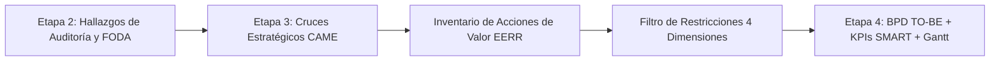

# Marco Metodológico: Acciones de Valor EERR y Filtro de Restricciones Operativas

Documento técnico de referencia metodológica para la formulación, evaluación operativa y gobernanza del **Inventario de Acciones de Valor** en la Etapa 3 de Gestión y Mejora de Procesos (GMP), fundamentado en los materiales de cátedra de la **Universidad Tecnológica Nacional - Facultad Regional Córdoba (UTN FRC)**:
- `SLI_U3_C05_Acciones_de_Valor.pdf` (Clase 5: Acciones de Valor).
- `PlanillaMATRICES-TPI 2026 con ejemplo.xlsx` (Hoja *'Etapa 3 Propuesta de mejora'*, Matriz 2: *Propuesta de Mejora y Alineación Estratégica*).

---

## 1. Fundamentos Conceptuales de Cátedra

La formulación de la solución en la Etapa 3 de GMP no es una lluvia de ideas abstractas ni una lista desarticulada de deseos, sino una derivación causal rigurosa:

### 1.1 La Mejora es un Proyecto (*SLI_U3_C05, Diapositiva 2*)
> *"La mejora de un proceso (o varios) ES UN PROYECTO en la organización. Como todo proyecto, asignará tiempo y recursos para su desarrollo, y espera alcanzar BENEFICIOS."*

Toda mejora consume recursos escasos (horas hombre, presupuesto, infraestructura tecnológica) y debe justificar su retorno en términos de valor para los clientes y ventajas competitivas sostenibles para la organización.

### 1.2 Principio de No Abstracción (*SLI_U3_C05, Diapositiva 5*)
> *"Una acción de valor no es una 'idea abstracta'. Es una intervención en el proceso actual."*

No es admisible formular intenciones difusas como *"mejorar la comunicación"* o *"digitalizar la empresa"*. La acción debe especificar la **nueva mecánica operativa**: qué tareas cambian, quién las ejecuta, qué tecnología interviene y qué pasos o comprobantes del proceso AS-IS desaparecen.

---

## 2. Decodificando el CAME (*SLI_U3_C05, Diapositivas 6 y 7*)

La cátedra descompone el paso de la estrategia a la acción operativa en cuatro componentes interconectados:

1. **El Disparador:**
   - Cruces estratégicos de la Matriz CAME (`FO`, `FA`, `DO`, `DA`).
   - Causas raíz de los problemas hallados en la auditoría del proceso AS-IS (control interno COSO, formularios, ergonomía, silos TI).
   - Expectativas y obstáculos de las partes interesadas (Matriz de Stakeholders).
   - Objetivos estratégicos corporativos.
2. **El Filtro de Restricciones Operativas:**
   - Pregunta rectora: *"¿Qué tareas y qué aspectos del proceso se eliminarán, crearán o cambiarán?"*
   - Evaluación en sus **4 dimensiones canónicas**:
     - *Plazos y tiempos:* Demoras en desarrollo o implementación.
     - *Costos / Presupuesto:* Limitaciones financieras para la mejora.
     - *Dependencia tecnológica:* Integraciones complejas de sistemas.
     - *Resistencia al cambio:* Curva de aprendizaje o necesidad de capacitación.
3. **El Resultado:**
   - Descripción clara de la nueva mecánica del proceso (intervención fáctica).
4. **Los Objetivos:**
   - Beneficios tangibles para la organización (optimizar recursos, elevar relación con el cliente, ganar competitividad).

---

## 3. Las Palancas de Cambio de Cátedra y el Esquema EERR

En la Matriz 2 de la planilla de cátedra (*'Etapa 3 Propuesta de mejora'*), la cátedra define cuatro orientaciones de cambio para la Propuesta de Valor, que armonizan con el esquema de reingeniería **EERR** (Eliminar, Reducir, Incrementar, Crear):

### 3.1 Automatizar / Digitalizar ➔ Palanca CREAR [C] / ELIMINAR [E]
- **Definición de Cátedra:** Reemplazar ejecución manual o física por tecnología o flujos automáticos (suele derivar en la eliminación de tareas manuales).
- **Mecánica Operativa:** Incorporación de pasarelas de pago digitales, lectura óptica de comprobantes, validación algorítmica de reglas de negocio o conectores API.
- **Efecto Directo:** Erradicación de colas en ventanillas, supresión de doble digitación y eliminación del papel físico.

### 3.2 Eliminar / Simplificar ➔ Palanca ELIMINAR [E]
- **Definición de Cátedra:** Suprimir pasos, burocracia, duplicación de cargas o controles que no agregan valor.
- **Mecánica Operativa:** Derogación de formularios triplicados, eliminación de autorizaciones jerárquicas redundantes para operaciones de bajo riesgo y consolidación de expedientes digitales.
- **Efecto Directo:** Disminución drástica de handoffs y puntos ciegos de control.

### 3.3 Modificar / Rediseñar (Cambio) ➔ Palanca REDUCIR [R] / INCREMENTAR [I]
- **Definición de Cátedra:** Reconfigurar el flujo existente, reglas de negocio o responsabilidades sin necesariamente cambiar de tecnología.
- **Mecánica Operativa:** Reordenamiento de secuencias de tareas, balanceo de cargas de trabajo, delegación de aprobaciones al punto de contacto o sincronización de actividades paralelas.
- **Efecto Directo:** Reducción drástica de tiempos de espera (*lead time* o TMO) y aumento de la exactitud y nivel de servicio (SLA).

### 3.4 Crear / Incorporar ➔ Palanca CREAR [C]
- **Definición de Cátedra:** Diseñar un proceso, servicio o estándar totalmente nuevo que hoy no existe.
- **Mecánica Operativa:** Lanzamiento de nuevas líneas formativas (ej. trayectos cortos o diplomaturas), habilitación de portales de autoservicio 24/7 o algoritmos predictivos de tutoría.
- **Efecto Directo:** Captura de nuevos segmentos de usuarios y generación de fuentes alternativas de valor.

---

## 4. El Filtro de Restricciones Operativas (Las 4 Dimensiones Canónicas)

Cada Acción de Valor formulada debe someterse individualmente a la matriz del filtro:

| Dimensión de Filtro (*SLI_U3_C05*) | Foco de Evaluación Operativa | Criterio Aprobación Directa | Criterio Mitigación Requerida | Causa de Descarte / Pospuesta |
|---|---|---|---|---|
| **1. Plazos y Tiempos** | Demoras en desarrollo o implementación frente al ciclo planificado. | Despliegue en < 8-12 semanas; compatible con calendario ordinario. | Requiere 12 a 24 semanas; exige cronograma por fases o piloto previo. | Supera los 12 meses; plazo impredecible o dependiente de licitaciones públicas complejas. |
| **2. Costos / Presupuesto** | Limitaciones financieras, CAPEX/OPEX y capacidad de absorción. | Costo marginal financiable con presupuesto operativo corriente; ROI < 6 meses. | Requiere partida extraordinaria pero justificada por reducción directa de costos. | Costo prohibitivo que supera la liquidez del negocio o con ROI incierto/negativo. |
| **3. Dependencia Tecnológica** | Integraciones complejas de sistemas, APIs, legados y seguridad IT. | Factible con configuración nativa del software actual o SaaS estándar con API documentada. | Requiere desarrollo de conectores intermedios o sincronización de bases de datos heterogéneas. | Exige rehacer el core bancario/ERP central o depende de tecnologías no homologadas localmente. |
| **4. Resistencia al Cambio** | Curva de aprendizaje del personal, hábitos y necesidad de capacitación. | Fricción baja; elimina tareas tediosas y es bien recibida por el equipo operativo. | Fricción media/alta; altera rutinas diarias; exige plan formal de capacitación y marcha blanca. | Rechazo sindical insalvable, oposición frontal de la gerencia media o despidos masivos inaceptables. |

---

## 5. Casos de Aplicación Práctica de Cátedra

### 5.1 Caso 1: Estrategia Ofensiva / Explotar (*SLI_U3_C05, Diapositiva 8*)
- **Contexto (Origen):** Oportunidad: Tendencia del mercado hacia el uso de Chatbots con IA.
- **¿Qué vamos a hacer?:** Implementar un Chatbot con IA para filtrar y resolver automáticamente las consultas simples, liberando al personal humano.
- **Dificultades (Filtro):** Integración técnica de la IA con el CRM actual y tiempo de entrenamiento del algoritmo (Dependencia tecnológica y Plazos).
- **Objetivos a alcanzar:** Aumentar la agilidad de la organización y reducir el tiempo de respuesta del primer contacto.

### 5.2 Caso 2: Estrategia Defensiva / Mantener (*SLI_U3_C05, Diapositiva 9*)
- **Contexto (Origen):** Fortaleza: Capacidad actual de resolver el 80% de los casos en el primer contacto.
- **¿Qué vamos a hacer?:** Crear un programa interno de "agentes mentores" para estandarizar las tácticas exitosas y capacitar activamente a los nuevos ingresos.
- **Dificultades (Filtro):** Asignar horas operativas de los mejores agentes a tareas de capacitación sin afectar los niveles de servicio actuales (Costos/Tiempos y Resistencia).
- **Objetivos a alcanzar:** Desarrollar un ambiente de colaboración, retener talento clave y aumentar la productividad de nuevos agentes.

### 5.3 Caso 3: Estrategia de Innovación / Explotar (*SLI_U3_C05, Diapositiva 10*)
- **Contexto (Origen):** Oportunidad: Posibilidad de alianzas internas con el equipo de logística.
- **¿Qué vamos a hacer?:** Integrar el panel de tracking logístico en el sistema de Atención al Cliente, para que los operadores puedan dar respuestas certeras sin derivar llamadas.
- **Dificultades (Filtro):** Unificar bases de datos de distintas plataformas informáticas manteniendo los estándares de seguridad IT (Dependencia tecnológica).
- **Objetivos a alcanzar:** Optimizar el uso de recursos, mejorar la fidelidad de marca y eliminar las derivaciones manuales al área de Logística.

### 5.4 Caso Integral de Planilla TPI: Universidad Privada (*PlanillaMATRICES-TPI, Matriz 2*)
- **Estrategia CAME de Origen:** `FO Ofensiva (F2 Infraestructura Adecuada – O3 Demanda Creciente de educación)`: Ampliar la oferta académica desarrollando programas innovadores y atractivos adaptados a la demanda creciente.
- **Propuesta de Valor:**
  - *Nombre:* CREAR: Estructuración y despliegue de Trayectos de Especialización Cortos (Diplomaturas) de alta demanda.
  - *Palanca Principal:* Crear un servicio/proceso nuevo + Automatizar la matriculación y pago.
  - *Efecto directo en el proceso:* Eliminación del control manual de requisitos y de la carga de datos duplicada.
- **Procesos Involucrados:**
  - *Gestión Académica y Diseño Curricular:* Responsable directo de estructurar la nueva arquitectura de módulos acreditables y flexibles.
  - *Admisión y Enrolamiento:* Proceso crítico que absorbe la automatización de la pasarela digital de cobro.
  - *Gestión de Calidad Institucional:* Dueño de la estandarización y documentación de la Guía.
- **Alineación Estratégica / Stakeholder:**
  - *Objetivo Estratégico:* Crecimiento sostenible de la oferta académica y diversificación de ingresos.
  - *Stakeholder / Expectativa:*
    - Alumnos / Profesionales en ejercicio: Demanda de capacitación continua, ágil, de corta duración y con certificación oficial.
    - Directorio / Gestión Financiera: Incremento de margen operativo mediante la captura de nuevos segmentos de mercado.

---

## 6. Mapeo de Procesos Involucrados para el Diagrama de Gantt

En la cátedra de GMP, la Columna J de la Matriz 2 (*"PROCESOS INVOLUCRADOS Directa o indirectamente"*) no es informativa, sino la base estructural para:
1. **Asignación de Roles y Responsables:** Determinar quién es el líder de cada tarea en el Plan de Mejora de Etapa 4.
2. **Definición de Tareas e Hitos de Gantt:** Dividir el despliegue en tareas operativas, técnicas, de homologación y de capacitación asignadas a cada área.
3. **Prevención de Silos:** Evitar que una mejora diseñada para un proceso genere colapsos en las áreas proveedoras o clientes internos adyacentes.
